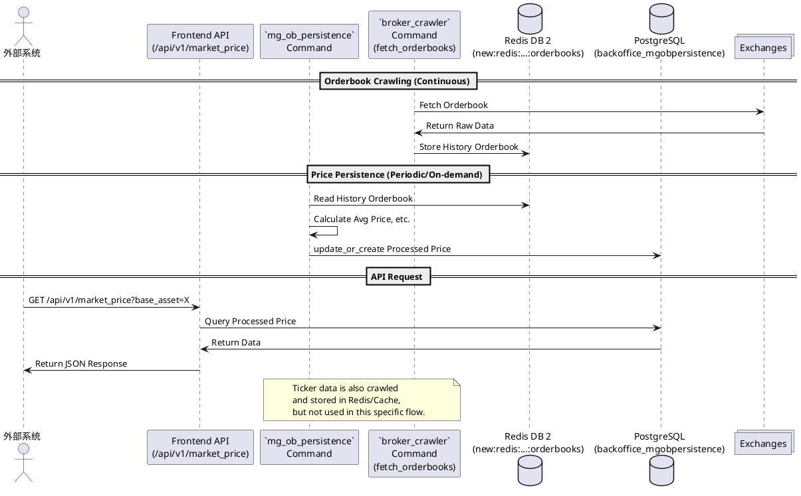
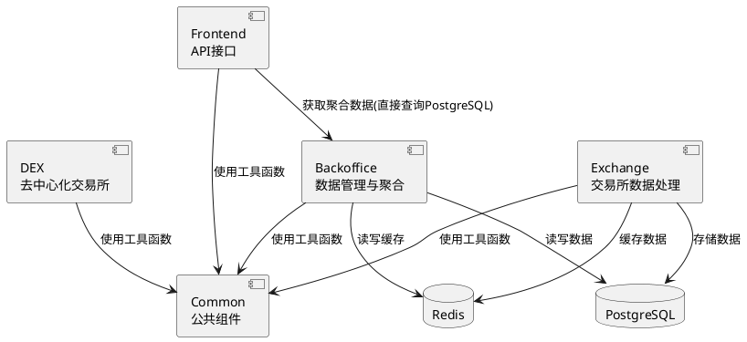
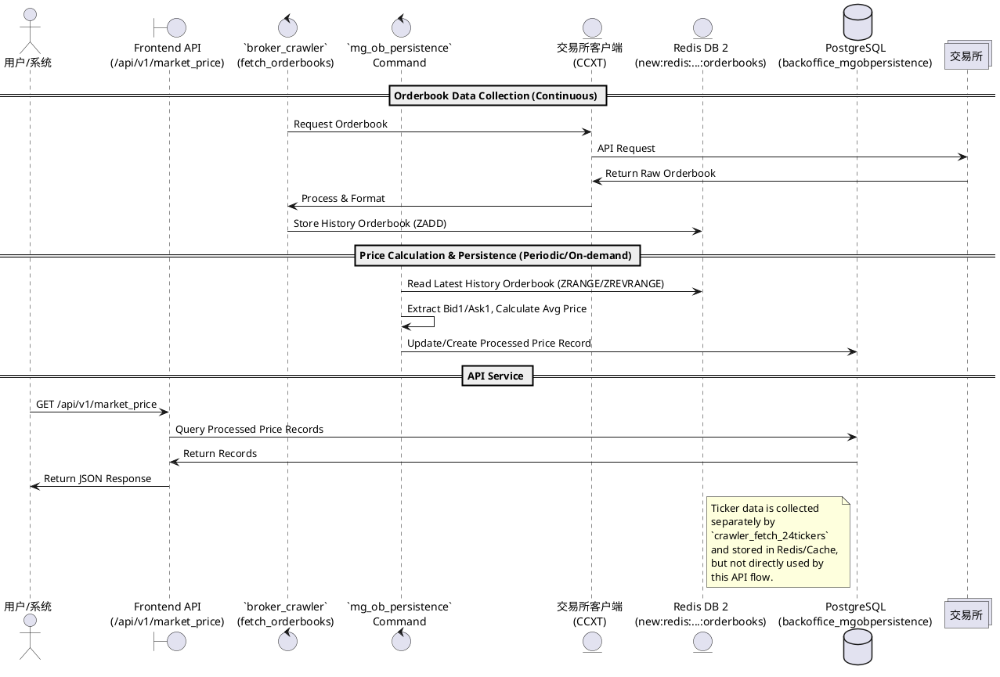

# Skyeye项目分析报告

## 项目概述

Skyeye是一个市场行情聚合器，用于聚合中心化交易所(CEX)和去中心化交易所(DEX)的市场数据。该项目使用Python编写，基于Django框架，并提供gRPC接口及部分HTTP
API供上层服务访问。

## 核心功能

1. **行情数据采集**：通过独立的Management Command (`broker_crawler`) 从多个交易所获取行情数据，包括订单簿(Orderbook)
   、24小时交易数据(Ticker)等。
2. **数据缓存与处理**：将原始行情数据存储在Redis中，并通过另一个Management Command (`mg_ob_persistence`)
   处理Redis中的订单簿数据，计算聚合价格。
3. **数据持久化**：将`mg_ob_persistence`计算出的聚合价格持久化存储到PostgreSQL数据库中。
4. **API接口**：通过`frontend`模块提供HTTP API接口（如`/api/v1/market_price`
   ）供外部访问，数据来源于PostgreSQL。同时可能存在gRPC接口（如`sevices/grpc_server.py`）。

## 技术架构

Skyeye采用Django框架开发，使用PostgreSQL作为数据库（主要存储经处理后的聚合价格），Redis主要用于缓存原始行情数据（包括历史记录）和可能的中间计算。

### 核心模块

1. **exchange**: 负责与交易所交互，获取行情数据（通过`ccxt_client.py`和`service.py`中的`CrawlerService`
   ）。包含数据采集命令`broker_crawler`。
2. **dex**: 专门处理去中心化交易所的数据（当前实现不完整）。
3. **frontend**: 提供HTTP API接口（如`/api/v1/market_price`）供外部访问。
4. **backoffice**: 包含数据模型（如`MgObPersistence`）和数据处理命令`mg_ob_persistence`，负责将Redis中的订单簿数据处理后存入PostgreSQL。
5. **common**: 公共组件和工具函数，包括Redis客户端获取逻辑 (`redis_client.py`)。
6. **sevices**: 可能包含gRPC服务定义和实现 (`grpc_server.py`)。

### 关键流程

1. **数据采集 (`broker_crawler`命令)**：
    * 运行`uv run manage.py broker_crawler crawler_fetch_orderbooks`抓取订单簿数据，存入Redis DB 2的Sorted
      Set (`new:redis:crawler:...:orderbooks`) 和内存缓存 (`crawler:...:orderbooks`)。
    * 运行`uv run manage.py broker_crawler crawler_fetch_24tickers`抓取Ticker数据，存入Redis DB 2的Sorted
      Set (`new:redis:crawler:...:tickers`) 和内存缓存 (`crawler:...:tickers`)
      。【注意：此Ticker数据目前未被`/api/v1/market_price`使用】。
    * 这些命令通常需要持续运行。
2. **数据处理与持久化 (`mg_ob_persistence`命令)**：
    * 运行`uv run manage.py mg_ob_persistence`。
    * 该命令读取Redis DB 2中的历史订单簿数据 (`new:redis:crawler:...:orderbooks`)。
    * 计算买一/卖一平均价等指标。
    * 将计算结果使用`MgObPersistence.objects.update_or_create()`写入PostgreSQL的`backoffice_mgobpersistence`表。
    * 此命令可按需或定期运行。
3. **API服务 (`/api/v1/market_price`)**：
    * 前端或其他服务请求该API。
    * Django视图函数 (`frontend.api_v1.chainup.market_price`) 直接查询PostgreSQL的`backoffice_mgobpersistence`表。
    * 根据请求参数过滤和排序。
    * 返回查询结果。

## 详细系统流程

### 1. 初始化阶段 [系统启动]

**核心步骤**：

- ⭐ 加载配置文件：读取`settings.py`及`local_settings.py`中的数据库、Redis (`TRADING_REDIS`指向DB 2)
  和交易所配置。注意Django默认缓存 (`CACHES`) 未配置，使用内存缓存。
- ⭐ 初始化数据库连接：建立与PostgreSQL的连接池。
- ⭐ 建立缓存连接：初始化Redis连接池（DB 2）及内存缓存。
- 加载交易对列表：通过数据库模型（如`seed_initial_data.py`所示）预先配置需要监控的交易对。
- 初始化交易所客户端：为每个交易所创建CCXT客户端实例 (`exchange/ccxt_client.py`)。

### 2. 数据采集阶段 [持续进行, 通过`broker_crawler`命令]

**核心步骤**：

- ⭐ 订单簿数据采集 (`crawler_fetch_orderbooks`):
    - 通过`exchange.service.CrawlerService`调用CCXT获取订单簿。
    - 调用`exchange.controllers.set_orderbook`将数据写入Redis DB 2 (Sorted Set, key=`new:redis:crawler:...:orderbooks`)
      和内存缓存 (key=`crawler:...:orderbooks`)。
    - 频率：由`SLEEP_CONFIG['crawler_fetch_orderbooks']`控制（默认3秒）。
- ⭐ 24小时行情数据 (`crawler_fetch_24tickers`):
    - 通过`exchange.service.CrawlerService`调用CCXT获取Ticker。
    - 调用`exchange.controllers.set_24ticker`将数据写入Redis DB 2 (Sorted Set, key=`new:redis:crawler:...:tickers`)
      和内存缓存 (key=`crawler:...:tickers`)。
    - 频率：由`SLEEP_CONFIG['crawler_fetch_24tickers']`控制（默认30秒）。
- 市场基础信息：(此部分逻辑未详细分析，可能由`crawler_fetch_markets`处理)

**错误处理**：

- `@retry_on()`装饰器处理部分重试。
- `service.py`中有日志记录错误。
- `ccxt_client.py`有更复杂的重试和代理逻辑。

### 3. 数据处理阶段 [按需/定期进行, 通过`mg_ob_persistence`命令]

**核心步骤**：

- ⭐ 读取Redis订单簿：调用`exchange.controllers.get_history_orderbook`从Redis DB 2的Sorted
  Set (`new:redis:crawler:...:orderbooks`)读取最近的订单簿。
- ⭐ 计算聚合价格：提取买一价、卖一价，计算平均价，应用汇率等。
- ⭐ 数据持久化：调用`backoffice.models.MgObPersistence.objects.update_or_create()`将计算结果写入PostgreSQL。

### 4. 数据聚合阶段 [发生在`mg_ob_persistence`命令中]

**核心步骤**：

- ⭐ 价格计算：基于单个交易所的最新历史订单簿计算平均价。
- 注意：项目代码中存在`merge_orderbooks`相关函数（在`controllers.py`），但`mg_ob_persistence`
  命令似乎未使用它来合并多个交易所数据后再计算，而是对每个交易所单独计算并存储。需要进一步确认聚合逻辑的细节。

### 5. 数据存储与缓存阶段 [持续进行]

**核心步骤**：

- ⭐ Redis缓存 (DB 2, 通过`local_redis()`访问):
    - 存储历史订单簿 (Sorted Set, `new:redis:crawler:...:orderbooks`), 由`mg_ob_persistence`读取。
    - 存储历史Ticker (Sorted Set, `new:redis:crawler:...:tickers`), **目前未被使用**。
- ⭐ 内存缓存 (Django Default Cache, 通过`global_redis()`访问):
    - 存储最新订单簿 (String, `crawler:...:orderbooks`)。
    - 存储最新Ticker (String, `crawler:...:tickers`), **目前未被使用**。
    - 注意`global_redis`有回退到`local_redis`的机制。
- ⭐ PostgreSQL存储 (`backoffice_mgobpersistence`表):
    - 存储由`mg_ob_persistence`命令处理后的聚合/计算价格。
    - 作为`/api/v1/market_price`的数据源。

### 6. API服务阶段 [对外服务]

**核心步骤**：

- ⭐ `/api/v1/market_price`接口 (HTTP):
    - 由`frontend.api_v1.chainup.market_price`处理。
    - **直接查询PostgreSQL**的`backoffice_mgobpersistence`表。
    - 不查询Redis或内存缓存。
    - 支持按`base_asset`过滤和按`price`/`ratio`排序。
- 其他可能的API/gRPC接口（如`sevices/grpc_server.py`）可能访问Redis或PostgreSQL，需单独分析。

## 数据获取机制

### 中心化交易所(CEX)数据获取

Skyeye主要通过CCXT (CryptoCurrency eXchange Trading Library)库获取中心化交易所的数据。CCXT提供了统一的API接口，可以连接多个交易所如Binance、Huobi、OKEx等。

核心实现在`exchange/ccxt_client.py`中：

1. `CCXTClient`类：包装CCXT库，提供更高级别的接口
2. `AsyncCCXTClient`类：异步客户端，用于高效获取数据

具体的数据抓取逻辑在`exchange/service.py`中的`CrawlerService`类：

1. `fetch_24ticker`: 获取24小时交易数据
2. `fetch_orderbook`: 获取订单簿数据
3. `crawler_fetch_markets`: 持续抓取市场数据

### 去中心化交易所(DEX)数据获取

虽然代码中有`dex`模块，但目前尚未看到完整的DEX数据获取实现。未来该模块可能会扩展为使用Web3接口或专用SDK连接Uniswap、SushiSwap等去中心化交易所。

## 数据模型

主要数据模型定义在以下几个文件中：

1. `exchange/models.py`:
    - `Asset`: 资产信息，记录代币名称、精度等基础信息
    - `Exchange`: 交易所信息，包含名称、配置和状态
    - `Symbol`: 交易对信息，记录基础资产和报价资产
    - `ExchangeAccount`: 交易所账户信息，存储API密钥等访问凭证

2. `exchange/types.py`:
    - `Orderbook`: 订单簿数据结构，包含买单和卖单列表
    - `Ticker`: 行情数据结构，记录价格和交易量信息
    - `OrderEntry`: 订单项，表示单个价格和数量的组合

3. `backoffice/models.py`:
    - `MgObPersistence`: 聚合后的市场数据，存储不同来源的综合信息
    - `OtcAssetPrice`: OTC资产价格，记录场外交易价格信息

## 系统架构图 (PlantUML)

```plantuml
@startuml Skyeye Architecture (Corrected)
!pragma layout vml
top to bottom direction
skinparam linetype ortho

package "Skyeye" {
  package "Management Commands" {
    component "broker_crawler" as crawler
    component "mg_ob_persistence" as persistence
  }

  package "Django App Modules" {
    component "Frontend\n(HTTP API /api/v1/market_price)" as frontend
    component "Exchange Module\n(CCXT Client, CrawlerService)" as exchange
    component "DEX Module\n(Incomplete)" as dex
    component "Backoffice\n(MgObPersistence Model)" as backoffice
    component "Common\n(Redis Clients, Helpers)" as common
    component "Sevices\n(gRPC Server?)" as services
  }
}

database "PostgreSQL" as postgres {
  folder "Tables" {
    rectangle "backoffice_mgobpersistence" as pg_table
  }
}

database "Redis" as redis {
  folder "DB 2 (local_redis)" {
     rectangle "new:redis:...:orderbooks (ZSET)" as redis_zset_ob
     rectangle "new:redis:...:tickers (ZSET)" as redis_zset_ticker
  }
  folder "DB 0/Other (Django Cache / global_redis primary)" {
     rectangle "crawler:...:orderbooks (String)" as redis_str_ob
     rectangle "crawler:...:tickers (String)" as redis_str_ticker
     note right: "Currently Memory Cache in default config"
  }
}

cloud "Exchanges (CEX)" as cex

' 调整数据流关系
crawler --> exchange : Uses CrawlerService
exchange --> cex : Fetch Ticker/Orderbook
exchange --> redis_zset_ticker : Write History Ticker (Unused?)
exchange --> redis_str_ticker : Write Latest Ticker (Unused?)
exchange --> redis_zset_ob : Write History Orderbook
exchange --> redis_str_ob : Write Latest Orderbook

persistence --> redis_zset_ob : Read History Orderbook
persistence --> backoffice : Uses MgObPersistence Model
persistence --> pg_table : Write Processed Price

frontend --> pg_table : Read Processed Price for API
frontend --> backoffice : Uses Models (e.g., Asset for filter)

services --> pg_table : Read Processed Price? (Possible)
services --> redis : Read Cache/History? (Possible)

@enduml
```

## 数据流程图 (PlantUML)

## 系统组件交互图

## 完整数据流水线

## 结论

Skyeye是一个市场行情聚合系统，核心流程涉及两个关键的后台命令：

1. **`broker_crawler`**: 负责从交易所抓取原始市场数据（订单簿、Ticker），并将它们缓存到 Redis（历史数据存DB 2 Sorted
   Set，最新数据存内存/Django缓存）。
2. **`mg_ob_persistence`**: 负责读取 Redis DB 2 中的**历史订单簿数据**，计算价格指标（如买一卖一平均价），并将结果**持久化到
   PostgreSQL** 的 `backoffice_mgobpersistence` 表中。

前端 API `/api/v1/market_price` **直接查询 PostgreSQL** 中的 `backoffice_mgobpersistence` 表来获取数据，不涉及直接读取
Redis 或 Ticker 缓存。

### 系统优势

1. **统一接口**：
    - 标准化的数据格式
    - 统一的访问方式
    - 简化的集成流程

2. **数据聚合**：
    - 多源数据合并
    - 智能价格计算
    - 市场深度整合

3. **高效缓存**：
    - 使用Redis存储原始数据和历史记录
    - 结合PostgreSQL实现持久化
    - 支持高并发访问

4. **可扩展性**：
    - 模块化设计
    - 插件式架构
    - 易于扩展

### 改进方向

1. **DEX支持**：
    - 完善DEX模块
    - 添加更多DEX支持
    - 优化Web3集成

2. **数据分析**：
    - 增加市场指标
    - 添加预警功能
    - 支持自定义分析

3. **性能优化**：
    - 提高更新频率
    - 优化数据处理
    - 改进缓存策略

4. **实时推送**：
    - 添加WebSocket支持
    - 实现实时数据推送
    - 优化推送性能

5. **数据使用优化**：
    - 明确Ticker数据的用途或移除未使用数据的采集
    - 考虑将Ticker数据整合到价格计算逻辑中
    - 优化多交易所数据的聚合算法

### 系统数据流

1. **原始数据抓取**：
    - `broker_crawler crawler_fetch_orderbooks` 命令抓取交易所订单簿，存入Redis DB 2
    - `broker_crawler crawler_fetch_24tickers` 命令抓取交易所Ticker数据，存入Redis DB 2和内存缓存

2. **数据处理与持久化**：
    - `mg_ob_persistence` 命令从Redis读取订单簿数据，计算关键价格指标，写入PostgreSQL

3. **数据查询**：
    - Frontend API (`/api/v1/market_price`) 直接查询PostgreSQL的`backoffice_mgobpersistence`表
    - 当前，API不使用Redis缓存数据
    - 部分抓取的数据(如Ticker)暂未被其他模块直接使用 