# SkyEye市场数据监听产品需求文档(PRD)

## 1. 文档信息
- **文档名称**: SkyEye市场数据监听产品需求文档
- **版本**: V1.1
- **创建日期**: 2025-05-08
- **状态**: 草稿

## 2. 项目概述
SkyEye市场数据监听系统旨在构建一个全面、实时、可靠的加密货币市场数据采集和处理平台。该系统将从中心化交易所(CEX)和去中心化交易所(DEX)采集关键市场数据，进行标准化处理，并提供给上游业务系统使用。

SkyEye项目是"HailStone业务中台"整体战略的重要组成部分。HailStone业务中台致力于提升公司在数字资产领域的服务能力和运营效率，而SkyEye系统通过提供统一、高质量的市场数据，将直接支撑HailStone业务中台在加密资产交易、风险管理、新金融产品研发等方面的战略拓展。本项目的启动旨在解决当前各业务线独立获取市场数据所带来的数据口径不一、重复开发、资源浪费以及响应速度慢等痛点，目标是提升HailStone平台在快速变化的数字资产市场中的竞争力，缩短新业务上线周期，并降低因数据获取分散带来的运营成本和风险。 

## 3. 目标与范围

### 3.1 业务目标
SkyEye系统的业务目标致力于为HailStone业务中台提供强大、高效的市场数据支持。为了确保目标的可衡量性和可追踪性，我们采用SMART（Specific, Measurable, Achievable, Relevant, Time-bound）原则对业务目标进行具体化定义，详见下表：

  **表1: SkyEye系统业务目标 (SMART原则)**

  | 原业务目标 (PRD V1.0) | SMART目标 (PRD V1.1) | 关键衡量指标 (KPIs) | 目标值 | 时间限制 | 与HailStone的战略关联 |
  |-----------------------|----------------------|---------------------|--------|----------|-----------------------|
  | 建立统一的市场数据采集和管理平台 | SkyEye V1.1上线后，实现对至少 **5个** 主流CEX和 **7个** 重点公链上 **10个** 核心DEX的结构化市场数据（包括实时价格、K线、交易量）的统一采集与管理。 | 覆盖的CEX数量, 覆盖的DEX数量, 采集的数据类型完整性 | CEX≥5, DEX≥10 (按公链计), 数据类型100%覆盖PRD定义 | V1.1上线时 | 为HailStone提供单一、标准化的市场数据入口，简化下游系统集成，提升数据接入效率。 |
  | 提供全面、准确、及时的市场数据支持 | SkyEye V1.1上线6个月内，关键交易对（如BTC/USDT, ETH/USDT）的价格数据与三大基准交易所（如Binance, OKX, Coinbase）的偏差不超过 **0.1%**，数据延迟（从交易所事件发生到API可查询）P95值小于 **1秒**。 | 数据准确率 (与基准源对比), 数据延迟 (P95) | 偏差≤0.1%, 延迟P95<1s | V1.1上线后6个月 | 保障HailStone业务决策和交易执行所依赖数据的质量和时效性，降低操作风险。 |
  | 降低多个业务系统独立获取市场数据的重复开发成本 | SkyEye V1.1上线12个月内，通过统一API，将HailStone业务系统接入新市场数据源的平均工时从当前的 **5人/天** (预估值) 降低到 **2人/天**。 | 新数据源接入平均工时 | 从5人/天降至2人/天 | V1.1上线后12个月 | 释放HailStone研发资源，使其更专注于核心业务逻辑创新，加速产品迭代。 |
  | 减少API调用次数，提高资源利用效率 | SkyEye V1.1上线6个月内，通过数据复用和内部缓存机制，使系统对外部付费数据API的总调用量相较于独立获取模式（预估）减少 **50%**。 | 外部付费API调用量减少百分比 | 减少≥50% | V1.1上线后6个月 | 降低HailStone在第三方数据上的支出，优化外部资源依赖，提升系统整体的成本效益。 |
  | 形成统一的市场数据标准，提高数据一致性 | SkyEye V1.1上线时，所有通过SkyEye API提供的数据（价格、交易量、K线等）遵循PRD 4.2.1中定义的统一标准，确保HailStone各业务系统使用的数据口径一致，跨系统数据一致性问题报告数每月小于 **1个**。 | 数据标准符合度 (通过审计抽查), 跨系统数据一致性问题报告数 | 100%符合, 报告数<1/月 | V1.1上线时及之后 | 消除HailStone内部因数据标准不一导致的数据转换成本和潜在错误，提升数据驱动决策的可靠性，增强跨部门协作效率。 |

### 3.2 系统范围
- CEX市场数据采集与处理
- 多链DEX市场数据采集与处理
- 数据标准化与存储
- 数据查询与分析接口
- 数据监控与告警

本系统专注于后端数据的采集、处理、存储及API服务提供，**不直接包含前端用户界面的展示功能。例如，K线图、数据报表等数据的可视化展示，将由对接本系统API的其他前端应用或分析工具负责实现。**

#### 3.2.1 非范围内容 (What We're Not Doing)
为了更清晰地界定SkyEye系统的边界，明确管理相关方的预期并防止范围蔓延，特此声明以下内容**不属于**本系统V1.1版本的范围：

- **不提供任何形式的交易执行功能**：本系统专注于提供原始及衍生市场数据，不包含任何交易下单、交易撮合或资产管理功能。
- **不包含针对外部客户的用户账户管理系统**：本系统的API服务主要面向内部业务系统（如HailStone业务中台），不提供外部用户注册、认证和账户管理功能。
- **不承诺支持所有非标准的、需要定制化开发的CEX/DEX API**：对于需要大量定制化开发才能接入的非标准数据源，除非经过特定评估并独立立项，否则不默认支持。
- **不提供预测性分析或交易信号生成功能**：本系统提供的是客观市场数据，不包含任何基于算法的预测模型、投资建议或交易信号生成服务。
- **不提供自定义前端报表或仪表盘开发**：如前所述，数据的可视化展示由上游应用负责。
- **不直接管理或存储用户资产**：系统不涉及任何用户资金或私钥的存储与管理。 

### 3.3 系统架构图

```plantuml
@startuml
skinparam componentStyle uml2
skinparam linetype ortho
skinparam ranksep 30
skinparam nodesep 50
skinparam packageStyle rectangle

' External entities: CEX/DEX as rectangles, HailStone as actor
rectangle CEX
rectangle DEX
rectangle "HailStone 业务中台" as HailStonePlatform

package "skyeye" {
    rectangle "行情数据抓取" as DataFetcher
    rectangle "行情数据处理" as DataProcessor
    rectangle "gRPC API" as GrpcApiService

    database "redis" as RedisCache
    database "主 postgres" as MasterPostgres
    database "从 postgres" as ReplicaPostgres
}

' Define data flows
CEX --> DataFetcher
DEX --> DataFetcher

DataFetcher --> RedisCache : "写入数据"
' Removed: DataFetcher --> MasterPostgres

RedisCache --> DataProcessor
' DataProcessor writes to MasterPostgres
DataProcessor --> MasterPostgres 

MasterPostgres --> ReplicaPostgres

' gRPC API inputs - now only from ReplicaPostgres
' Removed: DataProcessor --> GrpcApiService
ReplicaPostgres --> GrpcApiService

GrpcApiService --> HailStonePlatform
@enduml
```



**架构说明与数据流澄清:**

上图展示了SkyEye系统的核心组件及其交互关系。关键数据流和组件职责如下：

1.  **数据源 (CEX/DEX)**: 外部的中心化交易所和去中心化交易所，是市场数据的原始来源。

2.  **DataFetcher (行情数据抓取)**:
    *   **职责**: 负责从各个CEX和DEX主动拉取或接收推送的市场数据（如实时价格、成交量、订单簿快照等）。
    *   **数据流**: 
        *   将获取到的**实时数据**（或近期高频数据）快速写入 `RedisCache`，供下游 `DataProcessor` 近实时处理及部分快速查询场景使用。
        *   **同时，为了确保原始数据的完整性和可追溯性，并防范Redis故障导致的数据丢失风险，`DataFetcher` 会将采集到的原始数据（或经过基础格式化但未深度处理的"准原始"数据）直接或异步地持久化到 `MasterPostgres` 中的特定原始数据表。** 这部分数据将遵循PRD 4.3节中定义的原始数据保留策略（例如，保留30天）。

3.  **RedisCache (Redis缓存)**:
    *   **职责**: 作为高速缓存层，存储近期（例如，最近24小时）的实时市场数据、频繁访问的中间计算结果或配置信息。主要目的是提升 `DataProcessor` 的处理效率和 `gRPC API` 对热数据的查询响应速度。
    *   **数据特性**: 存储在Redis中的数据通常具有较高的时效性要求，但可能不是系统的最终持久化存储。其数据结构会针对查询和处理性能进行优化。

4.  **DataProcessor (行情数据处理)**:
    *   **职责**: 核心数据处理单元。从 `RedisCache` 读取待处理数据（也可能直接访问 `MasterPostgres` 中的原始数据进行批量处理），执行包括数据清洗、标准化（统一格式、精度、基准货币转换等）、衍生数据计算（如K线合成、技术指标计算）、数据验证（异常值检测、一致性校验）等在内的复杂处理逻辑。
    *   **数据流**: 处理完成后的结构化、高质量数据将被写入 `MasterPostgres` 的相应表中，供长期存储和API查询使用。

5.  **MasterPostgres (主PostgreSQL数据库)**:
    *   **职责**: 系统主要的持久化数据存储。存储经过 `DataFetcher` 采集的原始/准原始数据，以及经过 `DataProcessor` 清洗、处理和计算后的结构化市场数据（如各周期K线、技术指标、标准化价格和交易量等）。
    *   **数据特性**: 数据具有高可靠性和一致性要求，支持事务处理。是系统数据资产的核心载体。

6.  **ReplicaPostgres (从PostgreSQL数据库)**:
    *   **职责**: `MasterPostgres` 的只读副本。通过主从复制机制与主库保持数据同步。主要用于分担查询负载，特别是来自 `gRPC API Service` 的读取请求，从而保障主库的写入性能和稳定性。

7.  **GrpcApiService (gRPC API服务)**:
    *   **职责**: 向包括 `HailStone业务中台` 在内的上游业务系统提供统一、标准化的市场数据查询接口。封装了对后端数据存储的访问逻辑，支持实时数据查询、历史数据查询和聚合数据查询等功能。
    *   **数据流**: 主要从 `ReplicaPostgres` 读取数据以响应查询请求，确保查询操作不影响主数据库的性能。

8.  **HailStone业务中台**: SkyEye系统的主要服务对象，通过gRPC API消费市场数据，用于其自身的交易、风控、分析等业务场景。

**数据类型流转示例 (简化):**

*   `CEX/DEX` -> `DataFetcher`: 原始API响应 (JSON/WebSocket消息)
*   `DataFetcher` -> `RedisCache`: 格式化后的实时tick数据/订单簿片段 (例如: `{"symbol":"BTC/USDT", "price":60000, "volume":0.1, "timestamp":...}`)
*   `DataFetcher` -> `MasterPostgres` (原始表): 原始交易记录/事件 (例如: `raw_cex_trades`, `raw_dex_swaps`)
*   `RedisCache` -> `DataProcessor`: 上述实时tick数据
*   `DataProcessor` -> `MasterPostgres` (处理后表): 标准化K线数据 (OHLCV), 计算后的技术指标 (例如: `kline_1min`, `daily_vwap`, `rsi_14d`)
*   `ReplicaPostgres` -> `GrpcApiService`: 上述标准化K线、指标数据等
*   `GrpcApiService` -> `HailStonePlatform`: gRPC协议封装的结构化数据对象

**架构模式考虑:**

系统设计借鉴了分层架构和缓存的思想。数据采集、处理、存储和服务分离，便于独立扩展和维护。未来可根据需求演进，在特定环节（如DataProcessor）考虑引入微服务或事件驱动架构模式，以进一步提升系统的灵活性和可伸缩性。 

## 4. 功能需求

### 4.1 数据采集需求

#### 4.1.1 CEX数据采集
- **支持交易所**：
  - **初期覆盖**: 包括但不限于Binance、OKX、Huobi、Bybit、Bitget等当前主流交易所。
  - **新增与评估标准**: 未来新增CEX数据源将依据以下客观标准进行评估和决策：
    - **全球交易量排名**: 例如，参考权威第三方平台（如CoinMarketCap, Coingecko）的现货或衍生品24小时交易量，优先考虑持续排名前20的交易所。
    - **与HailStone业务的相关性**: 优先考虑支持HailStone当前或未来核心业务所需的特定币种、交易对或区域市场。
    - **API质量与稳定性**: API接口的文档完整性、规范性、数据推送的稳定性（如WebSocket连接的可靠性）、限频策略的合理性及历史可用性记录。
    - **接入成本与维护复杂度**: 接入该数据源所需的技术开发投入、持续维护成本以及潜在的合规风险。
    - **市场声誉与安全性**: 交易所的安全记录、用户口碑及合规情况。
- **采集频率**：
  - **实时价格与交易量**：标准采集频率为 **30秒** 更新一次。
    - *评估与动态调整考量*: 虽然30秒是标准频率，但系统应具备潜力，在未来版本中针对特定高活跃度交易对（如BTC/USDT, ETH/USDT）或市场剧烈波动时期，探索实现更短的采集间隔（例如10-15秒）。反之，对于流动性较低或非核心交易对，可考虑适当降低频率（例如60-90秒）以优化资源利用。此动态调整机制的引入需经过详细的技术评估和成本效益分析。
  - **K线数据**：
    - 1分钟K线：每 **1分钟** 生成并更新一次，确保数据在分钟结束后尽快可用。
    - 30分钟K线：每 **1分钟** 检查并更新一次，确保数据在30分钟周期结束后尽快聚合生成。
    - 1小时K线：每 **10分钟** 检查并更新一次，确保数据在小时点结束后尽快聚合生成。
    - 1天K线：每 **10分钟** 检查并更新一次，确保数据在自然日结束后尽快聚合生成。
    - 1周K线、1月K线、3月(季度)K线、12月(年度)K线：每 **1小时** 检查并更新一次，确保在相应周期结束后尽快聚合生成。
    - *K线更新策略说明*: K线的生成与更新应确保捕捉到该周期的准确开盘价、收盘价、最高价和最低价。对于较长周期K线（如1小时及以上），10分钟或1小时的"更新检查"频率旨在确保周期结束后的数据能被及时处理和聚合，而非实时更新K线本身。
  - **市值数据**：标准采集频率为 **15分钟** 更新一次。
- **错误处理与数据质量保障**：
  - **API调用失败处理**:
    - 当对某个CEX的API调用失败（如网络超时、认证失败、交易所返回错误码等），系统应在 **60秒** 内自动尝试重连或重试，最多重试 **3次**。每次重试间隔可适当递增（例如，10s, 20s, 30s）。
    - **"连续失败"定义**: 若在连续 **3个完整的重试周期**（即共计9次尝试，约3-5分钟）内均未能成功从主数据源获取数据，则定义为"连续失败"。
  - **备用数据源切换策略**:
    - **触发条件**: 当主数据源发生"连续失败"时，系统应自动触发向预定义的备用数据源切换的逻辑。
    - **备用源定义**: 针对核心交易对（如BTC/USDT, ETH/USDT等），应预先配置1-2个可靠的备用CEX数据源。选择标准包括数据质量、API稳定性及与主数据源的价格相似性。
    - **切换逻辑**: 系统将尝试从优先级最高的备用数据源获取数据。若首个备用源也失败，则尝试下一个，直至成功或所有备用源均尝试完毕。
    - **数据标记**: API在提供来自备用数据源的数据时，应在响应中明确标记数据来源（例如，`source: "OKX_backup"`），以便下游系统知晓。
    - **切回主源机制**: 系统切换至备用源后，应定期（例如，每 **5-10分钟**）尝试连接主数据源。若主数据源连续 **3次**（或可配置次数）成功返回健康数据，则自动切回主数据源，并清除备用源标记。
    - **无备用源情况**: 若某个交易对没有配置备用数据源，或所有备用数据源均不可用，则应将该数据标记为"不可用"或"数据源中断"，并触发高级别告警。
  - **数据内容异常处理**:
    - **极端离群值检测**: 除了API调用层面的错误，系统还需对获取到的数据内容本身进行基础校验。例如，若价格瞬时变为0、负数，或在单个更新周期内价格涨跌幅超过预设的极端阈值（例如，相比上一分钟价格波动超过 +/- 20%，此阈值需可配置并按不同交易对特性调整），应将此数据点标记为"可疑"，并触发告警。
    - **处理方式**: 可疑数据默认不直接入库影响核心数据流，或以特定状态存入待人工核查。具体处理策略（隔离、标记、告警级别）需进一步定义。
  - **日志与告警**:
    - 所有API调用失败、重试、数据源切换、数据内容异常等情况，均需记录详细日志，包含时间戳、交易所名称、交易对、错误详情、请求参数（脱敏后）、响应内容（部分）等，以便于问题排查。
    - 根据错误类型和影响程度触发不同级别的告警（详见4.5节监控与告警需求）。

#### 4.1.2 DEX数据采集
- **支持网络与DEX**：
  - **初期计划支持公链**：Ethereum, BNB Chain, Tron, Solana, TON, Sui, Aptos
  - **各公链上的DEX示例**：
    - **Ethereum (ETH)**：
      - [Uniswap](https://uniswap.org/) (主要关注v2和v3的主流交易对数据)
    - **BNB Chain (BSC)**：
      - [PancakeSwap](https://pancakeswap.finance/) (主要关注v2和v3的主流交易对数据)
    - **Tron (TRX)**：
      - [SunSwap](https://sunswap.com/) (Tron原生主流DEX)
      - [OpenOcean](https://openocean.finance/) (作为DEX聚合器，关注其在Tron上的交易数据)
      - [JustSwap](https://justswap.io/) (TRON上的早期DEX，支持TRC20代币交换)
      - [ByBarter](https://www.bybarter.io/) (支持TRON链上的P2P交易)
    - **Solana (SOL)**：
      - [Jupiter](https://jup.ag/) (Solana生态主流DEX聚合器)
      - [Raydium](https://raydium.io/) (Solana上的流行AMM，提供快速交易和订单簿)
      - [Orca](https://www.orca.so/) (Solana上用户友好的DEX，专注于低滑点)
      - [Saber](https://app.saber.so/) (Solana上专注于稳定币和锚定资产交换的AMM)
      - [Aldrin](https://aldrin.com/) (Solana上的DEX，通过AMM和现货交易功能)
    - **Ton (TON)**：
      - [STON.fi](https://ston.fi/) (TON区块链上最大的DEX，提供多种流动性池)
      - [DeDust](https://dedust.io/) (TON上的早期DEX，用户友好的界面)
      - [Tradoor](https://tradoor.io/) (TON上首个具有永续和期权交易功能的DEX)
      - [Snapster](https://t.me/SnapsterBot) (专注于TON链上迷因币交易的DEX)
      - [Storm Trade](https://t.me/stormtradebot) (Telegram集成的TON交易平台)
    - **Sui (SUI)**：
      - [Cetus](https://www.cetus.zone/) (Sui生态主流DEX)
      - [Kriya DEX](https://kriya.finance/) (Sui链上的全方位DeFi协议)
      - [Aftermath Finance](https://aftermath.finance/) (Sui链原生DEX)
      - [FlowX](https://www.flowx.finance/) (以生态系统为重点的Sui链DEX)
      - [DeepBook](https://docs.sui.io/standards/deepbookv3) (Sui链上的中心限价订单簿DEX)
    - **Aptos (APT)**：
      - [LiquidSwap](https://home.liquidswap.com/) (Aptos生态首个AMM DEX)
      - [PancakeSwap Aptos](https://aptos.pancakeswap.finance/) (多链DEX在Aptos的部署)
      - [Aptoswap](https://aptoswap.net/) (Aptos原生交易平台)
      - [HoustonSwap](https://houstonswap.io/) (Aptos上首个集中流动性DEX)
      - [Tortuga Finance](https://app.tortuga.finance/) (APT流动性质押平台)
      - [Cellana Finance](https://cellana.finance/) (Aptos生态ve(3,3)模型DEX)

    > **注**：以上所列DEX旨在构建全面的市场数据覆盖。在实际系统建设中，可根据业务优先级、各DEX的市场影响力及技术对接复杂度，分阶段实施。初期可优先覆盖各公链上交易量领先、用户基础广泛的核心DEX，后续根据运营情况和市场发展逐步扩展至其他DEX。


  - **分阶段实施与核心DEX选择标准**: 
    - 系统将根据业务优先级、各DEX的市场影响力（如TVL、交易用户数、社区活跃度）、API或Subgraph的可用性与质量、以及技术对接复杂度，分阶段实施DEX的数据接入。
    - **初期阶段 (V1.1)**: 计划为每个目标公链明确选定 **1-3个** 核心DEX作为首批接入对象。选择标准包括但不限于：
      - **交易量**: 过去30天日均交易量在该公链DEX中排名前5。
      - **总锁仓价值 (TVL)**: TVL在该公链DEX中排名前5。
      - **数据接口成熟度**: 提供稳定、文档完善的官方API或高质量、社区广泛认可的TheGraph Subgraph。
      - **安全性与可靠性**: 有良好的安全审计记录，未发生过重大安全事故，社区反馈正面。
- **采集范围**：
  - **交易对数量**: 默认采集每个已接入DEX平台上 **过去24小时交易量最大的前50个** 交易对。
  - **列表刷新频率**: "前50交易对"列表应 **每日至少更新一次**。
  - **特定监控**: 无论是否在前50，都必须包含该DEX平台原生代币与主流稳定币（USDT, USDC）、封装主流资产（WETH, WBTC）的交易对（如果存在）。
  - **多DEX同交易对处理**: 如果一个交易对同时在同一公链的多个已接入DEX上均符合采集标准（例如，均排名前50），系统默认应采集所有来源的数据，并在存储时明确标记来源DEX。后续聚合处理见4.2.4节。
- **采集频率**：
  - **价格和交易量**：标准采集频率为 **3分钟** 更新一次。
    - *评估与动态调整考量*: 类似于CEX数据采集，未来可评估引入基于交易对活跃度（如近期交易量、价格波动幅度、流动性池深度变化）的动态采集频率调整机制。高活跃度DEX交易对可适当提高频率，低活跃度则可降低。
  - **TVL数据**：标准采集频率为 **15分钟** 更新一次。
  - **流动性池数据**（例如，池内各代币数量、储备量）：标准采集频率为 **10分钟** 更新一次。
- **数据来源优先级与策略**：
  获取DEX数据的方式对系统的成本、实时性、可靠性和开发维护工作量有决定性影响。系统将根据目标DEX的具体情况、数据类型以及成本效益综合评估，采用以下优先级策略，并可能为不同DEX或数据类型组合使用不同来源：

  1.  **官方/DEX原生API (Preferred)**:
      *   **适用场景**: DEX项目方直接提供稳定、高效、数据全面的官方API接口。
      *   **优点**: 通常数据最准确、延迟较低、与DEX逻辑耦合最紧密。
      *   **缺点**: 并非所有DEX都提供，或API质量参差不齐，可能存在限频。
  2.  **TheGraph Protocol Subgraph (Indexed Data)**:
      *   **适用场景**: 目标DEX有官方维护或社区广泛认可的高质量Subgraph，特别是对于结构化查询历史事件和状态（如交易记录、流动性变更、TVL趋势）。
      *   **优点**: 提供GraphQL接口，简化了链上数据的复杂解析，查询效率较高。
      *   **缺点**: 数据索引可能存在延迟（几分钟到数十分钟不等）；依赖外部索引服务节点（或需自行部署节点，成本高）；Subgraph的维护和更新可能滞后于DEX合约升级。
  3.  **链上直接查询 (RPC节点)**:
      *   **适用场景**: 当官方API或Subgraph不可用、不满足实时性要求，或需要获取合约原始状态及事件时。通常用于获取最新价格、监听实时交易事件、查询流动性池合约的当前状态。
      *   **优点**: 数据最原始、实时性最高（取决于链确认速度和RPC节点性能）。
      *   **缺点**: 技术复杂度高，需要自行解析合约事件和状态；RPC节点调用成本高（特别是对于归档节点和高频轮询）；需要管理RPC节点连接池和负载均衡。
  4.  **第三方聚合API (如DeFiLlama, Dune API等)**:
      *   **适用场景**: 用于获取聚合性数据（如全网TVL、多链DEX概览）、补充性数据或作为交叉验证来源。不建议作为核心实时数据的唯一来源。
      *   **优点**: 接口便捷，可快速获取多链、多DEX的聚合信息。
      *   **缺点**: 引入对第三方服务的强依赖；数据更新频率、粒度和准确性可能无法满足所有需求；可能存在API调用成本和限制。

  **表2: DEX数据采集来源策略考量 (示例)**

  |DEX名称(公链)|数据类型|首选来源|备选来源1|备选来源2|理由/权衡(成本,延迟,可靠性,开发复杂度)|
  |-------------|--------|--------|---------|---------|-------------------------------------|
  |Uniswap V3(Ethereum)|价格/交易量|TheGraph(官方或高质量社区Subgraph)|RPC节点(订阅Swap事件)|DeFiLlama API(补充/验证)|TheGraph提供结构化数据但可能有延迟；RPC实时性高但开发复杂成本高；DeFiLlama便捷但可能非最新|
  |Uniswap V3(Ethereum)|TVL/流动性池|TheGraph|DeFiLlama API|RPC节点(定期查询池合约状态)|TheGraph对此类数据友好；DeFiLlama提供聚合数据；RPC成本高|
  |PancakeSwap(BNB Chain)|价格/交易量|官方API(若有且稳定)|RPC节点(订阅事件)|TheGraph|官方API最直接；RPC实时性好；TheGraph可能存在延迟|
  |Jupiter(Solana)|价格/交易量(聚合)|Jupiter官方API|直接查询其路由合约(通过RPC)|-|Jupiter本身是聚合器，其API是最佳来源；直接查询路由合约复杂|
  |STON.fi(TON)|价格/交易量|RPC节点(查询合约状态/解析交易)|TheGraph(若有支持TON且稳定的Subgraph)|第三方TON生态数据服务|TON生态相对较新，官方API和TheGraph支持可能不完善，RPC可能是主要手段但开发难度大|

  *注: 上表为策略分析示例，具体DEX的采集方案需在技术调研后确定。系统应具备灵活性，能够根据实际情况调整和组合数据源策略。*

- **错误处理与数据质量保障** (基本原则同CEX，但需考虑DEX特性):
  - **RPC节点稳定性**: 若依赖RPC节点，需监控节点健康状况，并配置多个备用RPC端点（可能来自不同提供商）。
  - **Subgraph同步延迟**: 若使用TheGraph，需监控Subgraph的索引延迟，当延迟超过阈值时应触发告警，并考虑临时切换至RPC直查（如果可行且必要）。
  - **链重组(Reorgs)处理**: 对于通过RPC直接监听链上事件获取的数据，需要有机制来处理潜在的区块链重组，确保数据的最终一致性（例如，等待足够数量的区块确认）。
  - **Gas费与交易成本**: 直接与链交互可能涉及Gas费用，需在设计中考虑成本效益。
  - 其他错误处理（如API调用失败、数据内容异常、日志告警等）参照4.1.1节CEX部分，并根据DEX特点进行适配。

### 4.2 数据处理需求

#### 4.2.1 数据标准化
数据标准化是构建统一、高质量市场数据平台的核心环节。所有从外部采集的数据在存入系统或对外提供前，必须经过严格的标准化处理，以确保数据的一致性、准确性和可比性。

- **价格数据格式与精度**：
  - **统一报价货币**: 所有价格数据在存储和API层面，优先使用 **USD** 作为统一的报价货币进行表示和比较。对于非USD的原始交易对，将根据实时汇率进行转换。
  - **报价精度**: 
    - 针对不同资产或价格区间，定义标准小数位数。例如：
      - BTC, ETH等高价资产：精确到 **2-4位** 小数 (USD计价)。
      - 主流山寨币 (如 $1-$1000)：精确到 **4-6位** 小数 (USD计价)。
      - 低价代币 (如 < $1)：精确到 **6-8位** 或更多有效数字 (USD计价)。
    - 或者，系统内部可采用高精度数值类型（如DECIMAL(38, 18)）存储所有价格，API层面按需格式化输出，但需明确各场景下的默认输出精度。
    - 报价精度标准应文档化，并作为数据质量校验的一部分。
  - **基准货币转换**: 
    - 当原始交易对非USD计价时（例如, XYZ/ETH, ABC/BTC），需要将其交易量和价格（可选）转换为USD等值。
    - **汇率来源**: 用于转换的汇率（如 ETH/USD, BTC/USD）应从系统内已接入的、高流动性的主流CEX获取（例如，取多个主流CEX报价的加权平均值或中位数）。汇率数据本身也属于SkyEye采集和管理的一部分。
    - **汇率更新频率**: 用于内部换算的基准货币汇率（如ETH/USD）应至少每 **10-30秒** 更新一次，以保证USD等值计算的准确性。

- **交易量计算标准**：
  - **统一单位**: 所有交易量数据在存储和API层面，主要以 **USD等值** 进行表示和比较。
  - **原始币种交易量**: 同时保留原始交易对的基础货币交易量（例如，对于BTC/USDT，保留BTC的交易量；对于ETH/BTC，保留ETH的交易量）。
  - **计算方法**: USD等值交易量 = 基础货币交易量 × 该基础货币对USD的实时价格。

- **时间戳标准化**：
  - **统一时区**: 所有系统内部及API输出的时间戳，必须统一使用 **UTC (Coordinated Universal Time)**。
  - **统一精度**: 时间戳精度应至少达到 **毫秒级 (milliseconds)**。
  - **统一格式**: 推荐使用 **ISO 8601** 格式进行表示（例如：`YYYY-MM-DDTHH:mm:ss.sssZ`）。例如, `2025-05-15T12:30:45.123Z`。

- **K线数据结构 (OHLCV)**：
  - 统一采用标准的OHLCV格式：
    - `open_time`: K线周期开始时间戳 (UTC, 毫秒级)
    - `open_price`: 开盘价 (USD计价，遵循上述价格精度标准)
    - `high_price`: 最高价 (USD计价)
    - `low_price`: 最低价 (USD计价)
    - `close_price`: 收盘价 (USD计价)
    - `volume`: 交易量 (以基础货币计，例如BTC交易对则为BTC数量)
    - `quote_volume`: 计价货币交易额 (例如，BTC/USDT交易对则为USDT交易额；BTC/ETH交易对则为ETH交易额)
    - `usd_volume`: 交易量 (以USD等值计，根据上述交易量计算标准)
    - `trade_count`: (可选) 该K线周期内的成交笔数。
    - `interval`: K线周期标识 (如 `1m`, `5m`, `1h`, `1d`)
    - `symbol`: 标准化交易对名称 (见下文)
    - `exchange_id`: 标准化交易所/DEX平台ID

- **交易对命名规范**: 
  - **目标**: 建立全系统统一、无歧义的交易对命名规范，便于数据索引、查询和跨平台比较。
  - **CEX交易对**: `BASECURRENCY_QUOTECURRENCY_EXCHANGEID`
    - 示例: `BTC_USDT_BINANCE`, `ETH_USDC_COINBASE`
    - `EXCHANGEID` 应采用系统内定义的标准化交易所ID (例如，`binance`, `okx`, `coinbase_pro`)。
  - **DEX交易对**: `BASECURRENCY_QUOTECURRENCY_DEXNAME_CHAINID`
    - 示例: `ETH_USDC_UNISWAPV3_ETHEREUM`, `CAKE_BNB_PANCAKESWAPV2_BSC`
    - `DEXNAME` 应采用系统内定义的标准化DEX名称 (例如，`uniswapv3`, `pancakeswapv2`)。
    - `CHAINID` 应采用系统内定义的标准化链ID (例如，`ethereum`, `bsc`, `solana`)。
  - **代币符号标准化**: 所有 `BASECURRENCY` 和 `QUOTECURRENCY` 应使用广泛接受的、统一的代币符号（例如，优先使用CoinMarketCap或Coingecko上的主流符号）。对于有冲突或不明确的符号，需内部定义并记录映射规则。

- **流动性深度数据结构** (若采集，具体字段待定，但需包含以下基本信息):
  - `symbol`: 标准化交易对名称
  - `exchange_id`: 标准化交易所/DEX平台ID
  - `timestamp`: 快照时间戳 (UTC, 毫秒级)
  - `bids`: 买盘列表，每个元素包含 `[price, quantity]`
  - `asks`: 卖盘列表，每个元素包含 `[price, quantity]`
  - 价格和数量均需遵循上述精度和单位标准。

#### 4.2.2 衍生数据计算
系统将基于标准化的基础数据，计算一系列常用的衍生数据和技术指标，以满足不同业务场景的分析需求。

- **涨跌幅计算**：
  - **计算逻辑**: 涨跌幅 = `(当前价格 - 对比周期价格) / 对比周期价格 × 100%`
  - **24小时涨跌幅**：基于当前时间点向前追溯24小时的收盘价（或最接近的有效价格）作为对比周期价格。
  - **7天/30天/季度/年度涨跌幅**：基于相应固定历史时间点（例如，7天前的同一时刻、上月最后一日收盘价等，具体取价逻辑需明确）的收盘价作为对比周期价格。

- **市值计算**：
  - **流通市值 (Circulating Market Cap)** = 当前价格 × 流通供应量
  - **全稀释市值 (Fully Diluted Valuation, FDV)** = 当前价格 × 最大供应量 (或总供应量，取决于代币经济模型)
  - **供应量数据源**: 
    - "流通供应量 (Circulating Supply)" 和 "最大供应量 (Max Supply) / 总供应量 (Total Supply)" 这类数据通常不由交易所API直接提供完整和最新的信息。
    - **主要来源**: 优先考虑从权威的第三方数据服务商获取，例如 CoinGecko API, CoinMarketCap API (需评估API的许可、成本和更新频率)。
    - **备选/补充来源**: 对于某些代币，如果其供应量信息在链上合约可查且易于解析，可考虑通过RPC节点直接从代币的智能合约读取（例如ERC-20的`totalSupply()`，或特定分发合约的状态）。
    - **更新频率**: 供应量数据应定期更新，建议至少 **每日更新一次**，对于关键资产可考虑更高频率（如每小时）。更新时需记录数据来源和时间戳。
    - **数据校验**: 获取到的供应量数据应进行合理性校验（例如，流通量不应大于最大供应量）。

- **技术指标计算**：
  所有技术指标的计算均基于标准化的K线数据 (OHLCV)。

  - **移动平均线 (Moving Average, MA)**：
    - **类型**: 支持计算 **简单移动平均线 (Simple Moving Average, SMA)** 和 **指数移动平均线 (Exponential Moving Average, EMA)**。默认优先提供SMA，EMA可按需计算或配置。
    - **默认周期**: 针对日K线数据，默认计算并提供以下周期的MA：
      - MA5 (5日均线)
      - MA10 (10日均线)
      - MA20 (20日均线)
      - MA30 (30日均线)
      - MA60 (60日均线)
      - MA120 (120日均线)
      - MA200 (200日均线)
    - 其他K线周期（如1小时、4小时）的MA周期可按需配置。API应支持查询指定周期的MA。
    - **计算基准**: 通常基于收盘价 (`close_price`) 计算。

  - **交易量加权平均价格 (Volume Weighted Average Price, VWAP)**：
    - **计算周期**: 主要针对 **日内VWAP** 进行计算，即从每日00:00 UTC开盘开始累积计算，至当日23:59:59 UTC结束。也可按需支持其他周期的VWAP（如周VWAP、月VWAP，或滚动VWAP）。
    - **典型价格 (Typical Price)** 定义: `Typical Price = (High Price + Low Price + Close Price) / 3` (基于对应K线周期的HLC价)。
    - **计算公式**: 
      \[ VWAP = \frac{\sum (Typical\ Price \times Volume)}{\sum Volume} \]
      其中，求和针对选定VWAP计算周期内的所有K线数据点（例如，对于日内VWAP，则为当日所有1分钟或更高频K线的典型价格和交易量）。
    - **输出**: API应能返回当前VWAP值以及（可选）VWAP的上下标准差带。

  - **相对强弱指标 (Relative Strength Index, RSI)**：
    - **计算周期 (Period)**: 默认使用 **14周期** (例如，基于14根日K线计算日RSI，或基于14根1小时K线计算小时RSI)。API应支持查询指定周期的RSI。
    - **计算步骤** (以14周期为例)：
      1.  计算N个周期内的价格涨幅 (Gain) 和跌幅 (Loss)。对于上涨周期，Gain = 收盘价 - 上一周期收盘价，Loss = 0；对于下跌周期，Loss = 上一周期收盘价 - 收盘价，Gain = 0；无涨跌则Gain=Loss=0。
      2.  计算平均涨幅 (Average Gain) 和平均跌幅 (Average Loss)。首次计算AvgGain为前N周期Gain的总和/N，AvgLoss为前N周期Loss的总和/N。后续周期采用平滑计算：
          `Average Gain = [(Previous Average Gain) × (N-1) + Current Gain] / N`
          `Average Loss = [(Previous Average Loss) × (N-1) + Current Loss] / N`
      3.  计算相对强度 (Relative Strength, RS): `RS = Average Gain / Average Loss` (若Average Loss为0，则RS趋近无穷大，RSI趋近100)。
      4.  计算RSI: 
          \[ RSI = 100 - \frac{100}{1 + RS} \]

  - **其他潜在技术指标 (根据用户故事及业务优先级评估添加)**：
    - **布林带 (Bollinger Bands, BBands)**：包括中轨（通常为N周期SMA）、上轨（中轨 + M倍标准差）、下轨（中轨 - M倍标准差）。需明确N和M的默认值。
    - **MACD (Moving Average Convergence Divergence)**：包括MACD线（快周期EMA - 慢周期EMA）、信号线（MACD线的P周期EMA）、柱状图（MACD线 - 信号线）。需明确快、慢、信号线的默认周期。
    - 其他如 KDJ, OBV (On-Balance Volume), CCI (Commodity Channel Index) 等，可根据后续需求评估引入。

#### 4.2.3 数据验证与清洗
数据验证与清洗是保障SkyEye数据质量的生命线，旨在识别并处理不准确、不完整或异常的数据点，确保输出数据的可靠性。

- **异常值检测 (Outlier Detection)**：
  - **目标**: 识别价格、交易量等数据中与正常模式显著偏离的极端值。
  - **阈值确定方法**: 
    - **静态百分比阈值 (基础校验)**: 例如，价格在单次更新（如30秒内）相比前一个有效数据点的波动超过 +/- X% (例如，X可设为15-30%，需按资产波动性调整) 则标记为潜在异常。交易量瞬时变为0或负数也视为异常。
    - **基于统计的动态阈值 (进阶校验)**: 
      - **方法**: 采用例如Z-score、移动标准差（例如，价格偏离过去N周期（如100个1分钟K线）均值的M倍标准差，M通常取3-5）等统计方法来动态设定阈值。此方法能更好适应不同资产的波动特性和市场状况。
      - **参数配置**: N和M的值应可配置，并可根据资产类别或特定市场阶段进行调整。
    - **结合交易量**: 对于价格异常的判断，可结合对应周期的交易量是否也出现异常放大或缩小进行辅助判断（例如，价格大幅跳动但交易量极小，可能为错价或操纵）。
  - **检测频率**: 应在数据采集后、核心处理（如K线合成、指标计算）前进行。
  - **处理流程**: 
    1.  **标记**: 检测到的异常数据点应被明确标记为"可疑 (suspicious)"或"待核查 (pending_review)"。
    2.  **隔离 (可选)**: 默认情况下，被标记为"可疑"的原始数据点不应直接参与K线合成或关键指标计算，除非经过特定策略（如多源交叉验证）确认。可将其存入特定隔离区或在主数据流中附加质量标记。
    3.  **告警**: 严重或持续的异常数据（例如，主流币种价格连续多个周期出现极端值）应触发告警（级别见4.5节），通知运维和数据质量团队。
    4.  **人工审查与干预**: 对于标记的异常数据，应建立相应的人工审查流程和工具，允许数据分析师或管理员确认、修正或剔除错误数据。

- **跨交易所/数据源一致性验证**: 
  - **目标**: 检查同一资产在不同交易所或数据源之间的价格、交易量等数据是否存在显著不一致。
  - **"合理性"定义**: 
    - 对于高流动性的主流交易对（如BTC/USDT），在同一时间点（允许秒级误差窗口），不同主流CEX之间的价格差异通常应在一个较小范围内（例如，不超过 **0.1% - 0.5%**，需考虑各自的买卖盘口价差和可能的最小交易单位影响）。DEX之间的价格差异可能因流动性池深度和Gas费影响而稍大。
    - 该合理性差异阈值应可配置，并可根据交易对和交易所特性调整。
  - **验证时机**: 可定期（例如，每5-15分钟）对选定的核心交易对进行抽样验证，或在检测到单一来源数据异常时触发交叉验证。
  - **不一致处理策略**: 
    1.  **标记与告警**: 当发现显著不一致时，相关数据源的数据均应被标记，并触发告警。
    2.  **数据源权重/可信度评估**: 若系统已建立数据源可信度评分机制，可暂时降低不一致数据源的权重。
    3.  **融合处理 (高级)**: 对于需要提供单一聚合价格的场景，可采用如加权平均（按交易量或可信度）、中位数等方法融合多源数据，同时剔除极端偏差值。此融合逻辑需明确定义。
    4.  **默认行为**: 在没有明确融合策略或人工干预前，优先使用历史表现更稳定或预设优先级更高的数据源，同时标记潜在不一致。

- **缺失数据处理 (Missing Data Handling)**：
  - **识别**: 监测数据流中预期的价格点、交易记录或K线数据是否未能按时到达或内容为空。
  - **处理原则**: 金融时间序列数据的插值需极其谨慎，错误插值可能引入虚假信息。优先采用标记和使用前值填充的策略。
  - **具体方法**: 
    - **标记为缺失 (Recommended for most cases)**: 对于关键数据点（如整个K线周期数据、关键交易事件、收盘价等）的缺失，应明确标记为"缺失 (missing)"或"数据源中断 (source_unavailable)"，并在API层面清晰传达给下游。**不建议对这类数据进行插值。**
    - **前值填充 (Last Observation Carried Forward, LOCF)**: 对于某些高频更新的非关键内部数据点（例如，一个1分钟K线内部的某个tick数据短暂缺失，且周边数据完整），在严格控制的条件下，可考虑使用前一个有效观测值填充，并记录填充操作。**此方法慎用，并需评估其对后续计算的影响。**
    - **插值 (Interpolation - Use with Extreme Caution)**: 
      - **适用场景**: 仅在极少数情况下，如一个非常短的高频数据序列中缺失1-2个内部点，且数据波动平缓，知道正确答案大概率是什么时，或用于非精确的图表展示辅助时，可考虑线性插值。例如，一个1秒周期的价格序列中，缺失了第N秒的点，可用(N-1)秒和(N+1)秒的价格做线性插值。
      - **禁止行为**: **严禁对K线的OHLC价格、交易量等关键聚合数据进行插值。严禁对长时间段的缺失数据进行插值。**
      - **记录与标记**:任何插值操作都必须详细记录，并通过数据质量标记清晰标识插值数据。
    - **告警**: 关键数据的持续或大量缺失应触发告警。

- **数据完整性与格式校验的扩展**: 
  - **格式校验**: 确保接收到的数据符合预期的格式规范（例如，数值型字段确实是数值，日期时间符合ISO 8601等）。不符合格式的数据应被拒绝或标记。
  - **值域校验**: 确保数据值在合理的业务范围内（例如，价格、交易量不能为负数；百分比指标在0-100之间）。超出值域的数据应被标记或拒绝。
  - **时间戳顺序校验**: 对于时间序列数据，校验时间戳是否单调递增（允许一定的乱序窗口和延迟容忍）。严重乱序的时间戳可能表明数据源或采集过程存在问题。
  - **枚举值校验**: 如果字段值应来自一个预定义的枚举列表（例如，交易类型、订单状态），校验其有效性。
  - **数据重复性检查**: 对于应具有唯一性的数据（如特定交易ID），进行重复性检查，防止重复入库或处理。

#### 4.2.4 多源数据处理原则
当同一资产（如特定交易对）在同一公链的多个去中心化交易所（DEX）或不同中心化交易所（CEX）均有交易时，系统应遵循以下数据处理原则，以确保数据的准确性、可追溯性和分析灵活性：

1.  **原始数据独立存储与标记 (Fundamental Principle)**：
    *   从各CEX及DEX采集的原始市场数据（包括时间戳、价格、交易量、流动性等）应在数据存储层独立保存，并清晰标记其具体来源的交易所/DEX平台ID、原始交易对符号以及采集时间戳。
    *   此原则确保了数据的完整性、可追溯性，并为精细化分析（如跨平台套利机会识别、特定交易所/DEX表现评估、数据质量审计）提供坚实基础。
    *   原始数据应尽可能保留其原貌，避免在早期阶段进行不可逆的转换或聚合。

2.  **按需聚合与展示 (Flexible Aggregation)**：
    *   对于需要展示或使用某资产在特定公链上的综合市场表现（例如，计算某代币在以太坊上的综合VWAP、总交易量、总流动性），或跨多个CEX的聚合价格时，应在数据查询、API服务或上层应用层面进行按需聚合计算。
    *   **聚合逻辑的明确定义与管理**: 
        *   聚合算法本身（例如，如何处理不同数据源之间的时间戳微小差异、如何根据交易量或可信度进行加权、如何排除在4.2.3节中标记为"可疑"或来自表现不稳定数据源的数据）必须被明确定义并文档化。
        *   常见的聚合方式可能包括：成交量加权平均价（VWAP）、简单平均价、中位数价格、总成交量、总流动性等。
        *   这些聚合规则的细节和参数（如时间窗口、权重因子、异常数据排除阈值）应可配置，并且如果聚合算法或关键参数发生变更，应有相应的版本控制记录或通知机制，以确保下游使用者知晓潜在的数据口径变化。
    *   **避免在原始存储层进行不可逆合并**: 为了保留数据分析的灵活性和原始数据的完整性，应避免在原始数据存储层对来自不同源的数据进行不可逆的合并或平均化处理。

3.  **API支持多样化查询 (Query Flexibility)**:
    *   数据接口的设计（详见4.4节）必须能够支持用户：
        *   查询来自特定单一交易所/DEX的原始、未聚合数据。
        *   查询按照特定、预定义规则聚合后的数据（例如，"获取ETH/USDC在以太坊网络上所有已接入DEX的聚合VWAP和总交易量"）。
        *   API层面应能清晰告知用户所查询数据的来源（单一源还是聚合数据）以及（如果适用）所采用的聚合规则标识。

4.  **数据一致性与冲突处理的考量**:
    *   在进行多源数据聚合前，应参考4.2.3节中"跨交易所/数据源一致性验证"的结果。
    *   若不同数据源间存在显著且持续的价格或交易量差异（超出预设合理阈值），聚合逻辑应能以预设策略处理此类冲突，例如：
        *   优先采用可信度更高或历史数据质量更好的数据源。
        *   暂时从聚合计算中排除数据严重偏离的数据源，并触发告警。
        *   提供标记，指示聚合结果可能受到数据源不一致性的影响。

### 4.3 数据存储需求
系统采用混合存储策略，结合使用Redis作为高速缓存层和PostgreSQL作为主要的持久化数据仓库，以平衡实时性能和长期数据分析的需求。
- **短期缓存 (Redis)**： 
  - **目的**: 存储近期（例如，最近24小时内）的、访问频繁的实时市场数据、中间计算结果或配置信息，以加速数据处理和API响应。
  - **缓存内容示例**:     
    - **最新成交价/Tick数据**: 各交易对最近N条成交记录（例如，最近100-500条）。    
    - **L1/L2订单簿快照 (若采集)**: 选定交易对的当前买一卖一价及前N档深度数据。    
    - **1分钟K线 (部分)**: 正在形成的当前1分钟K线的部分聚合数据，或最近N个已完成的1分钟K线。  
    - **频繁访问的配置/状态信息**: 如数据源健康状态、动态采集频率参数等。
      - **数据结构**: 针对查询性能优化，可能使用Redis Hashes, Sorted Sets, Streams等数据结构。
      - **驱逐策略 (Eviction Policy)**: 默认采用 **LRU (Least Recently Used)** 或 **LFU (Least Frequently Used)** 策略。对于时间敏感数据，也可结合TTL (Time-To-Live) 进行管理。
      - **持久化**: Redis的持久化（如RDB快照, AOF日志）应启用，以防止缓存服务器重启导致热数据完全丢失，但其主要角色仍是缓存而非主存储。
- **长期存储 (PostgreSQL)**：  
  - **目的**: 作为系统核心的持久化数据存储，保存经过清洗、标准化和处理后的结构化市场数据，以及必要的原始数据，支持长期历史分析、审计和复杂查询。
  - **存储内容与策略**：    
    - **原始数据 (Raw Data)**: 
        - **内容**: 从CEX/DEX采集的未经深度处理或仅经过基础格式化的原始交易事件、订单簿变更事件等（具体范围视采集策略而定）。
        - **保留周期**: 为支持数据问题追溯和重新处理，原始数据至少保留 **30天**。
    - **结构化行情数据 (Structured Market Data)**:
      - **内容 ("汇总数据"的具体定义)**: 包括但不限于：
        - **各周期K线数据 (OHLCV)**: 如1分钟、5分钟、15分钟、30分钟、1小时、4小时、1天、1周、1月K线。这些是核心的"汇总数据"。
        - **衍生技术指标**: 如MA, VWAP, RSI, Bollinger Bands, MACD等（与K线周期关联）。
        - **标准化的价格与交易量时间序列**: 经过清洗和标准化的tick级或聚合价格/交易量数据。
        - **市值数据**: 流通市值、全稀释市值等，通常按日或更高频率汇总。
        - **流动性池历史数据 (DEX)**: TVL变化、池内代币储备量变化等，通常按日或更高频率汇总。
      - **保留周期**:
        - **高频汇总数据 (例如，1分钟至1小时K线及其指标)**: 至少保留 **1年**。
        - **中低频汇总数据 (例如，4小时、1天K线及其指标、每日市值、每日流动性池数据)**: 至少保留 **3-5年**。
        - **按周/按月汇总的宏观数据 (例如，周/月K线、月末市值)**: **长期保留，定义为至少7-10年**，以支持长期趋势分析和潜在的未来审计需求。
  - **数据库设计与优化**:
    - **表分区 (Table Partitioning)**: 对于大型历史数据表（如各周期K线表、原始交易记录表、tick数据表），必须制定并实施基于时间范围（例如，按日、按月或按季度分区，取决于数据量和查询模式）的分区策略。这能显著提升历史数据查询性能、简化数据归档/清理操作并改善索引效率。
    - **索引策略**: 针对常见的查询模式（如按交易对和时间范围查询）设计高效的数据库索引。
    - **数据压缩**: 评估并启用PostgreSQL的表和索引压缩功能（如TOAST表压缩），以节省存储空间，特别是对于历史冷数据。
  - **备份与恢复**: 
    - 详细的备份恢复策略在非功能需求5.2节定义，PostgreSQL应配置可靠的备份机制，例如：
      - **定期全量备份** (例如，每日或每周)。
      - **持续归档WAL (Write-Ahead Logging) 日志**，以支持 **时间点恢复 (Point-In-Time Recovery, PITR)**，确保能将数据库恢复到故障前特定时间点的状态，最大限度减少数据丢失 (实现较低的RPO - Recovery Point Objective)。
    - 备份数据应存储在与主数据库物理隔离的位置（例如，不同的可用区或异地存储），并定期进行恢复测试。

### 4.4 数据接口需求
系统应提供稳定、高效、易用的gRPC API接口，以满足不同业务场景下的数据查询需求。

#### 4.4.1 API设计原则
- **协议**: 采用gRPC协议，利用其高性能、强类型、支持双向流等特性。
- **数据格式**: 请求和响应数据均使用Protocol Buffers (protobuf)进行序列化。
- **安全性**:
    - **认证机制**:
        - 初期采用API密钥（API Key）认证。客户端在每次请求时需在gRPC metadata中携带有效的API密钥。
        - 系统应记录API密钥的生成、分发、吊销流程。
        - 远期规划支持OAuth 2.0或JWT等更灵活的认证授权机制，以适应复杂的应用场景。
    - **传输加密**: 所有gRPC通信必须基于TLS加密，确保数据传输过程的机密性。
- **版本控制**:
    - API版本通过URI路径进行管理，例如：`skyeye.api.v1.MarketDataService`。不同版本的API定义可以独立演进。
    - 重大变更（不兼容旧版）应发布新版本的API。
- **错误处理**:
    - 遵循gRPC标准的错误码（如 `INVALID_ARGUMENT`, `NOT_FOUND`, `UNAUTHENTICATED`, `PERMISSION_DENIED`, `UNAVAILABLE` 等）。
    - 在错误响应的 `details` 字段中，应包含更丰富的错误信息，可参考RFC 7807 (Problem Details for HTTP APIs) 或 gRPC的 Richer error model (google.rpc.Status)，至少应包含：
        - `type`: 一个URI，用于标识错误类型（可选）。
        - `title`: 对错误的简短、人类可读的摘要。
        - `detail`: 对此特定错误的详细、人类可读的解释。
        - `instance`: 一个URI，标识错误的具体发生实例（可选）。
    - 提供清晰的客户端错误处理指南和建议。
- **分页机制**:
    - 对于可能返回大量数据的查询（如历史K线、历史交易），必须支持分页。
    - 采用基于游标 (cursor-based) 的分页机制：
        - 请求参数：`page_size` (每页记录数，有最大值限制，如1000条)
        - 请求参数：`page_token` (上一页响应中返回的下一页令牌，首页查询时为空)
        - 响应参数：`next_page_token` (下一页令牌，若无更多数据则为空)
        - 响应参数：`items` (当前页的数据列表)
    - 避免使用 `offset` 和 `limit` 的方式，以提高大数据量下的查询性能和一致性。
- **速率限制**:
    - 为保护系统资源，防止滥用，API接口将实施速率限制。
    - 限制策略可基于API密钥，区分不同等级的客户或应用。
    - 初始限制可设定为：
        - 单个API密钥：默认100 QPS (每秒查询数)，2000 QPM (每分钟查询数)。特定高频场景可单独评估。
    - 超出速率限制的请求将返回 `RESOURCE_EXHAUSTED` 错误码，并建议客户端在一段时间后重试（例如，使用 `Retry-After` 头部指示）。
    - (与 5.3 安全需求中的API调用限流呼应)

#### 4.4.2 主要API服务与方法 (示例)
定义核心的 `MarketDataService` 服务：

```protobuf
service MarketDataService {
  // 获取实时行情快照 (可批量)
  rpc GetTicker(GetTickerRequest) returns (GetTickerResponse);

  // 获取历史K线数据
  rpc GetKlines(GetKlinesRequest) returns (GetKlinesResponse);

  // 获取历史成交记录 (如果采集)
  rpc GetTrades(GetTradesRequest) returns (GetTradesResponse);

  // 获取聚合市场数据 (如全市场VWAP)
  rpc GetAggregatedMarketData(GetAggregatedMarketDataRequest) returns (GetAggregatedMarketDataResponse);

  // 获取支持的交易对列表
  rpc ListSymbols(ListSymbolsRequest) returns (ListSymbolsResponse);

  // 获取支持的数据源 (交易所/DEX) 列表
  rpc ListDataSources(ListDataSourcesRequest) returns (ListDataSourcesResponse);
}
```

#### 4.4.3 查询模式与参数
1.  **实时行情快照查询 (`GetTickerRequest`)**:
    *   `symbols`: `repeated string` - 交易对列表 (例如 `["BTC/USDT", "ETH/USDC"]`)。
    *   `data_source_ids`: `repeated string` - 数据源ID列表 (可选, 例如 `["binance", "uniswap_v3_ethereum"]`)。若为空，则返回该交易对在所有已配置数据源的综合最优报价或分别报价（需明确策略）。

2.  **历史K线数据查询 (`GetKlinesRequest`)**:
    *   `symbol`: `string` - 交易对 (例如 `BTC/USDT`)。
    *   `data_source_id`: `string` - 数据源ID (例如 `binance`)。
    *   `interval`: `enum` - K线周期 (例如 `MINUTE_1`, `MINUTE_5`, `HOUR_1`, `DAY_1`)。
    *   `start_time`: `timestamp` - 开始时间 (UTC)。
    *   `end_time`: `timestamp` - 结束时间 (UTC)。
    *   `page_size`: `int32` - 每页数量。
    *   `page_token`: `string` - 分页令牌。

3.  **历史成交记录查询 (`GetTradesRequest`)**:
    *   `symbol`: `string` - 交易对。
    *   `data_source_id`: `string` - 数据源ID。
    *   `start_time`: `timestamp` - 开始时间。
    *   `end_time`: `timestamp` - 结束时间。
    *   `limit`: `int32` - 返回记录数 (可考虑也用page_token分页)。

4.  **聚合数据查询 (`GetAggregatedMarketDataRequest`)**:
    *   `symbol`: `string` - 交易对 (例如 `ETH/USDC`)。
    *   `aggregation_type`: `enum` - 聚合类型 (例如 `VWAP`, `TOTAL_VOLUME`, `AVERAGE_PRICE`)。
    *   `scope`: `enum` - 聚合范围 (例如 `ALL_SOURCES`, `CHAIN_ETHEREUM_DEXES`, `SPECIFIC_SOURCES`)。
    *   `specific_source_ids`: `repeated string` - 当 `scope` 为 `SPECIFIC_SOURCES` 时指定源ID。
    *   `time_window`: `duration` - 聚合的时间窗口 (例如 `5m`, `1h`)。
    *   `timestamp`: `timestamp` - 查询特定时间点的聚合数据 (可选, 默认为当前)。
    *   (聚合的具体实现将遵循"多源数据处理原则"（见4.2.4节）)

#### 4.4.4 API性能指标
API接口应满足以下性能目标：

- **高频K线查询**:
    - 场景：查询单个交易对、1分钟K线、过去24小时数据。
    - 目标：P95响应时间 < 200ms。
    - 并发支持：100 QPS。
- **历史数据回溯查询**:
    - 场景：查询单个交易对、1日K线、过去1年数据。
    - 目标：P95响应时间 < 1000ms。
    - 并发支持：20 QPS。
- **多标的实时快照查询**:
    - 场景：一次请求查询50个指定交易对的最新价格和核心指标。
    - 目标：P95响应时间 < 300ms。
    - 并发支持：50 QPS。
- **聚合数据查询**:
    - 场景：查询单个交易对在所有主流DEX上的1小时VWAP。
    - 目标：P95响应时间 < 500ms。
    - 并发支持：30 QPS。

*注：以上QPS为基于单个API密钥或标准用户类型的参考值。实际可达到的总QPS取决于系统部署规模和资源配置。所有性能指标均在网络延迟可控（如同区域部署）的前提下测量。*

### 4.5 监控与告警需求
建立全面的监控和告警机制是保障SkyEye系统稳定运行、数据质量和及时响应问题的关键。
- **监控范围与具体指标**：
  - **数据采集监控**：
    - **连接状态**: 各CEX/DEX数据源的连接成功率、失败率、连接时长。
    - **数据新鲜度/延迟 (Data Freshness/Latency)**: 
      - 定义: 从数据源事件实际发生（如交易成交、区块确认）到数据在SkyEye系统内可用（例如，写入Redis或PostgreSQL原始表）的时间差。
      - 指标: P50, P95, P99 延迟。
      - 目标: 需为不同数据源类型（CEX vs DEX RPC vs DEX Subgraph）和数据类型设定目标值（参考5.1性能需求）。
    - **数据完整性**: 预期应收到/处理的数据点数量与实际收到/成功处理数量的比率（例如，对比WebSocket消息序列号、检查时间序列连续性）。
    - **API调用频率与错误率**: 对外部API的调用频率、成功率、错误类型分布（如4xx, 5xx错误）。
  - **数据质量监控**：
    - **异常数据率**: 被4.2.3节数据验证规则标记为"可疑"或"异常"的数据点占总处理数据点的比例。
    - **缺失数据率**: 被4.2.3节规则标记为"缺失"或"数据源中断"的关键数据点（如K线）的比例。
    - **数据一致性检查失败率**: 4.2.3节中跨交易所一致性检查失败的频率和涉及的数据源。
  - **系统性能监控**：
    - **服务器资源**: CPU使用率、内存使用率、磁盘I/O、磁盘空间使用率、网络带宽。
    - **核心服务健康**: DataFetcher, DataProcessor, GrpcApiService等关键服务的运行状态、实例数量、重启次数。
    - **队列/缓存状态**: Redis内存使用率、命中率、连接数；消息队列（若使用）的积压消息数量、处理速率。
    - **数据库性能**: PostgreSQL连接数、查询延迟 (平均/P95/P99)、慢查询日志、主从复制延迟、事务速率、锁等待情况。
    - **数据处理端到端延迟 (End-to-End Processing Latency)**:
      - 定义: 从数据采集完成（例如，原始数据写入PG）到相关处理结果（如1分钟K线、关键指标）在API可供查询的时间差。
      - 指标: P50, P95, P99 延迟。
      - 目标: 需为不同处理流程设定目标（参考5.1性能需求）。
    - **API性能**: 
      - **请求速率 (QPS)**: 各API端点的请求速率。
      - **响应时间**: 各API端点的 P50, P95, P99 响应时间。
      - **错误率**: API请求的错误率（按状态码区分，如4xx, 5xx）。
  - **告警机制细化**：
  - **告警触发阈值**: 必须为关键监控指标设定明确的、可量化的告警触发阈值。阈值应基于历史基线、业务影响和SLA要求设定，并支持动态调整。
    - 示例阈值: 
      - "当 Binance CEX 的 P95 数据采集延迟连续 5 分钟超过 1 秒时，触发'高'级别告警。"
      - "当 PostgreSQL 主库 CPU 使用率连续 15 分钟超过 90% 时，触发'严重'级别告警。"
      - "当标记为'可疑'的价格数据点比例在过去 1 小时内超过 0.5% 时，触发'中'级别告警。"
  - **告警级别体系**: 建立清晰的告警级别体系，用于区分问题严重性和响应优先级。示例如下（具体定义和阈值需详细讨论确定）：

    **表3: SkyEye告警级别与响应机制示例**

    |告警级别|定义/对SkyEye及HailStone的影响|示例触发条件|目标确认时间(Ack Time)|目标解决时间(Resolve Time)|主要响应人/团队|升级路径|
    |--------|------------------------------|------------|----------------------|-------------------------|---------------|--------|
    |**严重(Critical)**|系统核心功能不可用，或关键数据(如主流CEX价格)大规模中断/错误，严重影响HailStone实时业务|Binance/OKX等Top Tier CEX数据采集完全中断超过10分钟；PostgreSQL主库宕机；API服务整体不可用超过5分钟；关键数据质量问题导致下游系统重大故障|<5分钟|<1小时|SRE团队,核心开发组|CTO,业务负责人|
    |**高(High)**|系统部分功能受损，或重要数据更新显著延迟/质量下降，可能影响HailStone业务决策，但非立即可用性问题|单个主流CEX数据更新延迟超过PRD规定频率的3倍达15分钟；数据处理管道整体延迟(P95)超目标值1小时；API关键接口P95响应时间超目标值2倍达10分钟；重要交易对一致性检查连续失败|<15分钟|<4小时|SRE团队,相关模块开发组|核心开发组长,SRE负责人|
    |**中(Medium)**|系统性能下降，或非关键数据出现问题，对HailStone业务有潜在影响但非即时。指标指示潜在风险|Redis缓存命中率低于X%持续1小时；某个非核心DEX数据源连接失败超过30分钟；PostgreSQL从库同步延迟超过Y分钟；磁盘空间使用率超过85%|<1小时|<24小时|SRE团队,运维团队|相关模块开发组长|
    |**低(Low)**|轻微问题，或预警性信息，短期内不影响核心服务，但需关注或在工作时间内处理|单个交易对数据出现零星异常值(已自动标记)；非关键服务的资源使用率轻微超标；配置变更通知；计划性维护提醒|<4小时(工作时间)|<72小时(工作时间)|运维团队,相关开发人员|SRE团队(若问题持续)|

  - **告警通知**: 
    - **多渠道**: 支持通过多种渠道发送告警通知，如企业微信、钉钉、短信、邮件、电话（针对严重告警）。
    - **分级通知**: 不同级别的告警应发送到不同的通知组或个人，并采用不同的通知方式（例如，严重告警发短信/电话，低级别告警发邮件或聚合到聊天工具）。
    - **值班与升级**: 需明确告警处理的值班安排 (on-call schedule) 和自动升级策略（若第一响应人在规定时间内未确认告警，则自动通知上级或备份人员）。
  - **告警疲劳预防**: 
    - **告警聚合**: 将短时间内针对同一事件或相关资源的多个告警聚合成一个通知，避免信息轰炸。
    - **去重**: 对重复触发的同一告警进行去重处理，只在状态变化时发送通知。
    - **依赖关系**: 定义服务间的依赖关系，当上游服务故障时，抑制下游服务的相关告警。
    - **智能阈值/异常检测**: 使用基于历史数据的动态阈值或机器学习异常检测算法，减少基于固定阈值的误报和噪音。
    - **告警静默/维护窗口**: 提供临时静默特定告警或在计划维护期间暂停告警的功能。


## 5. 非功能需求

### 5.1 性能需求
系统性能是衡量SkyEye能否有效支撑HailStone业务中台的关键。性能需求旨在确保系统在数据采集、处理、存储和查询等各个环节都能达到及时、高效的标准。所有性能指标均需在明确的负载条件下进行测试和验证。

- **数据处理能力与吞吐量**：
  - **并发交易对处理**: 系统设计应能稳定处理至少 **500个** 交易对的并发实时数据流。
    - "实时数据流"主要指来自CEX的最新成交价(Tick数据)和来自DEX的Swap事件，以及必要的订单簿L1/L2快照（若采集）。
    - 这500个交易对是并发处理的，假设平均每个交易对每秒产生 **5-10条** 更新事件（此值需根据实际情况压测调整），则系统数据采集和初步处理层应能承载至少 **2500-5000 TPS** (Transactions Per Second) 的持续吞吐量。
  - **最大吞吐量 (CEX交易更新)**: 系统整体目标应能稳定处理的CEX交易更新事件（Trades/Ticks）峰值达到 **> 10,000条/秒**。

- **数据处理与生成延迟** (所有延迟指标均指P95或P99，需明确):
  - **定义**: "数据处理延迟"指从数据源事件发生（或数据被DataFetcher获取）到该数据或其衍生结果通过SkyEye API可供查询的时间差。
  - **CEX原始交易数据采集延迟**: 从交易所成交事件发生时间到数据进入SkyEye系统（例如，写入Redis或原始数据表）的 P95 延迟 **< 500毫秒** (针对主流交易所，网络状况良好时)。
  - **DEX原始交易数据采集延迟 (RPC直连)**: 从链上交易被确认（例如，1个区块确认）到数据进入SkyEye系统的 P95 延迟 **< 3秒** (此值高度依赖于具体公链的出块速度和确认机制，以及RPC节点性能)。
  - **1分钟K线生成延迟**: 从实际分钟结束时刻（例如 HH:MM:59.999）到该分钟的完整K线数据在API可查询的 P95 延迟 **< 5秒**。
  - **核心技术指标计算延迟 (如MA20, RSI14)**: 对于已生成的K线数据，其对应的技术指标计算完成并在API可查询的 P95 延迟 **< 2秒** (即K线生成后2秒内指标也应可用)。

- **API查询性能** (参考4.4节API接口性能，此处可进一步细化或设定更高级别目标):
  - **API实时价格查询 (单交易对)**: P95 响应时间 **< 100毫秒** (在系统总API并发达到500 QPS时的表现)。
  - **API历史K线查询 (单交易对, 最近1天1分钟K线)**: P95 响应时间 **< 500毫秒** (在系统总API并发达到100 QPS时的表现)。

- **横向扩展能力**: 
  - **组件化扩展**: 系统的核心组件，包括 `DataFetcher` 实例、`DataProcessor` 工作节点、`GrpcApiService` 实例等，均应支持通过增加节点/实例数量的方式进行横向扩展，以应对未来数据源增加、交易对数量增多或查询并发量上升的需求。
  - **扩展性目标 (示例)**: 当系统处理的交易对数量从500个增加到1000个时，通过按比例（例如，线性或接近线性）增加相关组件（如DataFetcher, DataProcessor）的计算和存储资源，系统的核心性能指标（如上述定义的各类P95延迟、API响应时间）的下降幅度应不超过 **15-20%**。

  **表4: 细化性能目标示例 (P95)**

  |性能维度|衡量指标|目标值|条件/假设|
  |--------|--------|------|---------|
  |CEX原始Tick采集延迟(端到端)|从交易所成交到API可查|<750毫秒|主流CEX，网络良好|
  |DEX Swap事件采集延迟(端到端)|从链上确认到API可查|<5秒|ETH Uniswap V3，12秒出块，1个块确认，RPC正常|
  |1分钟K线API可用延迟|分钟结束后到API可查|<5秒|-|
  |1小时K线API可用延迟|小时结束后到API可查|<15秒|-|
  |日K线API可用延迟|自然日结束后到API可查|<30秒|-|
  |MA20(1分钟K线)指标计算延迟|1分钟K线生成后到对应MA20指标API可查|<1秒|-|
  |API:GetLatestPrice(单交易对)|P95响应时间|<50毫秒|系统API总并发1000QPS|
  |API:GetKlines(1天历史,1分钟K线,单交易对)|P95响应时间|<300毫秒|系统API总并发200QPS|
  |API:GetKlines(30天历史,1分钟K线,单交易对)|P95响应时间|<1500毫秒|系统API总并发50QPS|
  |系统最大吞吐量(CEX Tick数据入库)|DataFetcher集群稳定处理并入库PostgreSQL的Trades/Ticks事件数/秒|>15,000TPS|覆盖500+交易对|

  *注: 上表中的目标值为P95设定，具体数值和P99目标需在详细设计和压力测试阶段进一步细化和验证。端到端延迟包括采集、处理、存储、API查询全链路。*

### 5.2 可靠性需求
系统的可靠性是确保SkyEye能够持续、稳定地为HailStone业务中台提供不间断数据服务的基础。这包括系统自身的可用性、数据的完整性以及从故障中恢复的能力。

- **系统可用性 (Availability)**：
  - **目标**: SkyEye核心API服务的可用性目标设定为 **99.9%** (三个九)。
    - 这相当于每年最大允许停机时间约为 **8.76小时**。
    - 此可用性主要指 `GrpcApiService` 的对外服务可用性，确保上游业务系统能够正常查询数据。内部数据采集和处理组件的可用性虽然也重要，但其短暂中断（若能在合理时间内恢复且不造成数据永久丢失）对API可用性的直接影响相对较小，但会影响数据新鲜度。
  - **衡量方式**: 
    - 通过外部探针服务，定期（例如，每1分钟）对核心API的关键健康检查端点进行轮询。
    - 记录在单位时间（例如，每月）内，因SkyEye系统自身原因（排除计划内维护）导致API服务不可用的总时长。
    - 可用性 = `(总时间 - 故障停机总时间) / 总时间 × 100%`。

- **数据完整性保障 (Data Integrity)**：
  - **核心机制**: 系统的核心数据完整性保障机制依赖于PRD **第4.2.3节"数据验证与清洗"** 中定义的各项措施，包括异常值检测、跨交易所/数据源一致性验证、缺失数据处理规则以及数据完整性与格式校验等。这些规则的严格执行是保障数据输入质量的第一道防线。
  - **定期审计与抽样比对 (进阶考量)**: 
    - 未来可考虑引入定期的数据审计流程，例如，每月随机抽取一定数量的核心交易对在特定时间点的数据（如每日收盘价、VWAP），与至少2-3个行业公认的、高质量的第三方基准数据源（如大型交易所官方历史数据、知名商业行情聚合器）进行交叉比对。
    - 记录偏差率，并对显著偏差进行溯源分析，持续优化数据采集和处理逻辑。
  - **事务与一致性**: 底层数据库（PostgreSQL）的操作应充分利用事务机制，确保数据写入的原子性和一致性，防止部分成功或数据损坏的情况。

- **数据备份与恢复策略 (Data Backup & Recovery - Primarily for PostgreSQL)**：
  - **目标**: 确保在发生硬件故障、数据损坏、人为误操作等灾难性事件时，能够将数据恢复到预定目标，并尽快恢复服务。
  - **恢复点目标 (Recovery Point Objective, RPO)**: 
    - 定义: 可容忍的最大数据丢失量（按时间计）。
    - 目标值: 对于PostgreSQL主数据库，RPO应 **≤ 15分钟**。这意味着在最坏情况下，系统恢复后最多丢失最近15分钟内的数据。
  - **恢复时间目标 (Recovery Time Objective, RTO)**: 
    - 定义: 系统从故障发生到恢复服务所需的最长时间。
    - 目标值: 对于PostgreSQL数据库服务，RTO应 **≤ 4小时**。这意味着数据库故障后，应在4小时内完成数据恢复和服务重建。
  - **备份机制与频率**: 
    - **每日全量备份 (Daily Full Backups)**: 对PostgreSQL主数据库执行每日（例如，凌晨低峰期）的完整物理备份。
    - **持续WAL归档 (Continuous Write-Ahead Logging Archiving)**: 必须启用WAL日志的持续归档。结合每日全量备份和WAL日志，可以实现时间点恢复 (Point-In-Time Recovery, PITR)，从而达到上述RPO目标。
    - **备份存储**: 所有备份数据（全量备份文件和WAL归档日志）必须存储在与主数据库物理隔离、高持久性的存储位置（例如，独立的备份服务器、对象存储服务，并考虑异地/跨区域存储以防区域性灾难）。
  - **备份保留周期**: 
    - 每日全量备份：至少保留 **14天**。
    - WAL归档日志：至少保留 **14天** (确保能覆盖最近的全量备份以进行PITR)。
    - 更长期的备份（例如，每周/每月快照）可根据业务和合规需求额外配置，但需注意存储成本。
  - **恢复测试**: 
    - **频率**: 必须定期（例如，**每季度至少一次**）进行数据恢复演练。演练内容应包括从备份中恢复数据库到一台独立的测试服务器，并验证数据的完整性和可访问性。
    - **目的**: 确保备份的有效性、恢复流程的熟练度以及RTO目标的可达性。演练结果应有记录。
  - **Redis缓存恢复**: Redis主要用作缓存，其数据的丢失通常不直接破坏核心数据完整性（因为权威数据在PostgreSQL）。但为了减少冷启动时的性能冲击和数据重新预热时间，Redis也应启用其自身的持久化机制（如RDB快照 + AOF日志），并进行定期备份。其RPO/RTO要求相对宽松，例如RPO < 1小时，RTO < 1小时。

### 5.3 安全需求
安全是金融数据平台的核心基石。SkyEye系统必须实施多层面的安全措施，以保护系统自身、存储的数据以及与外部系统的交互安全，特别是要防范加密货币领域的特有风险。

- **访问控制与身份验证 (Access Control & Authentication)**：
  - **内部访问**: 对SkyEye系统内部资源（如数据库访问、管理后台、部署操作等）的访问，必须基于严格的身份验证和授权机制。
    - **推荐策略**: 采用 **基于角色的访问控制 (Role-Based Access Control, RBAC)** 策略。为不同的用户（如运维工程师、数据分析师、开发人员）和服务（如DataFetcher, DataProcessor）分配预定义的角色，每个角色拥有其完成任务所需的最小权限。
    - **凭证管理**: 内部服务间访问凭证、数据库密码等敏感信息必须通过安全的凭证管理系统（如 HashiCorp Vault, AWS Secrets Manager, GCP Secret Manager等）进行存储和分发，禁止硬编码在代码或配置文件中。
  - **API认证**: 对外提供的gRPC API必须强制进行认证，具体机制在 **4.4节"数据接口需求"** 中定义（例如，基于API密钥）。

- **数据加密 (Data Encryption)**：
  - **传输加密**: 所有通过网络传输的数据（包括内部服务间通信、与外部数据源交互、API请求与响应）必须使用 **TLS 1.2及以上版本** 进行加密，以防止窃听和篡改。
  - **静态加密 (Encryption at Rest)**: 存储在PostgreSQL数据库中的敏感数据（例如，如果存储了用于访问外部服务的API密钥或其他配置信息），应考虑启用 **数据库层面的透明数据加密 (Transparent Data Encryption, TDE)** 或应用层加密（例如，使用AES-256算法），以保护数据在存储介质上的安全。

- **API安全 (API Security)**：
  - **限流与防滥用**: 必须实施API调用速率限制和防滥用机制（见4.4节和4.5节），防止恶意消耗资源或拒绝服务攻击。
  - **输入参数校验**: API网关或gRPC服务本身必须对所有接收到的请求参数进行严格的校验（包括类型、格式、长度、范围、合法字符集等），拒绝包含恶意载荷或格式错误的请求，以防止注入攻击（如SQL注入，尽管gRPC本身有一定防护）、跨站脚本（XSS，如果API数据最终在前端展示）等常见Web应用漏洞。
  - **API密钥安全**: 外部系统（如HailStone）使用的API密钥必须妥善保管，遵循安全最佳实践（见下文"外部数据源API密钥安全"）。

- **加密货币数据平台特定安全威胁防护**: 
  - **数据投毒 / 预言机操纵 防护 (Data Poisoning / Oracle Manipulation Defense)**:
    - **风险**: SkyEye依赖外部CEX/DEX作为数据源，这些数据源可能被攻击或自身出错，导致输出被操纵的、恶意的或严重错误的数据（如价格被拉砸、交易量伪造）。这些污染数据可能被下游系统（如HailStone的交易算法、风控模型）误用，导致重大损失。
    - **核心防御**: 
      - **依赖第4.2.3节的数据验证与清洗机制**: 这是抵御数据投毒的第一道也是最重要的防线。系统必须严格执行异常值检测（特别是基于动态阈值和多维度的检测）、跨交易所/数据源一致性校验、缺失数据处理等规则，及时识别并标记/隔离来自不可信或表现异常数据源的数据。
      - **告警联动**: 当检测到严重数据异常或持续的数据源不一致时，应触发高优先级告警，并可能需要人工干预来确认数据源的可靠性或暂时将其从可信列表中移除。
      - **数据源可信度评估 (进阶)**: 可考虑建立数据源的动态可信度评分机制，根据其历史表现（如数据稳定性、异常率、与其他源的一致性）调整其在数据聚合或验证中的权重。
  - **外部数据源API密钥安全 (External Source API Key Security)**:
    - **风险**: SkyEye系统持有用于访问各大CEX/DEX官方API的密钥/凭证，这些凭证是攻击者的高价值目标。一旦泄露，可能导致数据被篡改、服务被中断，甚至产生直接经济损失（如果密钥权限过高）。
    - **管理策略**: 
      - **安全存储**: 必须使用安全的密钥管理服务（如Vault、云服务商KMS/Secrets Manager）存储API密钥，严禁明文存储在代码、配置文件或环境变量中。
      - **最小权限原则**: 为每个数据源申请的API密钥应遵循最小权限原则，仅授予数据读取所需的权限，禁止赋予交易、提现等高风险权限。
      - **定期轮换**: 制定并执行API密钥的定期轮换策略（例如，每90天或根据交易所建议），以减少密钥泄露的潜在影响窗口。
      - **访问控制**: 限制对存储密钥的系统或服务的访问权限，仅授权给必要的核心服务或管理人员。
  - **内部威胁防护 (Internal Threat Protection)**:
    - **操作审计**: 对系统关键配置（如数据源管理、告警规则、访问控制策略）的修改、以及对数据库敏感数据的访问，必须记录详细的操作审计日志。
    - **职责分离**: 实施职责分离原则，例如，开发人员不应拥有生产环境数据库的直接修改权限。

- **安全审计与渗透测试 (Security Audit & Penetration Testing)**：
  - **要求**: 系统应定期（例如，**每年至少一次**，或在重大功能上线、架构变更后）接受全面的安全审计和渗透测试。
  - **范围**: 测试范围应覆盖API接口、数据处理逻辑、基础设施配置、依赖库安全、访问控制机制以及对上述特定安全威胁的防护能力。
  - **目的**: 主动发现潜在的安全漏洞和风险点，并在被恶意利用前进行修复。

### 5.4 可扩展性需求
系统需要具备良好的可扩展性，以适应未来业务发展带来的数据源增加、监控交易对增多、衍生指标丰富以及用户查询量增长等需求。可扩展性设计应贯穿数据采集、处理和API服务等多个层面。

- **目标量化 (示例)**:
  - **快速接入新数据源**: 
    - 对于一个API规范、数据结构与现有已支持源类似的 **新CEX**，在核心框架稳定前提下，增加对其基础数据（实时价格、交易量）的采集支持，目标开发与测试时间不超过 **2-3人周**。
    - 对于一个已有稳定 **TheGraph Subgraph** 或 **官方API** 的 **新DEX**（在已支持的公链上），增加对其基础数据（价格、交易量、TVL）的采集支持，目标开发与测试时间不超过 **3-5人周**。
    - *注*: 对于需要通过 **RPC节点** 直接解析复杂合约或非标准API的数据源，接入时间和成本会显著增加，需单独评估。
  - **便捷添加新交易对**: 对于系统已支持的数据源，通过配置（而非大量代码修改）添加对新的、符合标准的交易对的监控，目标操作和验证时间应在 **1人天** 以内。
  - **灵活增加新数据指标**: 对于已采集的基础数据（如K线），通过配置或开发标准化的计算插件，添加一个新的标准技术指标（如MACD, Bollinger Bands）到数据处理流程和API输出中，目标开发和测试时间不超过 **2-3人天**。

- **架构支撑策略**: 
  - **插件式连接器架构 (Plugin Architecture for DataFetcher)**: 
    - `DataFetcher` 组件应设计为支持插件式架构。每一种CEX或DEX（或每一类数据获取方式，如WebSocket, REST API, RPC, Subgraph）的数据拉取和初步解析逻辑应封装为独立的"连接器插件"模块。
    - **优点**: 提高代码复用性、降低模块间耦合度、简化新数据源的开发、测试和部署流程。开发新插件不应影响现有连接器的运行。
  - **配置驱动的数据管道 (Configuration-Driven Pipelines)**:
    - 系统的核心数据流转（例如，监控哪些交易对、应用哪些标准化规则、计算哪些衍生指标、数据存储策略等）应尽可能通过外部化配置（如数据库表、YAML文件、配置中心服务）来驱动，而非硬编码在代码中。
    - **优点**: 提高系统的灵活性和响应速度。添加新交易对、调整采集频率、启用/禁用某些指标计算等常见变更，可以通过修改配置快速生效，减少代码修改、编译和重新部署的需要。
  - **服务化与水平扩展**: 
    - 关键组件（`DataFetcher`, `DataProcessor`, `GrpcApiService`）应设计为可独立部署和水平扩展的服务实例。
    - 结合负载均衡机制，系统可以通过简单增加服务实例数量来提升对应环节的处理能力（如采集更多数据源、处理更大数据量、响应更高API并发）。

- **可扩展性层面**: 
  - **数据采集层 (`DataFetcher`)**: 支持通过增加连接器插件和扩展Fetcher实例数量来接入更多样化、更大规模的数据源。
  - **数据处理层 (`DataProcessor`)**: 支持通过扩展Processor实例数量来处理更高的数据吞吐量；支持通过插件化或配置化方式便捷添加新的数据清洗、转换和衍生计算逻辑。
  - **API服务层 (`GrpcApiService`)**: 支持通过扩展API服务实例数量来承载更高的查询并发量；API设计应考虑版本控制以支持未来功能扩展（见4.4节）。


## 6. 交付标准与验收标准

### 6.1 交付标准
项目最终交付物应至少包含以下内容：

- 全部源代码及相关依赖库。
- 详尽的系统设计文档、数据库设计文档、模块说明文档。
- 标准化的部署文档、配置手册及运维操作指南。
- 完整的gRPC API接口文档（Protobuf定义、各方法说明、请求响应示例）。
- API客户端示例代码（至少覆盖主要查询场景）。
- 系统测试报告，包括单元测试、集成测试、功能测试的覆盖率和结果。
- 详细的性能测试报告，包含测试环境、负载模型、测试过程及各项性能指标（见5.1及4.4.4）的测试结果。
- **安全审计报告（若在项目周期内执行了第三方或内部专项安全审计）。**

### 6.2 验收标准
SkyEye系统V1.1版本的成功验收，必须满足以下所有标准。这些标准直接关联并量化了PRD中定义的功能需求、非功能性需求和业务目标：

1.  **数据源覆盖与数据采集稳定性**:
    *   **数据源范围**: 系统能够成功采集并处理在PRD **4.1.1节** 和 **4.1.2节** 中定义的初期（Tier 1）CEX和DEX列表（具体清单以项目启动后确认为准，至少应覆盖业务目标3.1中定义的数量）的所有指定数据类型（包括但不限于实时价格、成交量、各周期K线、市值数据、流动性池数据）。
    *   **运行稳定性**: 在为期至少 **连续14天** 的验收测试期内，所有核心数据采集任务（针对上述Tier 1数据源）能够持续稳定运行，非计划性中断次数少于 **2次**，且单次中断恢复时间不超过 **1小时**。
    *   **数据完整率**: 在验收测试期内，针对核心交易对（如BTC/USDT, ETH/USDC等至少10个），从主要CEX和DEX采集到的数据点（例如，每分钟价格点、1分钟K线）的完整率（实际获取数/理论应获取数）应达到 **99.9%** 以上。

2.  **数据更新频率符合性**:
    *   **频率标准**: 在为期至少 **7天** 的验收测试期内，对于PRD **4.1.1节** 和 **4.1.2节** 中定义的各类数据（如CEX实时价格30秒、DEX价格3分钟、1分钟K线等），㚼其实际更新频率与规定频率的符合度应达到 **99%** 以上。
    *   **延迟容忍**: 例如，对于1分钟K线数据，应有99%的K线在对应分钟结束后的 **5秒内**（参照5.1节性能目标）生成并可通过API查询。其他频率数据也应有类似明确的延迟容忍上限。

3.  **系统核心性能达标**:
    *   **测试条件**: 在模拟生产环境的典型峰值负载（具体负载模型和QPS目标见PRD **5.1节** 及 **4.4.4节** API性能指标，例如CEX Tick数据入库 >15,000 TPS，API总并发1000 QPS等）下，系统连续稳定运行至少 **8小时**。
    *   **指标达成**: 在上述性能测试中，系统各项关键性能指标，包括但不限于：
        *   数据采集与处理延迟（各类P95延迟目标，见5.1节表4）。
        *   API各项查询的P95响应时间（见4.4.4节及5.1节表4）。
        *   系统最大吞吐量（见5.1节）。
        均必须达到或优于PRD中定义的具体目标值。

4.  **数据准确性与质量验证**:
    *   **内部校验通过**: 系统必须通过PRD **4.2.3节 "数据验证与清洗"** 中定义的所有自动化数据验证规则的测试用例，包括异常值检测、格式校验、值域校验等。在验收测试期间，被自动标记为"可疑"或"异常"的核心数据点比例应低于 **0.1%**。
    *   **外部交叉验证**: 针对至少 **5个核心交易对**（例如BTC/USDT, ETH/USDC, BNB/USDT, SOL/USDT, XRP/USDT）的价格和交易量数据：
        *   与至少 **3个** 行业公认的、独立的基准数据源（如大型交易所官方API、CoinMarketCap API、CoinGecko API、TradingView数据）进行交叉验证。
        *   在验收测试期内，每日随机抽取 **100个** 不同时间点的数据进行比对。
        *   对于价格数据，SkyEye系统提供的数据与上述基准源的中位数价格偏差，在95%的采样点上应不超过 **0.05%** （对于高流动性CEX交易对）或 **0.2%** （对于主流DEX交易对）。
        *   对于交易量数据（例如，日交易量），与基准源的偏差应在合理范围内（例如，±5%，需考虑统计口径差异）。
    *   **数据一致性**: 跨已接入的多个主流CEX之间，同一核心交易对的实时价格差异，在99%的时间内应符合PRD 4.2.3中定义的一致性检查阈值（例如，不超过0.1%-0.5%）。

5.  **功能完整性与正确性**:
    *   PRD **第4章 "功能需求"** 中定义的所有核心功能（数据采集、处理、存储、API服务、监控告警）均已实现，并通过详细的功能测试用例验证。
    *   所有用户故事（PRD **第8章**）中明确的、已纳入V1.1范围的核心需求场景（特别是针对交易策略分析师和风控经理的关键数据查询需求），其对应的验收标准（ACs）均已满足。

6.  **非功能性需求满足度**:
    *   系统的可靠性（API可用性99.9%，RPO ≤ 15分钟，RTO ≤ 4小时，见5.2节）目标通过设计评审、故障演练和稳定性测试得到验证。
    *   系统的安全性需求（访问控制、数据加密、API安全、特定威胁防护，见5.3节）已按设计实施，并通过安全测试或代码审计（若有）确认关键措施有效。
    *   系统的可扩展性设计（插件式连接器、配置驱动，见5.4节）已体现在架构中，并通过小范围的扩展性测试（如模拟添加新交易对或简单指标）验证其便捷性。
    *   监控告警系统（见4.5节）能够按设计对关键指标进行监控，并在异常发生时按预设级别和渠道发送告警通知，告警规则和阈值经过初步验证。

7.  **交付物完整性**:
    *   PRD **6.1节 "交付标准"** 中列出的所有文档、代码和报告均已提供，内容准确、完整，符合质量要求。

只有当以上所有验收标准均得到项目发起人（或其授权代表）和核心用户代表的共同确认和签署后，SkyEye系统V1.1版本方可视为正式验收通过。

## 7. 附录

### 7.1 术语表
- **API Key**: API密钥，用于应用程序接口的身份验证和授权的字符串。
- **CEX**: 中心化交易所 (Centralized Exchange)，由中心化实体运营的加密货币交易平台。
- **DEX**: 去中心化交易所 (Decentralized Exchange)，基于区块链技术、无需中心化托管资产即可进行点对点交易的平台。
- **EMA**: 指数移动平均线 (Exponential Moving Average)，一种加权移动平均线，对近期价格数据赋予更大权重。
- **FDV**: 全稀释市值 (Fully Diluted Valuation)，假设所有未来可能发行的代币（包括尚未解锁或铸造的）都已流通时的总市值。
- **gRPC**: Google Remote Procedure Call，一个高性能、开源的通用RPC框架。
- **JWT**: JSON Web Token，一种开放标准 (RFC 7519)，用于在各方之间安全地传输信息作为JSON对象。
- **OHLCV**: 开盘价(Open)、最高价(High)、最低价(Low)、收盘价(Close)、交易量(Volume)的缩写，常用于表示K线数据。
- **Order Book**: 订单簿，特定交易对的买卖双方挂出的未成交订单列表，显示不同价格水平上的流动性。
- **P95/P99 Latency**: 第95/99百分位延迟，指95%/99%的请求或操作在该延迟值以下完成，用于衡量系统性能的稳定性。
- **PITR**: 时间点恢复 (Point-In-Time Recovery)，数据库恢复技术，允许将数据库恢复到过去的任意特定时间点。
- **QPS**: 每秒查询率 (Queries Per Second)，衡量系统每秒能够处理的查询请求数量。
- **RBAC**: 基于角色的访问控制 (Role-Based Access Control)，一种根据组织内用户的角色来管理对计算机或网络资源的访问的方法。
- **RPC Node**: 远程过程调用节点 (Remote Procedure Call Node)，在区块链网络中，允许应用程序与区块链进行交互（如读取数据、发送交易）的服务器。
- **RPO**: 恢复点目标 (Recovery Point Objective)，可容忍的最大数据丢失量（按时间计），衡量灾难恢复能力。
- **RSI**: 相对强弱指标 (Relative Strength Index)，一种动量震荡指标，衡量价格变动的速度和变化。
- **RTO**: 恢复时间目标 (Recovery Time Objective)，系统从故障发生到恢复服务所需的最长时间，衡量灾难恢复能力。
- **SMA**: 简单移动平均线 (Simple Moving Average)，特定周期内价格的算术平均值。
- **Subgraph**: TheGraph协议中的子图，一个开放的API，用于索引和查询区块链数据。
- **TLS**: 传输层安全性协议 (Transport Layer Security)，一种加密协议，用于在计算机网络上提供通信安全。
- **TPS**: 每秒事务处理量 (Transactions Per Second)，衡量系统每秒能够处理的事务数量。
- **TVL**: 总锁仓价值 (Total Value Locked)，衡量DeFi协议中存入的加密资产总价值。
- **VWAP**: 成交量加权平均价格 (Volume Weighted Average Price)，特定时期内总成交额除以总成交量的价格。
- **WAL**: 预写式日志 (Write-Ahead Logging)，数据库在修改数据前先将修改操作写入日志的技术，用于保证数据完整性。

### 7.2 数据字典
本节详细定义了SkyEye系统核心数据实体的结构。所有价格和数量相关的字段，除非特别说明，建议在数据库中使用高精度 `DECIMAL(precision, scale)` 类型（例如 `DECIMAL(38, 18)`）存储，以避免浮点数精度问题。时间戳统一为UTC。

#### 7.2.1 价格行情数据 (TickerData)
用于存储交易对的实时或近期行情快照。

| 字段名                     | 数据类型 (PostgreSQL) | 可空性    | 描述与示例                                                                                                |
| :------------------------- | :-------------------- | :-------- | :-------------------------------------------------------------------------------------------------------- |
| `symbol`                   | `VARCHAR(100)`        | NOT NULL  | 标准化交易对名称。示例: `BTC_USDT_BINANCE`                                                                   |
| `exchange_id`              | `VARCHAR(50)`         | NOT NULL  | 标准化交易所/DEX ID。示例: `binance`, `uniswapv3_ethereum`                                                   |
| `timestamp`                | `TIMESTAMPTZ`         | NOT NULL  | 数据快照生成或获取时间戳 (UTC)。示例: `2025-05-15 10:00:00.123+00`                                        |
| `last_price`               | `DECIMAL(38, 18)`     | NULL      | 最新成交价 (USD计价)。示例: `60000.50`                                                                       |
| `best_bid_price`           | `DECIMAL(38, 18)`     | NULL      | 当前最优买一价 (USD计价，可选)。示例: `60000.45`                                                               |
| `best_ask_price`           | `DECIMAL(38, 18)`     | NULL      | 当前最优卖一价 (USD计价，可选)。示例: `60000.55`                                                               |
| `price_24h_change_percent` | `DECIMAL(10, 4)`      | NULL      | 过去24小时价格变动百分比 (例如，0.0525代表+5.25%)。示例: `0.0525`                                                  |
| `volume_24h_base`          | `DECIMAL(38, 18)`     | NULL      | 过去24小时基础货币交易量。示例: `1500.75` (例如1500.75 BTC)                                                      |
| `volume_24h_quote`         | `DECIMAL(38, 18)`     | NULL      | 过去24小时计价货币交易量。示例: `90000000.00` (例如90,000,000 USDT)                                             |
| `volume_24h_usd`           | `DECIMAL(38, 2)`      | NULL      | 过去24小时USD等值交易量。示例: `90000000.00`                                                                  |
| `data_source_notes`        | `VARCHAR(255)`        | NULL      | 数据来源备注，例如用于区分主备源或特定API版本。示例: `Source: Primary API, Latency: 50ms`                          |

#### 7.2.2 K线数据 (KlineData)
用于存储各时间周期的OHLCV数据。

| 字段名           | 数据类型 (PostgreSQL) | 可空性    | 描述与示例                                                                     |
| :--------------- | :-------------------- | :-------- | :----------------------------------------------------------------------------- |
| `symbol`         | `VARCHAR(100)`        | NOT NULL  | 标准化交易对名称。示例: `ETH_USDC_COINBASE`                                       |
| `exchange_id`    | `VARCHAR(50)`         | NOT NULL  | 标准化交易所/DEX ID。示例: `coinbase_pro`                                        |
| `interval`       | `VARCHAR(10)`         | NOT NULL  | K线周期。示例: `1m`, `5m`, `1h`, `1d`, `1w`, `1M`                                |
| `open_time`      | `TIMESTAMPTZ`         | NOT NULL  | K线周期开始时间戳 (UTC)。示例: `2025-05-15 10:01:00.000+00`                        |
| `open_price`     | `DECIMAL(38, 18)`     | NOT NULL  | 开盘价 (USD计价)。示例: `3000.00`                                                 |
| `high_price`     | `DECIMAL(38, 18)`     | NOT NULL  | 最高价 (USD计价)。示例: `3005.50`                                                 |
| `low_price`      | `DECIMAL(38, 18)`     | NOT NULL  | 最低价 (USD计价)。示例: `2998.75`                                                 |
| `close_price`    | `DECIMAL(38, 18)`     | NOT NULL  | 收盘价 (USD计价)。示例: `3002.25`                                                 |
| `volume_base`    | `DECIMAL(38, 18)`     | NOT NULL  | 基础货币交易量 (例如 ETH 数量)。示例: `120.50`                                     |
| `volume_quote`   | `DECIMAL(38, 18)`     | NOT NULL  | 计价货币交易量 (例如 USDC 数量)。示例: `361500.75`                                 |
| `volume_usd`     | `DECIMAL(38, 2)`      | NOT NULL  | USD等值交易量。示例: `361500.75`                                                 |
| `trade_count`    | `BIGINT`              | NULL      | 该K线周期内的成交笔数 (可选)。示例: `512`                                         |
| `is_final`       | `BOOLEAN`             | NULL      | 标记此K线是否已最终确定 (可选, 对未结束周期可能为false)。示例: `true`                  |

#### 7.2.3 交易记录数据 (TradeData)
用于存储单笔成交记录 (若系统采集此粒度数据)。

| 字段名            | 数据类型 (PostgreSQL) | 可空性    | 描述与示例                                                                                    |
| :---------------- | :-------------------- | :-------- | :-------------------------------------------------------------------------------------------- |
| `symbol`          | `VARCHAR(100)`        | NOT NULL  | 标准化交易对名称。                                                                               |
| `exchange_id`     | `VARCHAR(50)`         | NOT NULL  | 标准化交易所/DEX ID。                                                                            |
| `trade_id`        | `VARCHAR(255)`        | NULL      | 交易所或链上提供的唯一成交ID (若有)。示例: `tid_12345abc`                                           |
| `timestamp`       | `TIMESTAMPTZ`         | NOT NULL  | 成交时间戳 (UTC)。示例: `2025-05-15 10:00:01.543+00`                                            |
| `price`           | `DECIMAL(38, 18)`     | NOT NULL  | 成交价格 (USD计价)。示例: `60000.50`                                                              |
| `quantity_base`   | `DECIMAL(38, 18)`     | NOT NULL  | 成交量 (基础货币)。示例: `0.0012` (例如0.0012 BTC)                                                 |
| `quantity_quote`  | `DECIMAL(38, 18)`     | NOT NULL  | 成交额 (计价货币)。示例: `72.0006` (例如72.0006 USDT)                                              |
| `quantity_usd`    | `DECIMAL(38, 2)`      | NOT NULL  | 成交额 (USD等值)。示例: `72.00`                                                                  |
| `side`            | `VARCHAR(10)`         | NULL      | 买卖方向 (e.g., `BUY`, `SELL`, `UNKNOWN`, 可选)。示例: `BUY`                                        |
| `is_maker`        | `BOOLEAN`             | NULL      | 是否为Maker订单成交 (可选, 主要用于CEX)。示例: `false`                                             |

#### 7.2.4 市值数据 (MarketCapData)
用于存储代币的市值相关信息。

| 字段名                 | 数据类型 (PostgreSQL) | 可空性    | 描述与示例                                                                                             |
| :--------------------- | :-------------------- | :-------- | :----------------------------------------------------------------------------------------------------- |
| `asset_id`             | `VARCHAR(50)`         | NOT NULL  | 代币的系统内唯一标识符 (例如，基于其主流符号或合约地址)。示例: `bitcoin`, `ethereum`, `uniswap`                 |
| `symbol`               | `VARCHAR(20)`         | NOT NULL  | 代币的通用符号。示例: `BTC`, `ETH`, `UNI`                                                                 |
| `timestamp`            | `TIMESTAMPTZ`         | NOT NULL  | 数据快照时间戳 (通常为每日00:00 UTC)。示例: `2025-05-15 00:00:00.000+00`                                  |
| `current_price_usd`    | `DECIMAL(38, 18)`     | NOT NULL  | 计算市值时采用的该代币USD价格。示例: `60000.00`                                                             |
| `circulating_supply`   | `DECIMAL(38, 18)`     | NOT NULL  | 流通供应量。示例: `19700000.00`                                                                         |
| `total_supply`         | `DECIMAL(38, 18)`     | NULL      | 总供应量 (可选)。示例: `21000000.00`                                                                      |
| `max_supply`           | `DECIMAL(38, 18)`     | NULL      | 最大供应量 (可选)。示例: `21000000.00`                                                                      |
| `market_cap_usd`       | `DECIMAL(38, 2)`      | NOT NULL  | 流通市值 (USD)。示例: `1182000000000.00`                                                                 |
| `fdv_usd`              | `DECIMAL(38, 2)`      | NULL      | 全稀释市值 (USD)。示例: `1260000000000.00`                                                                |
| `supply_data_source`   | `VARCHAR(100)`        | NULL      | 供应量数据来源。示例: `CoinGecko API`, `CoinMarketCap API`, `OnChain Contract Read`                         |

#### 7.2.5 DEX流动性池数据 (LiquidityPoolData)
用于存储DEX流动性池的详细信息。

| 字段名              | 数据类型 (PostgreSQL) | 可空性    | 描述与示例                                                                                                |
| :------------------ | :-------------------- | :-------- | :-------------------------------------------------------------------------------------------------------- |
| `pool_address`      | `VARCHAR(255)`        | NOT NULL  | DEX流动性池的合约地址 (主键之一)。示例: `0x88e6A0c2dDD26FEEb64F039a2c41296FcB3f5640`                       |
| `dex_id`            | `VARCHAR(50)`         | NOT NULL  | 标准化DEX ID (主键之一)。示例: `uniswapv3_ethereum`                                                          |
| `symbol`            | `VARCHAR(100)`        | NULL      | 该池主要交易对的标准化名称 (方便查询)。示例: `USDC_WETH_UNISWAPV3_ETHEREUM_FEE5` (可附加费率等级)           |
| `timestamp`         | `TIMESTAMPTZ`         | NOT NULL  | 数据快照时间戳 (UTC)。                                                                                       |
| `token0_address`    | `VARCHAR(255)`        | NOT NULL  | 池中代币0的合约地址。示例: `0xA0b86991c6218b36c1d19D4a2e9Eb0cE3606eB48` (USDC)                              |
| `token0_symbol`     | `VARCHAR(20)`         | NOT NULL  | 代币0的符号。示例: `USDC`                                                                                   |
| `token0_reserve`    | `DECIMAL(38, 18)`     | NOT NULL  | 池中代币0的储备量。示例: `50000000.00`                                                                      |
| `token1_address`    | `VARCHAR(255)`        | NOT NULL  | 池中代币1的合约地址。示例: `0xC02aaA39b223FE8D0A0e5C4F27eAD9083C756Cc2` (WETH)                              |
| `token1_symbol`     | `VARCHAR(20)`         | NOT NULL  | 代币1的符号。示例: `WETH`                                                                                   |
| `token1_reserve`    | `DECIMAL(38, 18)`     | NOT NULL  | 池中代币1的储备量。示例: `15000.00`                                                                       |
| `tvl_usd`           | `DECIMAL(38, 2)`      | NULL      | 池总锁仓价值 (USD计价)。示例: `95000000.00`                                                                 |
| `volume_24h_usd`    | `DECIMAL(38, 2)`      | NULL      | 该池过去24小时交易量 (USD等值，可选)。示例: `1200000.00`                                                     |
| `fee_tier_bps`      | `INTEGER`             | NULL      | 对于某些DEX (如Uniswap V3)，表示费率等级 (basis points)。示例: `5` (0.05%), `30` (0.3%)                     |
| `extra_data`        | `JSONB`               | NULL      | 用于存储特定DEX池的额外信息 (如tick, sqrtPriceX96等，可选)。示例: `{"current_tick": 201650}`              |

#### 7.2.6 订单簿快照数据 (OrderBookSnapshotData)
(若项目确认采集订单簿数据，则启用此结构)

| 字段名           | 数据类型 (PostgreSQL) | 可空性    | 描述与示例                                                                                                   |
| :--------------- | :-------------------- | :-------- | :----------------------------------------------------------------------------------------------------------- |
| `symbol`         | `VARCHAR(100)`        | NOT NULL  | 标准化交易对名称。                                                                                              |
| `exchange_id`    | `VARCHAR(50)`         | NOT NULL  | 标准化交易所ID (主要用于CEX或订单簿模式DEX)。                                                                      |
| `timestamp`      | `TIMESTAMPTZ`         | NOT NULL  | 订单簿快照时间戳 (UTC)。                                                                                         |
| `bids`           | `JSONB`               | NOT NULL  | 买盘列表，数组形式，每个元素为 `[price_str, size_str]`。示例: `[["60000.50", "0.5"], ["60000.40", "1.2"]]`          |
| `asks`           | `JSONB`               | NOT NULL  | 卖盘列表，数组形式，每个元素为 `[price_str, size_str]`。示例: `[["60001.00", "0.8"], ["60001.20", "2.5"]]`          |
| `sequence_id`    | `BIGINT`              | NULL      | (可选) CEX提供的订单簿更新序列ID或事件ID，用于追踪更新顺序和增量更新。示例: `16234567890`                               |
| `depth`          | `INTEGER`             | NULL      | (可选) 快照深度，例如代表采集了前20档。                                                                             |

*注: 对于 `bids` 和 `asks` 字段，使用 `JSONB` 存储价格和数量的字符串数组，可以保持原始精度，并在应用层进行解析和转换。或者，可以设计更规范化的表结构将每一档订单存为单独的行，但这会显著增加存储量，需根据查询需求权衡。*

## 8. 用户故事

### 8.1 交易策略分析师
作为一名交易策略分析师，我需要：
- 查看多个CEX和DEX上相同代币的实时价格对比
  - **验收标准 (Acceptance Criteria, ACs)**:
    - AC1: 我能通过API调用指定一个代币符号（例如，`BTC`）。
    - AC2: API能返回一个列表，包含所有已接入的、正在交易该代币的CEX和DEX的名称（标准化ID）及其对应的最新成交价格。
    - AC3: 返回的价格数据包含来源交易所/DEX的明确标识和原始时间戳（UTC，毫秒级）。
    - AC4: 对于CEX来源的价格，其数据新鲜度（从交易所成交到API可查询的P95延迟）符合性能需求（例如，<750ms）。
    - AC5: 对于DEX来源的价格，其数据新鲜度（从链上确认到API可查询的P95延迟）符合性能需求（例如，<5s）。
    - AC6: API能优雅处理代币在某些交易所不存在交易对的情况（例如，不返回该交易所信息或明确提示）。
- 分析不同时间周期（1分钟到1个月）的价格走势
  - **验收标准 (Acceptance Criteria, ACs)**:
    - AC1: 我能通过API调用指定交易对符号（标准化）、K线周期（例如 `1m`, `5m`, `1h`, `1d`, `1w`, `1M`）以及查询的时间范围（开始时间、结束时间）。
    - AC2: API能返回符合查询条件的K线数据列表（OHLCV格式，数据结构见7.2节）。
    - AC3: 返回的K线数据包含准确的开盘时间戳、开盘价、最高价、最低价、收盘价和交易量（基础货币、计价货币、USD等值）。
    - AC4: K线数据的生成延迟符合性能需求（例如，1分钟K线在分钟结束后5秒内P95可用）。
    - AC5: API支持分页查询（例如，使用`page_token`, `page_size`），能够处理跨越大量历史K线的查询请求。
- 监控特定交易对在多个DEX上的流动性深度和滑点情况
  - ***注: 当前PRD范围可能未包含采集精确滑点所需的订单簿深度数据。此用户故事的实现依赖于对数据采集范围（4.1节）、数据字典（7.2节）的潜在扩展。以下ACs基于假设已采集相关数据。***
  - **验收标准 (Acceptance Criteria, ACs - 假设已采集相关数据)**:
    - AC1: 我能通过API调用指定DEX交易对符号（标准化）和特定的交易金额（例如，1000 USD, 10000 USD）。
    - AC2: API能返回该交易对在指定DEX上，针对该交易金额预估的买入/卖出滑点百分比。
    - AC3: （如果采集订单簿数据）我能通过API查询指定DEX交易对当前的订单簿快照（例如，前N档买卖盘的价格和数量）。
    - AC4: 返回的滑点或流动性数据需包含时间戳，并反映数据的近似实时性（符合相关数据采集频率）。
- 发现跨交易所/DEX的套利机会
  - **验收标准 (Acceptance Criteria, ACs)**:
    - AC1: 我能通过API查询同一交易对在不同交易所/DEX之间的实时价格差异（基于ACs for 实时价格对比）。
    - AC2: （可选，可能由上游系统实现）系统能够根据预设的价格差异阈值和交易成本模型，识别并标记潜在的套利机会（例如，价格差 > X% 且覆盖预估交易费用）。
    - AC3: 识别潜在套利机会所依赖的价格数据必须是高时效性的。
- 追踪代币的市值变化趋势
  - **验收标准 (Acceptance Criteria, ACs)**:
    - AC1: 我能通过API查询指定代币的历史流通市值和全稀释市值（FDV）数据。
    - AC2: API允许指定查询的时间范围和数据频率（例如，每日、每周）。
    - AC3: 返回的市值数据包含时间戳，数据源（流通量/最大供应量来源）和计算时所使用的价格。
    - AC4: 市值数据依赖的供应量数据更新频率符合4.2.2节的规定（例如，每日更新）。

这样我才能开发有效的交易策略，发现市场机会，并为决策提供数据支持。

### 8.2 风控经理
作为风控经理，我需要：
- 监控主流代币在多个交易平台的异常价格波动
  - **验收标准 (Acceptance Criteria, ACs)**:
    - AC1: 我能通过API查询指定的主流代币（例如，BTC, ETH）在所有已接入的CEX和核心DEX上的最新价格和历史价格（参照4.4节API方法，如 `GetTicker`, `GetKlines`）。
    - AC2: 我能通过API查询或系统监控仪表盘（若有）查看被系统自动标记为"可疑"或"异常"的价格数据点（依据4.2.3节异常值检测规则）。
    - AC3: 当系统检测到主流代币价格波动超出PRD 4.5节定义的"严重"或"高"级别告警阈值时，我能按预设渠道（如企业微信、邮件）及时收到告警通知。
    - AC4: API返回的价格数据包含来源交易所/DEX的明确标识和时间戳，便于追溯。
- 分析DEX上特定代币的流动性变化
  - **验收标准 (Acceptance Criteria, ACs)**:
    - AC1: 我能通过API查询指定DEX上特定代币流动性池的历史数据，包括总锁仓价值(TVL_USD)和池内各代币储备量 (参照4.4节API方法及7.2.5节 `LiquidityPoolData`)。
    - AC2: API允许我按不同时间粒度（例如，每日、每周）查询流动性数据，以分析趋势。
    - AC3: （若采集订单簿或可计算）我能获取特定交易对在DEX上不同交易规模下的预估滑点信息。
- 比较不同公链上同类DEX的交易活跃度
  - **验收标准 (Acceptance Criteria, ACs)**:
    - AC1: 我能通过API查询不同公链（例如，Ethereum, BNB Chain, Solana）上已接入DEX的24小时交易量(USD等值)和交易笔数（若采集）。
    - AC2: API允许我按公链、DEX或特定交易对维度筛选和聚合交易活跃度数据。
    - AC3: 查询结果包含数据的时间戳范围，确保数据的可比性。
- 查看市场整体趋势与特定代币表现的对比
  - **验收标准 (Acceptance Criteria, ACs)**:
    - AC1: 我能通过API获取市场整体的关键指标，如加密货币总市值（若系统计算或接入）、主流指数（若有）的历史趋势。
    - AC2: 我能通过API查询特定代币的价格、市值、涨跌幅等历史数据。
    - AC3: 我能够将特定代币的表现数据（例如，价格涨跌幅）与市场整体趋势指标（例如，总市值涨跌幅）在同一时间维度上进行比较（通常由上游分析工具实现，SkyEye提供基础数据）。
- 获取不同时间粒度的市场数据以识别潜在风险
  - **验收标准 (Acceptance Criteria, ACs)**:
    - AC1: 我能通过API按需查询各交易对不同周期的K线数据 (1分钟、5分钟、1小时、1天等，参照4.4节 `GetKlines` 及7.2.2节 `KlineData`)。
    - AC2: 我能通过API查询历史成交记录 (`TradeData`，若采集) 以分析微观市场行为。
    - AC3: 我能通过API查询衍生技术指标 (如MA, VWAP, RSI) 来辅助风险判断。
    - AC4: 所有查询结果都包含精确的时间戳，数据新鲜度符合PRD 5.1中定义的性能目标。

这样我才能及时发现市场风险，保护公司资产安全，并制定有效的风险管理策略。

### 8.3 产品经理
作为产品经理，我需要：
- 查看多个DEX平台的用户活跃度和交易量趋势
  - **验收标准 (Acceptance Criteria, ACs)**:
    - AC1: 我能通过API查询指定DEX平台或一组DEX平台的历史交易量（USD等值）和交易笔数（若采集）。
    - AC2: API允许我按日、周、月等不同时间粒度聚合这些数据以查看趋势。
    - AC3: 返回的数据包含清晰的DEX平台标识和时间戳。
- 分析不同公链上DeFi生态的发展情况
  - **验收标准 (Acceptance Criteria, ACs)**:
    - AC1: 我能通过API查询各主要公链（如Ethereum, BNB Chain, Solana等）上已接入DEX的总TVL、总交易量等聚合指标。
    - AC2: API允许我按时间序列查看这些聚合指标的变化，以分析各公链DeFi生态的增长、萎缩或相对表现。
- 监控新兴公链上DEX的增长情况
  - **验收标准 (Acceptance Criteria, ACs)**:
    - AC1: 当系统接入新的、被定义为"新兴公链"的数据源后，我能通过与ACs for "分析不同公链上DeFi生态的发展情况"类似的API查询，获取这些新兴公链上DEX的TVL、交易量等数据。
    - AC2: 我能够追踪这些新兴公链DEX自接入系统以来的关键指标增长曲线。
- 获取主流代币在不同平台的价格和交易量数据
  - **验收标准 (Acceptance Criteria, ACs)**:
    - AC1: 我能通过API查询指定的主流代币在多个已接入CEX和DEX平台上的最新价格及历史价格（参照 `GetTicker`, `GetKlines`）。
    - AC2: 我能通过API查询指定的主流代币在多个已接入CEX和DEX平台上的交易量数据（例如24小时交易量，历史K线交易量）。
    - AC3: API返回结果清晰标识数据来源平台。
- 生成可视化报表展示市场数据 (调整为：使数据易于被BI工具集成以生成可视化报表)
  - **验收标准 (Acceptance Criteria, ACs)**:
    - AC1: SkyEye API提供的数据结构（如 `TickerData`, `KlineData`, `LiquidityPoolData` 等，见7.2节）清晰、一致且文档完备。
    - AC2: API支持通过参数查询和过滤所需的数据维度和时间范围，便于BI工具按需提取。
    - AC3: API返回的数据格式（例如，gRPC protobuf可以直接转换为JSON或CSV）易于主流BI工具（如Tableau, PowerBI, Superset等）或数据分析库（如Pandas）的消费和集成。
    - AC4: SkyEye系统提供的数据在准确性、及时性方面符合PRD中定义的SLA（见6.2节验收标准）。

这样我才能做出基于数据的产品决策，识别市场机会，并优化产品功能。

### 8.4 系统运维工程师
作为系统运维工程师，我需要：
- 监控数据采集服务的健康状态
  - **验收标准 (Acceptance Criteria, ACs)**:
    - AC1: 我能通过系统监控仪表盘（如Prometheus/Grafana，或SkyEye自身提供的状态接口）实时查看DataFetcher等采集服务的关键健康指标（如运行实例数、错误率、消息处理速率）。
    - AC2: 当采集服务出现异常（如实例崩溃、错误率持续高于阈值），我能及时收到PRD 4.5节定义的告警。
- 查看各数据源的连接状态和响应时间
  - **验收标准 (Acceptance Criteria, ACs)**:
    - AC1: 我能通过监控仪表盘查看每个已配置数据源（CEX/DEX API, RPC节点, Subgraph）的当前连接状态（成功/失败）、连接延迟、API调用成功率及平均响应时间。
    - AC2: 当特定数据源连接持续失败或响应时间显著恶化（超出PRD 4.5节定义的阈值），我能收到告警。
- 接收数据异常或中断的告警
  - **验收标准 (Acceptance Criteria, ACs)**:
    - AC1: 当发生PRD 4.5节定义的各类数据异常（如价格异常波动、数据中断、数据质量问题）或系统异常时，告警系统能按预设级别和渠道（企业微信、邮件等）准确发送通知给我或值班团队。
    - AC2: 告警信息包含足够上下文（时间、数据源、问题描述、严重级别），便于快速定位和处理。
    - AC3: 告警疲劳预防机制（如告警聚合、去重）按设计工作，避免不必要的干扰。
- 分析数据采集性能和资源使用情况
  - **验收标准 (Acceptance Criteria, ACs)**:
    - AC1: 我能通过监控仪表盘查看SkyEye各组件（DataFetcher, DataProcessor, PostgreSQL, Redis等）的CPU使用率、内存使用率、磁盘I/O、网络带宽等资源指标。
    - AC2: 我能查看数据采集的吞吐量（TPS）、处理延迟（P95）、API QPS等核心性能指标，并与PRD 5.1节设定的目标进行对比。
    - AC3: 系统日志（结构化日志）记录了详细的性能数据和操作信息，便于进行离线分析和故障排查。
- 管理数据存储和清理策略
  - **验收标准 (Acceptance Criteria, ACs)**:
    - AC1: 我了解PRD 4.3节定义的数据存储策略（原始数据保留期、汇总数据保留期）。
    - AC2: 系统具备（或有明确的操作流程指导）按预设策略进行历史数据归档或清理的机制，以管理存储成本和性能。
    - AC3: 我能监控PostgreSQL数据库的磁盘空间使用率，并在达到预警阈值（如85%）时收到通知。

这样我才能保证数据服务的可靠性和性能，及时处理技术问题，确保系统稳定运行。

### 8.5 业务决策者
作为业务决策者，我需要：
- 查看整体市场趋势和关键指标
  - **验收标准 (Acceptance Criteria, ACs)**:
    - AC1: 我能通过BI工具或定制化报表（其数据来源于SkyEye API）查看加密货币市场总市值、主流加密资产（如BTC, ETH）的价格指数（若系统计算或接入）、以及整体市场24小时交易量等宏观趋势指标。
    - AC2: 这些指标数据支持按不同时间维度（日、周、月）进行聚合和展示。
- 比较不同公链生态的发展状况
  - **验收标准 (Acceptance Criteria, ACs)**:
    - AC1: 我能通过BI工具或定制化报表获取并比较不同公链（如Ethereum, BNB Chain, Solana, TON等）的总锁仓价值(TVL)、总交易量、活跃DEX数量（若可统计）等关键生态指标。
    - AC2: 数据应能支持跨公链的横向对比和单公链的历史趋势分析。
- 分析新兴DEX平台的增长潜力
  - **验收标准 (Acceptance Criteria, ACs)**:
    - AC1: 我能通过BI工具或定制化报表，针对系统接入的新兴DEX平台，追踪其关键增长指标，如TVL增长率、交易量增长率、流动性池数量变化等。
    - AC2: 我可以获取这些新兴DEX平台上的热门交易对及其表现数据。
- 监控主要竞争对手的市场表现 (调整为：监控市场上主流交易所/DEX或代币的表现)
  - **验收标准 (Acceptance Criteria, ACs)**:
    - AC1: 我能通过BI工具或定制化报表，查询并监控市场上已被SkyEye系统覆盖的主流CEX/DEX的关键运营数据（如交易量份额，若可计算或推断）。
    - AC2: 我能查询并监控公司关注的重点代币（即使非我方发行）在各大平台的综合市场表现（价格、交易量、市值）。
- 获取定制化的市场分析报告 (调整为：获取用于生成定制化市场分析报告的数据)
  - **验收标准 (Acceptance Criteria, ACs)**:
    - AC1: SkyEye API提供的数据具有足够的粒度和维度，能够支持数据分析团队使用外部工具（如SQL查询、Python脚本、BI软件）进行灵活的多维数据提取和组合。
    - AC2: API接口稳定可靠，能够满足分析团队定期或按需获取数据的需求。
    - AC3: 数据字典（PRD 7.2节）清晰准确，便于分析团队理解数据含义和结构，以支持他们生成定制化的分析报告。

这样我才能做出明智的业务决策，把握市场机会，并制定有效的发展战略。 