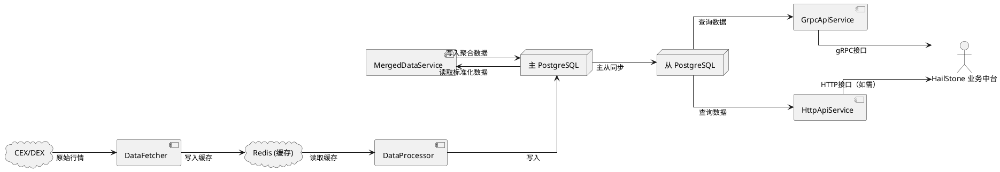
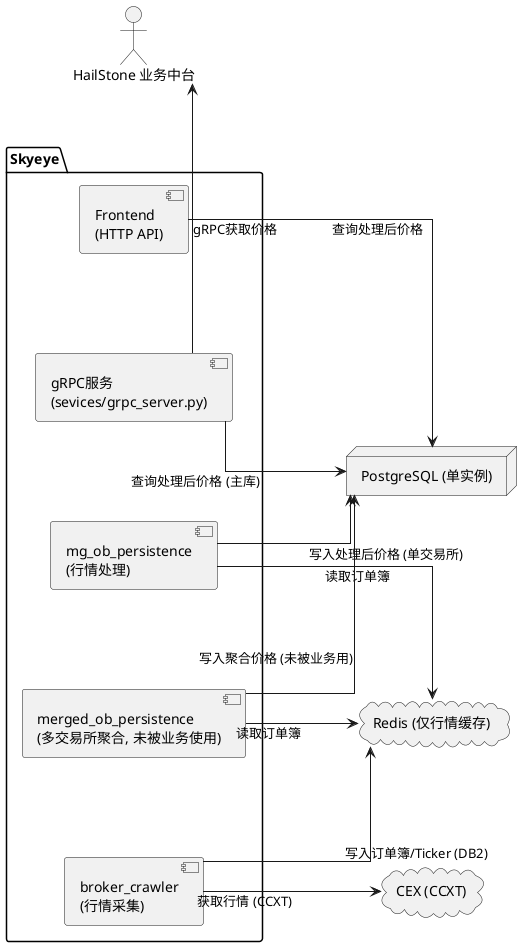
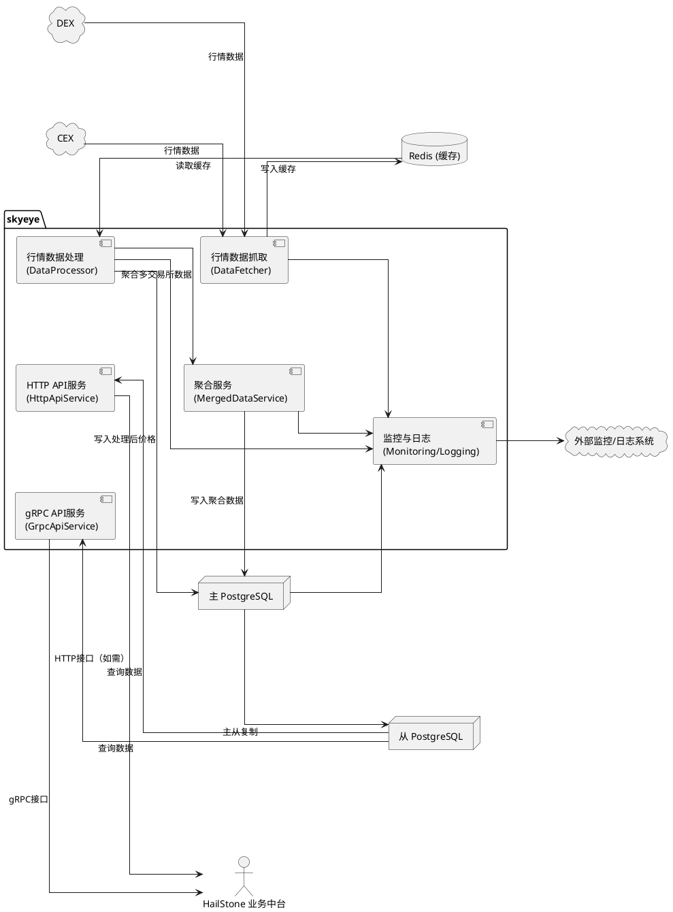

# SkyEye 一期技术设计文档

## 1. 引言 (Introduction)
### 1.1. 项目背景与目标 (Project Background and Goals)
### 1.2. 文档目的 (Purpose of this Document)
为SkyEye一期提供详细的技术设计规格。

### 1.3. 范围 (Scope of Phase 1)
#### 1.3.1. 核心数据指标
*   当前价格 (Price)
*   24小时涨跌幅 (%)
*   7天涨跌幅 (%)
*   30天涨跌幅 (%)
*   季度 (90天) 涨跌幅 (%)
*   年度 (365天) 涨跌幅 (%)
*   24小时交易量 (Volume)
*   流通市值 (Circulating Market Cap)
*   全稀释市值 (Fully Diluted Market Cap)

#### 1.3.2. K线数据周期
*   1分钟 (1m)
*   30分钟 (30m)
*   1小时 (1h)
*   1天 (1d)
*   1周 (1w)
*   1个月 (1mo)
*   3个月 (3mo)
*   12个月 (12mo)

#### 1.3.3. CEX (中心化交易所) 接入
*   一期计划接入2-3个核心CEX，例如：Binance、okx。
*   系统设计应具备良好的可扩展性，方便后续接入更多CEX。

#### 1.3.4. DEX (去中心化交易所) 接入公链及目标
*   **Ethereum**: 支持一个主流DEX，Uniswap V2/V3
*   **BNB Chain (BSC)**: 支持一个主流DEX， PancakeSwap V2/V3
*   **Tron**: 支持一个主流DEX，OpenOcean
*   **Solana**: 支持一个主流DEX，Jupiter
*   **TON**: 支持一个主流DEX，Ston.fi
*   **Sui**: 支持一个主流DEX，Cetus
*   **Aptos**: 支持一个主流DEX， PancakeSwap (Aptos)
*   注：具体DEX的选择可能根据调研结果调整，但每条链支持一个为一期目标。

#### 1.3.5. API 服务
*   提供HTTP API，用于查询指定市场的K线数据 (支持所有周期)。
*   提供HTTP API，用于查询指定资产的核心数据指标。
*   提供gPRC

### 1.4. 设计原则 (Design Principles)
### 1.5. 术语与定义 (Glossary)

## 2. 系统架构 (System Architecture)
### 2.1. 总体架构图 (Overall Architecture Diagram)
### 2.2. 核心组件职责 (Core Component Responsibilities)

| 组件名称                | 职责描述                                                                 | 主要输入/输出                        | 关键依赖                | 未来演进方向                         |
|-----------------------|-----------------------------------------------------------------------|--------------------------------------|------------------------|--------------------------------------|
| DataFetcher           | 从CEX/DEX采集原始行情，写入Redis缓存                                    | 输入：CEX/DEX行情<br>输出：Redis缓存  | CCXT/Web3、Redis        | 支持更多链、更多数据源                |
| DataProcessor         | 从Redis读取原始数据，计算标准化价格，写入主库                          | 输入：Redis缓存<br>输出：主库        | Redis、PostgreSQL       | 引入流式处理、实时计算                |
| MergedDataService     | 聚合多交易所数据，处理交叉盘/锁定盘，输出聚合行情                      | 输入：主库<br>输出：主库聚合表        | PostgreSQL              | 聚合算法优化、支持更多聚合维度        |
| GrpcApiService        | 对外提供gRPC接口，供业务中台等消费                                     | 输入：从库<br>输出：gRPC响应          | PostgreSQL（从库）、proto | 支持更多接口、细粒度权限              |
| HttpApiService        | 对外提供HTTP接口，供外部系统或前端消费                                 | 输入：从库<br>输出：HTTP响应          | PostgreSQL（从库）、Django | RESTful规范、API网关接入              |
| Monitoring/Logging    | 采集全链路运行指标与日志，输出到外部监控系统                           | 输入：各服务日志<br>输出：监控系统    | ELK/Prometheus等         | 智能告警、全链路追踪                  |
| Redis                 | 缓存原始行情数据，支撑高频读写                                         | 输入：DataFetcher<br>输出：Processor | -                      | 引入分布式Redis、持久化策略           |
| PostgreSQL (主/从)    | 存储处理后价格、聚合数据，主从同步支撑高可用                           | 输入：Processor/MergedService<br>输出：API | -                | 分库分表、读写分离、弹性扩容          |
| CEX/DEX               | 外部行情数据源                                                          | 输出：原始行情数据                    | -                      | 支持更多交易所、链上DEX               |

> 注：如需更细粒度，可为每个组件单独分节详细描述。

### 2.3 数据流程图 (Data Flow Diagrams)

> 下图展示了Skyeye主流程的数据流转链路，从行情采集到API服务对外输出的全链路。



> 说明：
> - 主流程为"行情采集→缓存→处理→入库→聚合→主从同步→API服务→业务消费"。
> - 详细业务语义见上文表格与说明。

### 2.x 现状增强版系统架构图

> 说明：本图基于 skyeye_analysis.md 及澄清问卷整理，反映当前Skyeye系统真实结构。



### 2.x 目标演进版系统架构图

> 说明：本图基于 skyeye_market_data_monitoring_prd.md 及一期目标设计，体现主从库、API分层、聚合数据、日志监控等目标特性。



> 主要差异点与演进建议：
> - **主从库分离**：目标架构引入主从PostgreSQL，API服务全部查从库，提升读写性能与高可用性。
> - **API分层**：gRPC/HTTP API服务独立，支持多种消费方式，便于后续扩展。
> - **聚合数据服务**：聚合多交易所数据成为标准流程，聚合结果可被业务直接消费。
> - **监控与日志**：全链路接入监控与日志系统，便于运维和故障追踪。
> - **DEX支持**：数据抓取层支持CEX与DEX，便于后续多链扩展。
> - **外部依赖**：HailStone业务中台可通过gRPC/HTTP灵活接入。
> 
> **演进优先级建议：**
> 1. 先实现主从库部署与API查从库，提升系统可用性。
> 2. 推动聚合数据服务标准化，逐步让业务消费聚合结果。
> 3. 引入监控与日志系统，完善运维体系。
> 4. 逐步扩展DEX数据抓取与处理能力。
> 5. API分层与接口规范化，便于多端对接。

## 3. 数据库设计 (Database Design)
### 3.1. 设计概述与参考
本章节详细描述SkyEye一期项目的核心数据表结构。设计参考了项目现有的 `skyeye_database_schema.md` 文档，力求在满足新功能需求的同时，保持与现有系统逻辑的兼容性和一致性（如命名约定、核心概念等）。所有表默认包含 `created_at` 和 `updated_at` 字段 (可由ORM基类提供)。

### 3.2. `assets` (资产/币种表)
存储资产（如BTC, ETH, USDT）的元数据信息。

**原有概念字段 (Fields with concepts from the original `exchange.Asset` table):**
*   `id`: SERIAL PRIMARY KEY
*   `name`: VARCHAR(100) (资产全名, e.g., "Bitcoin", "Ethereum", 可选)
*   `decimals`: INTEGER (资产精度。**对应原 `exchange.Asset.unit` 字段功能**)
*   `status`: VARCHAR(20) DEFAULT 'Active' NOT NULL (e.g., 'Active', 'Delisted') (资产状态)
*   `is_stablecoin`: BOOLEAN NOT NULL DEFAULT FALSE (是否为稳定币 - **对应并取代原 `exchange.Asset.is_stable` 字段功能，使用布尔类型**)

**新增字段 (Newly added fields for Phase 1):**
*   `symbol`: VARCHAR(50) NOT NULL (标准化的、人类可读的唯一资产代码, e.g., "BTC", "ETH", "USDT") **(新增字段)**
*   `chain_name`: VARCHAR(50) (资产归属的链, e.g., "ethereum" for ERC20 USDT, "tron" for TRC20 USDT) **(新增字段)**
*   `contract_address`: VARCHAR(255) (链上资产的合约地址) **(新增字段)**
*   `circulating_supply`: DECIMAL(38, 18) (流通供应量) **(新增字段)**
*   `total_supply`: DECIMAL(38, 18) (总供应量) **(新增字段)**
*   `max_supply`: DECIMAL(38, 18) (最大供应量, 可选) **(新增字段)**
*   `supply_data_source`: VARCHAR(100) (供应量数据来源, e.g., "CoinGecko API", "CoinMarketCap API", "On-chain Query", "Manual") **(新增字段)**
*   `supply_last_updated`: TIMESTAMPTZ (供应量数据最后更新时间) **(新增字段)**
*   `logo_url`: VARCHAR(255) (资产Logo图片的URL, 可选) **(新增字段)**
*   `meta_data`: JSONB (其他元数据，如项目官网、白皮书链接等) **(新增字段)**

**唯一性规则 (Uniqueness Rules):**
*   对于通过智能合约发行的代币（`contract_address` 不为 NULL），其在表中的唯一性主要由 `chain_name` 和 `contract_address` 的组合保证。
*   对于区块链平台的原生币（`contract_address` 为 NULL），其在表中的唯一性由 `symbol` 和 `chain_name` 的组合保证。
*   请注意，`symbol` 字段本身，即使在同一 `chain_name` 内，也可能因为不同合约使用相同符号而出现重复。本表旨在区分每一个唯一的链上资产。
*   数据库层面将通过适当的约束机制来强制执行这些唯一性规则，以确保数据的完整性和准确性。具体而言，可以考虑使用条件唯一索引 (Partial Unique Indexes)，例如：
    *   针对代币（`contract_address IS NOT NULL`）：创建一个唯一索引作用于 (`chain_name`, `contract_address`)。
    *   针对原生币（`contract_address IS NULL`）：创建一个唯一索引作用于 (`chain_name`, `symbol`)。

**变更摘要：**
此表是对原有 `exchange.Asset` 表 (定义于 `skyeye_database_schema.md`) 的核心重构和功能扩展。
*   **核心概念的保留与调整**：
    *   `name` 字段用于存储资产的**全名** (e.g., "Bitcoin")，这是一个核心的资产描述信息。
    *   `decimals` 字段（资产精度）的功能对应原 `exchange.Asset.unit`。
    *   `status` 字段（资产状态）保留了其核心功能。
*   **新增的核心字段与功能分离**：
    *   引入了新的 `symbol` 字段，专门用于存储标准化的、人类可读的资产**代码/简称** (e.g., "BTC", "ETH")。这明确区分了资产代码与其完整名称。
    *   原 `exchange.Asset.name` 字段在旧表中实际存储的是资产代码，其功能由新的 `symbol` 字段承接。
*   **其他新增字段**：
    *   引入了 is_stablecoin: BOOLEAN 字段，直接对应并使用布尔类型取代了原 exchange.Asset.is_stable 字段（该字段原使用 'Yes'/'No' 字符串）的功能，用于明确标识资产是否为稳定币。
    *   其他新增字段包括：`chain_name` (资产归属链), `contract_address` (链上合约地址), `circulating_supply` (流通供应量), `total_supply` (总供应量), `max_supply` (最大供应量), `supply_data_source` (供应量数据来源), `supply_last_updated` (供应量数据更新时间), `logo_url` (Logo链接), `meta_data` (通用元数据存储，可用于白皮书链接、官网等)。

### 3.3. `exchanges` (交易所/交易平台表)
存储交易所或DEX平台的基础信息。此表是对原有 `exchange.Exchange` 表的扩展和重构。

**原有概念字段 (Fields with concepts from the original `exchange.Exchange` table):**
*   `id`: SERIAL PRIMARY KEY
*   `name`: VARCHAR(100) NOT NULL UNIQUE (交易所/平台全名, e.g., "Binance", "Uniswap V3 Ethereum")
*   `type`: VARCHAR(10) NOT NULL (交易所类型，例如: 'CEX', 'DEX'。**对应原 `exchange.Exchange.market_type` 字段功能**)
*   `status`: VARCHAR(20) DEFAULT 'Active' NOT NULL (交易所状态，例如: 'Active', 'Inactive')
*   `meta_data`: JSONB (其他特定配置, 如DEX的Factory/Router地址、CEX的API限频或特殊参数。**扩展并修改自原 `exchange.Exchange.config` 字段功能，以支持更丰富的配置信息**)

**新增字段 (Newly added fields for Phase 1):**
*   `slug`: VARCHAR(50) NOT NULL UNIQUE (用于内部代码引用和`market_identifier`构建的唯一简称, e.g., "binance", "uniswap_v3_ethereum") **(新增字段)**
*   `base_api_url`: VARCHAR(255) (CEX的API基地址, 可选) **(新增字段)**
*   `chain_name`: VARCHAR(50) (DEX平台所在的链, e.g., "ethereum", "bsc", "solana", 可选) **(新增字段)**
*   `logo_url`: VARCHAR(255) (交易所Logo图片的URL, 可选) **(新增字段)**

**变更摘要：**
此表是对原有 `exchange.Exchange` 表 (定义于 `skyeye_database_schema.md`) 的核心重构和功能扩展。
*   **原有概念的保留与调整**：
    *   `name` (交易所/平台全名)、`status` (状态) 字段保留了其在旧表中的核心定义与用途。
    *   `type` (交易所类型) 字段对应原 `exchange.Exchange.market_type` 的功能。
    *   `meta_data` 字段扩展并修改了原 `exchange.Exchange.config` 的功能，用以支持更丰富和结构化的配置信息，例如DEX的Factory/Router地址、CEX的API特殊参数等。
*   **主要新增的字段包括**：
    *   `slug`: 用于内部代码引用的唯一简称。
    *   `base_api_url`: CEX的API基础地址。
    *   `chain_name`: DEX平台所属的区块链名称。
    *   `logo_url`: 交易所的Logo链接。

### 3.4. `trading_pairs` (通用交易对定义表) **(核心重构自 `exchange.Symbol` 表)**
定义可交易的资产对，不特定于某个交易所。此表是对原有 `exchange.Symbol` 表的核心重构和关注点分离。

**源自 `exchange.Symbol` 的概念字段 (Fields with concepts from the original `exchange.Symbol` table):**
*   `id`: SERIAL PRIMARY KEY (对应原 `exchange.Symbol.id`)
*   `base_asset_id`: INTEGER NOT NULL REFERENCES `assets(id)` (对应原 `exchange.Symbol.base_asset` 外键)
*   `quote_asset_id`: INTEGER NOT NULL REFERENCES `assets(id)` (对应原 `exchange.Symbol.quote_asset` 外键)
*   `symbol_display`: VARCHAR(100) (用于UI展示的交易对符号, e.g., "BTC/USDT". **对应原 `exchange.Symbol.name` 字段功能**)
*   `status`: VARCHAR(20) DEFAULT 'Active' NOT NULL (e.g., 'Active', 'Delisted'. **对应原 `exchange.Symbol.status` 字段功能**)
*   `category`: VARCHAR(20) DEFAULT 'Spot' NOT NULL (e.g., 'Spot', 'Perpetual'. **对应原 `exchange.Symbol.category` 字段功能**)
*   `CONSTRAINT uq_trading_pair_base_quote_category UNIQUE (base_asset_id, quote_asset_id, category)` (基于原有概念设定的新约束)

**变更摘要：**
此表是对原有 `exchange.Symbol` 表的核心重构，旨在将通用交易对的定义（本表）与该交易对在具体交易所的上市情况（由 `markets` 表处理）分离开来。
*   **所有核心字段均源自 `exchange.Symbol` 表的概念**:
    *   `id` 对应原 `id`。
    *   `base_asset_id` 和 `quote_asset_id` 分别对应原 `base_asset` 和 `quote_asset` 外键。
    *   `symbol_display` 用于展示交易对名称，功能上对应原 `name` 字段。
    *   `status` 和 `category` 字段保留了其在原表中的核心定义与用途。
*   **结构性变化**：
    *   原 `exchange.Symbol` 表中通过 `exchanges` (ManyToManyField) 与 `Exchange` 表的关联，在新设计中由独立的 `markets` 表来体现。`trading_pairs` 表本身不再直接关联交易所。
    *   新增了唯一约束 `uq_trading_pair_base_quote_category` 以确保交易对在其类别内的唯一性。

### 3.5. `markets` (具体市场/上架交易对表) **(核心重构，取代原ExchangeSymbolShip并扩展功能)**
表示在特定交易所实际交易的交易对实例。此表是原有 `exchange.Symbol` 与 `exchange.Exchange` 之间多对多关系的具体化（取代了 `ExchangeSymbolShip` 表），并承接了部分原 `exchange.Symbol` 的市场特定属性。

**原有概念字段 (Fields with concepts from original `exchange.Symbol` and its linkage to `exchange.Exchange`, including `ExchangeSymbolShip`):**
*   `id`: SERIAL PRIMARY KEY (作为此市场记录的主键，**概念上对应原 `ExchangeSymbolShip.id`**)
*   `exchange_id`: INTEGER NOT NULL REFERENCES `exchanges(id)` (关联到交易所，**概念上承接原 `ExchangeSymbolShip.exchange_id` 的关联**)
*   `trading_pair_id`: INTEGER NOT NULL REFERENCES `trading_pairs(id)` (关联到通用交易对，**概念上承接原 `ExchangeSymbolShip.symbol_id` 的关联**)
*   `external_symbol_api`: VARCHAR(50) (该市场在交易所API中使用的原始符号, e.g., "BTCUSDT" for Binance. **功能上主要对应原 `exchange.Symbol.name` 在实际使用中存储的交易所原始符号**)
*   `status`: VARCHAR(20) DEFAULT 'Active' NOT NULL (e.g., 'Active', 'Inactive', 'Suspended'. **表示此市场（交易对在特定交易所的上市）的状态，概念上对应并细化了原 `exchange.Symbol.status`**)

**新增字段 (Newly added fields for Phase 1):**
*   `market_identifier`: VARCHAR(150) NOT NULL UNIQUE (系统全局唯一的市场ID, e.g., "binance_spot_btc_usdt") **(新增字段)**
*   `precision_price`: INTEGER (价格显示精度的小数位数, 可选) **(新增字段)**
*   `precision_amount`: INTEGER (数量显示精度的小数位数, 可选) **(新增字段)**
*   `min_trade_size_base`: DECIMAL(38,18) (最小下单量 - 基础资产，可选) **(新增字段)**
*   `min_trade_size_quote`: DECIMAL(38,18) (最小下单额 - 计价资产，可选) **(新增字段)**
*   `meta_data`: JSONB (DEX交易对合约地址、CEX特定的费率层级、上架时间等。**用于存储此特定市场的扩展配置信息**) **(新增字段)**
*   `CONSTRAINT uq_market_exchange_trading_pair UNIQUE (exchange_id, trading_pair_id)`

**变更摘要：**
此表用于表示特定交易所上的具体交易对实例（即一个"市场"），它取代了原有的 `ExchangeSymbolShip` 表，并整合及扩展了相关功能。
*   **核心关联与原有概念的承接 (源自 `ExchangeSymbolShip` 和 `exchange.Symbol`)**:
    *   `id` 作为主键，概念上对应原 `ExchangeSymbolShip.id`。
    *   `exchange_id` 和 `trading_pair_id` 共同定义了市场，其组合唯一性通过 `uq_market_exchange_trading_pair` 约束保证，这承接了原 `ExchangeSymbolShip` 的核心关联功能 (对应其 `exchange_id` 和 `symbol_id` 外键)。
    *   `external_symbol_api` 字段的功能对应原 `exchange.Symbol.name` 在很多情况下实际存储的交易所API符号。
    *   `status` 字段表示此特定市场（上市）的状态，概念上继承并细化了原 `exchange.Symbol.status`。
*   **主要新增的字段与功能增强**：
    *   `market_identifier` 是为系统引入的全局唯一市场标识符。
    *   `precision_price` (价格精度), `precision_amount` (数量精度), `min_trade_size_base` (最小下单量 - 基础资产), `min_trade_size_quote` (最小下单额 - 计价资产) 均为新增的、用于描述市场具体交易规则的字段。
    *   `meta_data` 字段用于存储更丰富的市场特定配置，如DEX的交易对合约地址、CEX的特定费率信息或上架时间等，是对原有简单配置的扩展。

### 3.6. `klines` (K线数据表) **(新增表)**
存储各市场、各周期的K线数据。

**表字段:**
*   `id`: BIGSERIAL PRIMARY KEY (K线记录主键，使用BIGSERIAL以应对大量数据)
*   `market_identifier`: VARCHAR(150) NOT NULL (关联到 `markets.market_identifier`, 有索引, 用于唯一识别K线所属的市场)
*   `interval`: VARCHAR(10) NOT NULL (K线周期, e.g., "1m", "30m", "1h", "1d", "1w", "1mo", "3mo", "12mo")
*   `open_time`: TIMESTAMPTZ NOT NULL (K线开盘时间, UTC)
*   `open_price`: DECIMAL(38, 18) NOT NULL
*   `high_price`: DECIMAL(38, 18) NOT NULL
*   `low_price`: DECIMAL(38, 18) NOT NULL
*   `close_price`: DECIMAL(38, 18) NOT NULL
*   `volume`: DECIMAL(38, 18) NOT NULL (以基础资产计价的交易量)
*   `quote_volume`: DECIMAL(38, 18) (以计价资产计价的交易量, 可选)
*   `trade_count`: INTEGER (成交笔数, 可选)
*   `is_final`: BOOLEAN DEFAULT FALSE (对于非完整周期的K线，标记其是否已完结, 一期可默认为TRUE)
*   `CONSTRAINT uq_kline_market_interval_opentime UNIQUE (market_identifier, interval, open_time)` (唯一约束)
*   (建议索引: `(market_identifier, interval, open_time DESC)`)

**变更摘要：**
此表是新增表，用于存储各市场、各周期的K线数据。设计上通过 `market_identifier` 实现与市场的标准化关联，包含完整的K线数据属性：
*   基础的K线构成元素包括 `id` (主键), `interval` (周期), `open_time` (开盘时间), OHLC价格数据, 以及交易量信息。
*   使用 `market_identifier` 字段作为K线数据与特定 `markets` 记录的直接关联键，是一种清晰的市场关联方式。
*   包含 `quote_volume` (以计价资产计价的交易量)，提供了更全面的交易量信息。
*   包含 `trade_count` (成交笔数)，为分析提供了更多维度。
*   包含 `is_final` 标志位，用于区分已完成周期的K线和当前周期尚未结束的K线。
*   唯一约束 `uq_kline_market_interval_opentime` 确保在 `market_identifier`、`interval` 和 `open_time` 组合下的数据唯一性。

### 3.7. `asset_metrics` (资产核心指标表) **(新增表)**
存储计算后的资产核心市场指标。
*   `id`: SERIAL PRIMARY KEY
*   `asset_id`: INTEGER NOT NULL REFERENCES `assets(id)`
*   `reference_market_identifier`: VARCHAR(150) (可选, 指示计算该指标所主要参考的`markets.market_identifier`, e.g., BTC价格可能参考 `binance_spot_btc_usdt`)
*   `current_price`: DECIMAL(38, 18)
*   `price_24h_ago`: DECIMAL(38, 18)
*   `price_7d_ago`: DECIMAL(38, 18)
*   `price_30d_ago`: DECIMAL(38, 18)
*   `price_90d_ago`: DECIMAL(38, 18) (季度)
*   `price_365d_ago`: DECIMAL(38, 18) (年度)
*   `volume_24h`: DECIMAL(38, 18) (24小时总交易量，可能需要聚合多个市场)
*   `circulating_market_cap`: DECIMAL(38, 18)
*   `fully_diluted_market_cap`: DECIMAL(38, 18)
*   `price_change_percentage_24h`: DECIMAL(10, 4) (%)
*   `price_change_percentage_7d`: DECIMAL(10, 4) (%)
*   `price_change_percentage_30d`: DECIMAL(10, 4) (%)
*   `price_change_percentage_90d`: DECIMAL(10, 4) (%)
*   `price_change_percentage_365d`: DECIMAL(10, 4) (%)
*   `last_updated`: TIMESTAMPTZ
*   `metrics_data_sources`: JSONB (可选, 存储各项核心指标的具体数据来源, 例如: {"current_price": "ticker_redis", "volume_24h": "cmc_api", "price_change_percentage_7d": "kline_calculated"})
*   `CONSTRAINT uq_asset_metrics_asset_ref_market UNIQUE (asset_id, reference_market_identifier)`

**变更摘要：**
此为 **(新增表)**，用于存储资产的核心市场指标，所有字段均为新设计。
*   新增 `metrics_data_sources` (JSONB) 字段，用于详细记录每个计算指标（如当前价格、24小时交易量、各周期价格涨跌幅等）的具体数据来源。这增强了数据的透明度和可追溯性，允许系统根据配置和数据可用性灵活选择指标的计算方法（例如，来源于实时Ticker、第三方API预计算值，或内部K线聚合计算）。

### 3.8. 可选原始数据表 (`raw_cex_trades`, `raw_dex_swaps`) **(可选表，统一市场关联)**
这些表用于存储从CEX获取的原始成交记录和DEX的原始Swap事件，主要用于调试、数据回补和复杂分析。虽为可选表，但对数据溯源和问题排查非常有价值。

#### 3.8.1. `raw_cex_trades` (CEX原始成交记录表) **(可选表)**
存储从中心化交易所API获取的原始成交数据。

**表字段:**
*   `id`: BIGSERIAL PRIMARY KEY
*   `market_identifier`: VARCHAR(150) NOT NULL REFERENCES `markets(market_identifier)` (关联到对应市场)
*   `exchange_id`: INTEGER NOT NULL REFERENCES `exchanges(id)` (冗余存储，便于查询)
*   `external_symbol_api`: VARCHAR(50) NOT NULL (交易所原始交易对符号，如"BTCUSDT")
*   `external_trade_id`: VARCHAR(100) (交易所提供的唯一成交ID，可能为字符串)
*   `price`: DECIMAL(38, 18) NOT NULL (成交价格)
*   `amount`: DECIMAL(38, 18) NOT NULL (成交数量，基础资产)
*   `trade_time`: TIMESTAMPTZ NOT NULL (成交时间)
*   `side`: VARCHAR(10) (买/卖方向，如"buy"/"sell"，如有)
*   `is_taker`: BOOLEAN (是否为taker成交，如有)
*   `fee`: DECIMAL(38, 18) (手续费，如有)
*   `fee_asset`: VARCHAR(20) (手续费资产，如有)
*   `raw_data`: JSONB (完整的原始JSON响应，用于保留所有可能有用的额外字段)
*   `CONSTRAINT uq_raw_cex_trade UNIQUE (market_identifier, exchange_id, external_trade_id, trade_time)` (确保成交记录唯一性)
*   (建议索引: `(market_identifier, trade_time DESC)`)

#### 3.8.2. `raw_dex_swaps` (DEX原始Swap事件表) **(可选表)**
存储从区块链获取的DEX交易对Swap事件原始数据。

**表字段:**
*   `id`: BIGSERIAL PRIMARY KEY
*   `market_identifier`: VARCHAR(150) NOT NULL REFERENCES `markets(market_identifier)` (关联到对应市场)
*   `exchange_id`: INTEGER NOT NULL REFERENCES `exchanges(id)` (冗余存储，便于查询)
*   `chain_name`: VARCHAR(50) NOT NULL (区块链名称，如"ethereum", "bsc")
*   `pair_address`: VARCHAR(66) NOT NULL (DEX交易对合约地址，如Uniswap Pair地址)
*   `tx_hash`: VARCHAR(66) NOT NULL (交易哈希)
*   `block_number`: BIGINT NOT NULL (区块高度)
*   `block_time`: TIMESTAMPTZ NOT NULL (区块时间)
*   `event_index`: INTEGER (事件在交易中的索引位置)
*   `amount0_in`: DECIMAL(38, 18) (交易对token0的输入量)
*   `amount1_in`: DECIMAL(38, 18) (交易对token1的输入量)
*   `amount0_out`: DECIMAL(38, 18) (交易对token0的输出量)
*   `amount1_out`: DECIMAL(38, 18) (交易对token1的输出量)
*   `sender`: VARCHAR(66) (发送者地址)
*   `to`: VARCHAR(66) (接收者地址)
*   `calculated_price`: DECIMAL(38, 18) (根据输入输出计算的价格，按基础/计价资产的顺序)
*   `calculated_amount`: DECIMAL(38, 18) (按基础资产计算的交易量)
*   `protocol_fee`: DECIMAL(38, 18) (协议费用，如有)
*   `lp_fee`: DECIMAL(38, 18) (流动性提供者费用，如有)
*   `raw_data`: JSONB (完整的原始事件数据，可包含特定DEX独有字段)
*   `CONSTRAINT uq_raw_dex_swap UNIQUE (chain_name, tx_hash, event_index)` (确保事件记录唯一性)
*   (建议索引: `(market_identifier, block_time DESC)`, `(tx_hash)`)

**变更摘要：**
这些可选表为系统提供了重要的原始数据存储能力:

1. **数据完整性与溯源**:
   * 保存完整的原始数据，包括交易所返回的所有字段和区块链事件的完整细节
   * 通过`raw_data` JSONB字段灵活存储不同交易所和DEX特有的数据结构

2. **统一关联方式**:
   * 主要通过`market_identifier`与其他表关联，保持一致的数据关系模型
   * 同时保留传统的`exchange_id`加交易所特定标识符的关联方式作为备选

3. **用途**:
   * 数据调试和问题排查
   * 历史数据回填和修复
   * 高级分析和研究
   * K线数据验证和审计

4. **实现考量**:
   * 推荐实现表分区以管理潜在的大量数据
   * 可考虑更严格的数据保留策略(如只保留最近30天数据)
   * 建议为高频查询模式创建适当索引

### 3.9. 数据库扩展性考虑
为确保SkyEye系统在数据量快速增长的情况下保持高性能和可靠性，我们设计了以下数据库扩展策略：

#### 3.9.1. 表分区策略
对于预计数据量大的表，特别是`klines`表，采用表分区技术：

*   **推荐策略：组合分区 (Composite Partitioning)**
    *   **第一级：时间范围分区 (Range Partitioning)**
        *   基于 `open_time` 字段进行 **月度分区**。
        *   分区命名方式: `klines_YYYY_MM`。
        *   查询时可以通过分区裁剪(Partition Pruning)大幅提高性能。
        *   旧数据分区可以轻松归档或独立管理。
    *   **第二级：时间间隔分区 (List Partitioning)**
        *   在每个时间范围分区内，基于 `interval` 字段进行列表分区。
        *   因为 `interval` 的值数量有限且固定 (e.g., '1m', '30m', '1h', '1d'...)，管理复杂度可控。
        *   分区命名方式: `klines_YYYY_MM_1m`, `klines_YYYY_MM_1h` 等。
        *   这种组合策略能更精细地优化查询，并有效隔离不同周期的数据。

*   **（可选，但不推荐）其他分区方式**：虽然 PostgreSQL 支持列表分区（如按 `market_identifier` 的热门市场）或哈希分区，但对于 `klines` 表，按时间范围+时间间隔的组合分区是兼顾性能、管理和灵活性的最佳实践。

#### 3.9.2. 主从复制与读写分离
*   **读写分离架构**:
    *   配置一个主数据库节点(Master)负责所有写操作
    *   配置多个从数据库节点(Slave)处理读请求
    *   通过应用层路由或代理层(如PgBouncer)实现请求分发
*   **延迟考量**:
    *   主从复制存在一定延迟，API服务需考虑数据最终一致性的场景
    *   对于实时性要求高的查询，可直接路由至主节点

#### 3.9.3. 索引优化策略
*   **为`klines`表创建必要的复合索引**: (需要在每个最底层分区上创建)
    *   推荐：`(market_identifier, interval, open_time DESC)` - 用于时间序列查询。
    *   索引应创建在每个物理分区上。
*   **为`asset_metrics`表创建索引**: (如果该表数据量大)
    *   `(asset_id, last_updated DESC)` - 用于检索最新指标。

#### 3.9.4. 数据归档与清理策略
*   **数据保留策略**: (基于分区进行)
    *   低频K线(1d及以上) - 考虑永久保留或长期保留。
    *   高频K线(1h及以下) - 根据重要性和存储成本制定保留期 (例如，保留最近N个月)。
*   **自动归档/清理流程**: (基于分区操作)
    *   实现定期任务 `DETACH PARTITION` 或 `DROP TABLE` 过期的分区。
    *   操作分区比在大表中 `DELETE` 数据高效得多。

#### 3.9.5. 容量规划
*   **数据增长估算**: (基于分区大小估算)
    *   K线数据: 根据支持的市场数量、周期种类及历史长度评估单个分区的增长率。
    *   按一期支持的交易所和交易对数量（按50对/交易所计，约500个市场），每日K线总增量估算约为 **76万行** (主要由1m/30m/1h/1d贡献)。月度分区规模预计在 **2300万行** 左右。
    *   **远期扩展考虑**：若未来市场数量增长100倍（达5万级别），月度分区数据量可能达到 **23亿行**。这在强大的硬件和优化的分区/索引策略下，PostgreSQL理论上仍可管理，但对维护和查询性能是巨大挑战，届时可能需考虑分布式方案（如Citus/TimescaleDB）或更激进的数据生命周期管理。
*   **存储规划**: (按分区进行)
    *   考虑至少3年数据增长的存储需求，规划分区存储。
    *   制定适当的数据库和分区存储扩容计划。

#### 3.9.6. 典型实现示例
以下提供组合分区策略的实际实现示例 (PostgreSQL)。

##### 表分区实现示例 (PostgreSQL - 时间范围 + 时间间隔)

```sql
-- 1. 创建分区主表 (定义两级分区键)
CREATE TABLE klines (
    id BIGSERIAL NOT NULL,
    market_identifier VARCHAR(150) NOT NULL,
    interval VARCHAR(10) NOT NULL,
    open_time TIMESTAMPTZ NOT NULL,
    open_price DECIMAL(38, 18) NOT NULL,
    high_price DECIMAL(38, 18) NOT NULL,
    low_price DECIMAL(38, 18) NOT NULL,
    close_price DECIMAL(38, 18) NOT NULL,
    volume DECIMAL(38, 18) NOT NULL,
    quote_volume DECIMAL(38, 18),
    trade_count INTEGER,
    is_final BOOLEAN DEFAULT FALSE,
    created_at TIMESTAMPTZ DEFAULT now(),
    updated_at TIMESTAMPTZ DEFAULT now()
    -- 主键/唯一约束需要包含所有分区键
    -- CONSTRAINT pk_klines PRIMARY KEY (open_time, interval, market_identifier, id) -- 示例
    -- CONSTRAINT uq_kline_market UNIQUE (market_identifier, interval, open_time)
) PARTITION BY RANGE (open_time);

-- 2. 创建第一级分区（按月）
CREATE TABLE klines_2024_06 PARTITION OF klines
    FOR VALUES FROM ('2024-06-01') TO ('2024-07-01')
    PARTITION BY LIST (interval); -- 指定此分区将按interval进行二级分区

CREATE TABLE klines_2024_07 PARTITION OF klines
    FOR VALUES FROM ('2024-07-01') TO ('2024-08-01')
    PARTITION BY LIST (interval);

-- 3. 创建第二级分区（在月分区内按interval）
-- 为 klines_2024_06 创建子分区
CREATE TABLE klines_2024_06_1m PARTITION OF klines_2024_06 FOR VALUES IN ('1m');
CREATE TABLE klines_2024_06_30m PARTITION OF klines_2024_06 FOR VALUES IN ('30m');
CREATE TABLE klines_2024_06_1h PARTITION OF klines_2024_06 FOR VALUES IN ('1h');
CREATE TABLE klines_2024_06_1d PARTITION OF klines_2024_06 FOR VALUES IN ('1d');
CREATE TABLE klines_2024_06_1w PARTITION OF klines_2024_06 FOR VALUES IN ('1w');
CREATE TABLE klines_2024_06_1mo PARTITION OF klines_2024_06 FOR VALUES IN ('1mo');
CREATE TABLE klines_2024_06_3mo PARTITION OF klines_2024_06 FOR VALUES IN ('3mo');
CREATE TABLE klines_2024_06_12mo PARTITION OF klines_2024_06 FOR VALUES IN ('12mo');

-- 为 klines_2024_07 创建子分区 (类似地为每个月创建)
CREATE TABLE klines_2024_07_1m PARTITION OF klines_2024_07 FOR VALUES IN ('1m');
-- ... 其他 interval 分区 ...

-- 4. 在每个最底层分区上创建索引 (示例)
CREATE INDEX idx_klines_2024_06_1m_market_time ON klines_2024_06_1m (market_identifier, open_time DESC);
CREATE INDEX idx_klines_2024_06_1h_market_time ON klines_2024_06_1h (market_identifier, open_time DESC);
-- ... 为所有最底层分区创建索引 ...

-- 5. 自动创建分区的函数 (需要扩展以支持两级分区创建)
-- (自动创建函数的逻辑会更复杂，需要同时处理月分区和内部的interval分区)
-- (此处省略复杂函数示例，实际应用中需要仔细编写和测试)
```

##### PostgreSQL主从复制配置示例

**主服务器配置** (`postgresql.conf`):

```
# 开启WAL归档模式
wal_level = replica
max_wal_senders = 10                # 支持的最大WAL发送进程数
max_replication_slots = 10          # 支持的最大复制槽数
wal_keep_segments = 64              # 保留的WAL文件数
hot_standby = on                    # 允许从库接受只读查询
```

**主服务器认证配置** (`pg_hba.conf`):

```
# 允许从服务器进行复制连接
host    replication     repl_user      10.0.0.0/24          md5
```

**主服务器上创建复制用户**:

```sql
CREATE ROLE repl_user WITH REPLICATION LOGIN PASSWORD 'secure_password';
CREATE REPLICATION SLOT slave1 PERMANENT;
```

**从服务器恢复配置** (`recovery.conf` 或 PostgreSQL 12+中的 `postgresql.conf`):

```
# 对于PostgreSQL 12+
primary_conninfo = 'host=master_host port=5432 user=repl_user password=secure_password'
primary_slot_name = 'slave1'
recovery_target_timeline = 'latest'
hot_standby = on
```

**从服务器初始化命令**:

```bash
# 停止从服务器
pg_ctl -D /path/to/slave/data stop -m fast

# 备份主服务器数据（使用pg_basebackup）
pg_basebackup -h master_host -D /path/to/slave/data -U repl_user -P -v -X stream -C -S slave1

# 启动从服务器
pg_ctl -D /path/to/slave/data start
```

##### 读写分离中间件配置 (PgBouncer)

**PgBouncer配置文件** (`pgbouncer.ini`):

```ini
[databases]
* = host=127.0.0.1 port=5432 dbname=skyeye

[pgbouncer]
listen_port = 6432
listen_addr = *
auth_type = md5
auth_file = /etc/pgbouncer/userlist.txt
pool_mode = transaction
max_client_conn = 1000
default_pool_size = 20
min_pool_size = 5
reserve_pool_size = 10
reserve_pool_timeout = 5.0
log_connections = 1
log_disconnections = 1
application_name_add_host = 1

# 为写操作设置单独的端口
[databases]
skyeye_write = host=master_host port=5432 dbname=skyeye
skyeye_read = host=slave_host port=5432 dbname=skyeye
```

**应用层读写分离逻辑示例** (Python Django配置):

```python
# settings.py
DATABASES = {
    'default': {
        'ENGINE': 'django.db.backends.postgresql',
        'NAME': 'skyeye',
        'USER': 'skyeye_user',
        'PASSWORD': 'password',
        'HOST': 'pgbouncer_host',
        'PORT': '6432',
        'OPTIONS': {'application_name': 'skyeye_app'},
    },
    'reader': {
        'ENGINE': 'django.db.backends.postgresql',
        'NAME': 'skyeye_read',
        'USER': 'skyeye_user',
        'PASSWORD': 'password',
        'HOST': 'pgbouncer_host',
        'PORT': '6432',
        'OPTIONS': {'application_name': 'skyeye_read_app'},
    }
}

# 数据库路由
class ReadReplicaRouter:
    def db_for_read(self, model, **hints):
        """
        将读操作路由到读副本
        """
        return 'reader'

    def db_for_write(self, model, **hints):
        """
        将写操作路由到主库
        """
        return 'default'

    def allow_relation(self, obj1, obj2, **hints):
        """
        允许所有关系
        """
        return True

    def allow_migrate(self, db, app_label, model_name=None, **hints):
        """
        只在主库上执行迁移
        """
        return db == 'default'

# 在settings.py中添加数据库路由
DATABASE_ROUTERS = ['path.to.ReadReplicaRouter']
```

##### 数据归档与清理示例

**创建归档表和归档存储过程**:

```sql
-- 创建归档表结构（与原表结构一致但没有分区）
CREATE TABLE klines_archive (
    id BIGINT NOT NULL,
    market_identifier VARCHAR(150) NOT NULL,
    interval VARCHAR(10) NOT NULL,
    open_time TIMESTAMPTZ NOT NULL,
    open_price DECIMAL(38, 18) NOT NULL,
    high_price DECIMAL(38, 18) NOT NULL,
    low_price DECIMAL(38, 18) NOT NULL,
    close_price DECIMAL(38, 18) NOT NULL,
    volume DECIMAL(38, 18) NOT NULL,
    quote_volume DECIMAL(38, 18),
    trade_count INTEGER,
    is_final BOOLEAN DEFAULT FALSE,
    created_at TIMESTAMPTZ,
    updated_at TIMESTAMPTZ,
    archived_at TIMESTAMPTZ DEFAULT now()
);

-- 按年月对归档表进行分区
CREATE TABLE klines_archive_2023 PARTITION OF klines_archive
    FOR VALUES FROM ('2023-01-01') TO ('2024-01-01');
    
-- 创建归档过程
CREATE OR REPLACE PROCEDURE archive_old_klines(
    archive_before_date DATE,
    intervals_to_archive TEXT[]
)
LANGUAGE plpgsql
AS $$
DECLARE
    archived_count INT;
    partition_name TEXT;
    partition_year TEXT;
    partition_month TEXT;
BEGIN
    -- 检查归档表的分区是否存在
    partition_year := extract(year from archive_before_date)::text;
    
    -- 检查年度归档分区是否存在，不存在则创建
    IF NOT EXISTS (
        SELECT 1 FROM pg_class c JOIN pg_namespace n ON n.oid = c.relnamespace
        WHERE c.relname = 'klines_archive_' || partition_year AND n.nspname = 'public'
    ) THEN
        EXECUTE format(
            'CREATE TABLE klines_archive_%s PARTITION OF klines_archive
             FOR VALUES FROM (%L) TO (%L)',
            partition_year,
            partition_year || '-01-01',
            (partition_year::int + 1) || '-01-01'
        );
    END IF;

    -- 获取要归档的月份分区名称
    partition_month := LPAD(extract(month from archive_before_date)::text, 2, '0');
    partition_name := 'klines_' || partition_year || '_' || partition_month;
    
    -- 记录开始归档的日志
    RAISE NOTICE 'Starting archival of partition % (intervals: %)', 
                 partition_name, intervals_to_archive;
    
    -- 将数据从生产表移至归档表
    EXECUTE format(
        'INSERT INTO klines_archive 
         SELECT *, now() as archived_at FROM %I 
         WHERE interval = ANY($1)',
        partition_name
    ) USING intervals_to_archive;
    
    GET DIAGNOSTICS archived_count = ROW_COUNT;
    RAISE NOTICE 'Archived % rows from partition %', archived_count, partition_name;
    
    -- 从生产表中删除已归档的数据
    EXECUTE format(
        'DELETE FROM %I WHERE interval = ANY($1)',
        partition_name
    ) USING intervals_to_archive;
    
    RAISE NOTICE 'Completed archival process for partition %', partition_name;
END;
$$;

-- 调用示例：归档2023年6月之前的1分钟和5分钟K线
CALL archive_old_klines('2023-06-01', ARRAY['1m', '5m']);
```

##### 数据清理策略实现

```sql
-- 创建自动清理过期高频K线数据的函数
CREATE OR REPLACE FUNCTION cleanup_old_high_frequency_klines()
RETURNS void AS $$
DECLARE
    retention_days_1m INT := 90;  -- 1分钟K线保留90天
    retention_days_5m INT := 180; -- 5分钟K线保留180天
    cutoff_date_1m DATE;
    cutoff_date_5m DATE;
BEGIN
    -- 计算截止日期
    cutoff_date_1m := current_date - retention_days_1m;
    cutoff_date_5m := current_date - retention_days_5m;
    
    -- 清理1分钟K线数据
    EXECUTE format(
        'DELETE FROM klines WHERE interval = ''1m'' AND open_time < %L',
        cutoff_date_1m
    );
    
    -- 清理5分钟K线数据
    EXECUTE format(
        'DELETE FROM klines WHERE interval = ''5m'' AND open_time < %L',
        cutoff_date_5m
    );
    
    -- 记录操作日志
    RAISE NOTICE 'Cleaned up high frequency klines older than: 1m before %, 5m before %',
                 cutoff_date_1m, cutoff_date_5m;
END;
$$ LANGUAGE plpgsql;

-- 在crontab中添加定期运行的任务
-- 0 1 * * 0 psql -U skyeye_user -d skyeye -c "SELECT cleanup_old_high_frequency_klines();"
```

### 3.9.7. 未来演进：专用OLAP引擎考虑

当前设计以 PostgreSQL 配合分区、读写分离等策略为核心，能够有效应对一期及可预见未来的数据增长和查询需求。然而，当系统规模扩展到极致（例如，月度分区数据达到数十亿甚至百亿级别），并且复杂的跨市场分析、实时聚合等OLAP查询场景成为性能瓶颈时，可以考虑引入专用的OLAP数据库引擎作为补充或替代方案。

*   **候选技术**: Apache Doris、ClickHouse 等优秀的开源OLAP数据库在处理海量数据分析方面具有显著优势（如极致的查询性能、高数据压缩率、面向分析的特性）。
*   **可能架构**: 届时可评估采用混合架构，例如：
    *   核心元数据、配置数据以及需要强事务支持的数据保留在 PostgreSQL 中。
    *   海量的 `klines` 数据或经过初步处理的聚合结果同步到 Doris 或 ClickHouse 中，专门用于高性能OLAP查询和分析。
*   **决策依据**: 是否引入以及选择何种OLAP引擎，应基于实际遇到的性能瓶颈、具体的查询负载特征、团队技术栈以及运维成本等因素综合评估。

**结论**：在一期及后续迭代中，应优先充分利用和优化 PostgreSQL 的能力。引入专用OLAP引擎是应对未来极端规模挑战的一个备选演进方向。

## 4. 核心模块与组件详细设计 (Core Modules and Components Design)
### 4.1. 配置服务 (`ConfigService`)
### 4.2. CEX数据采集器 (`CEXDataFetcher`)
**目标与职责**:
*   高效、可靠地从配置的中心化交易所 (CEX) 实时采集 **Trades (逐笔成交)** 和 **Tickers (行情快照)** 数据。
*   将采集到的原始数据进行初步统一化处理后，写入 Redis，作为下游服务（如 `KLineGenerator`, `MetricsCalculator`）的核心数据源。
*   设计为一个独立、可配置、可水平扩展、持久运行的后台服务。

**技术选型**:
*   **语言**: Python 3.12+
*   **核心库**:
    *   `ccxt` (>= 4.x, 强制依赖其 `async_support` 和 `pro` (WebSocket) 功能以实现高性能实时数据采集)
    *   `redis-py` (异步版本, e.g., `redis[hiredis]>=5.0`): 用于与 Redis 高效异步交互。
    *   `asyncio`: Python 内建库，用于构建并发I/O密集型应用。
    *   `Django` (>=4.2): 用于访问数据库中的配置模型（如 `exchanges`, `markets`）和作为管理命令 (`Management Command`) 的运行框架。
    *   `Pydantic` (可选但推荐): 用于定义和校验统一的数据模型，确保数据一致性。
*   **数据存储 (Redis)**:
    *   **Trades (逐笔成交)**: 使用 Redis Streams。
        *   Key 格式: `cex:trades:{market_identifier}` (e.g., `cex:trades:binance_spot_btc_usdt`)。
        *   优点: 支持持久化、消费者组、消息追溯，适合流式处理。
    *   **Tickers (行情快照)**: 使用 Redis Hash 或 JSON (配合 `redis-py` 的 JSON命令)。
        *   Key 格式: `cex:tickers:{market_identifier}` (e.g., `cex:tickers:binance_spot_btc_usdt`)。
        *   设置合理的 TTL (例如 60-180 秒) 以确保数据新鲜度并自动清理过期数据。
*   **配置来源**:
    *   **数据库 (通过 Django ORM)**:
        *   `exchanges` 表: 获取启用的CEX列表、API凭证的引用或安全存储方式的配置（如 Vault 路径）、以及特定交易所的全局参数（如API限速）。
        *   `markets` 表: 获取需要在各交易所采集的交易对列表 (`external_symbol_api`) 及其对应的系统内 `market_identifier`。
    *   **环境变量**: 存储全局服务配置、Redis连接信息、以及API Keys等高度敏感的凭证 (如果不由 Vault 等系统管理)。
    *   **Django Settings**: 存储服务级别参数，如默认轮询间隔、Redis Key 前缀等。

**核心逻辑**:
*   **运行方式**:
    *   实现为一个 Django Management Command (e.g., `python manage.py run_cex_fetcher`)。
    *   内部完全基于 `asyncio` 事件循环运行，以支持大量并发网络连接和任务。
*   **主类 (`CEXDataFetcherService`)**:
    *   **初始化**:
        *   安全地连接到 Redis (支持异步客户端)。
        *   调用 `_load_config` 方法从数据库 (通过 Django ORM 的异步接口如 `sync_to_async` 或异步 ORM 查询) 和环境变量加载配置，构建需要监控的交易所和市场列表。
    *   **交易所客户端管理**:
        *   为每个配置的 CEX 维护一个 `ccxt.pro` 异步客户端实例池（或单个实例，取决于 `ccxt.pro` 的设计模式和资源消耗）。使用 `_get_exchange_client(exchange_slug)` 方法获取或创建客户端，处理认证和初始化参数。
    *   **任务调度**:
        *   为每个配置的交易所启动一个主控的 `asyncio` 任务 (`_run_exchange_tasks(exchange_config)`)。
        *   该主控任务负责管理该交易所下所有市场的数据采集子任务。
*   **数据订阅与获取 (针对每个交易所的任务内)**:
    *   **Trades (逐笔成交)**:
        *   主要通过 `ccxt.pro` 的 `watchTradesForSymbols(symbols)` (如果交易所支持批量订阅) 或循环调用 `watchTrades(symbol)` 方法订阅指定市场列表的实时成交数据。
        *   获取到的每条 Trade 数据进入后续的统一化和存储流程。
    *   **Tickers (行情快照)**:
        *   **能力检测**: 组件在初始化特定交易所的 CCXT 客户端后，将进行能力检测：
            1.  检查 `exchange.has['watchTickers']` (或 `watchTicker` 对单个 symbol) 属性以确定是否支持 WebSocket Ticker 订阅。
            2.  （可选）检查配置文件中对应交易所的 `prefer_websocket_tickers` 设置（默认为 `true`）。
        *   **WebSocket 优先**: 如果交易所支持 WebSocket 订阅 (`exchange.has['watchTickers']` 为 `True` 或支持 `watchTicker` 且 `prefer_websocket_tickers` (如果配置了) 不为 `False`)，则调用 `watchTickers(symbols)` 或循环调用 `watchTicker(symbol)` 方法订阅实时 Ticker 数据流。
        *   **REST API 轮询备选**: 如果不支持 WebSocket Ticker 或配置为不优先使用，组件将为该交易所启动一个独立的后台异步任务。该任务会定期调用 `fetchTickers(symbols)` (获取多个市场) 或 `fetchTicker(symbol)` (获取单个市场) 方法通过 REST API 获取 Ticker 数据。
            *   轮询的时间间隔应通过配置项 `TICKER_POLLING_INTERVAL_SECONDS`（例如，在 Django settings 或环境变量中定义，也可针对特定交易所配置）进行控制，建议默认值为 3-10 秒。
            *   此轮询任务需要包含健壮的错误处理 (捕获超时、网络错误、API错误)、智能重试逻辑 (如指数退避)，并考虑交易所的 API 限频。
*   **消息处理与统一化**:
    *   无论是通过 WebSocket 接收到的实时消息，还是通过 REST API 轮询获取的数据，都必须在组件内部被解析和转换。
    *   使用预定义的、标准化的数据模型 (例如，Pydantic 模型或 dataclass) 来表示 Trade 和 Ticker。这确保了数据结构的一致性，便于下游消费。
        *   **UnifiedTradeModel**: 包含 `market_identifier`, `trade_id` (交易所原始ID), `timestamp` (毫秒级UTC), `datetime` (ISO8601字符串), `price` (字符串以保证精度), `amount` (字符串), `side` (`'buy'` 或 `'sell'`)。
        *   **UnifiedTickerModel**: 包含 `market_identifier`, `timestamp` (毫秒级UTC), `datetime` (ISO8601字符串), `bid` (字符串), `ask` (字符串), `last` (字符串), `volume_24h` (字符串, 基础资产), `quote_volume_24h` (字符串, 计价资产, 可选)等 `ccxt` 标准字段。
*   **数据存储 (异步)**:
    *   `_store_trade(trade_data: UnifiedTradeModel)`:
        *   将统一化后的 Trade 数据异步 `XADD` 到对应的 Redis Stream (`cex:trades:{market_identifier}`)。Stream 的消息体可以是 Trade 模型的字典表示。
    *   `_store_ticker(ticker_data: UnifiedTickerModel)`:
        *   将统一化后的 Ticker 数据异步 `HSET` (如果用 Hash) 或 `JSON.SET` (如果用 RedisJSON) 到 Redis Key (`cex:tickers:{market_identifier}`)，并使用 `EXPIRE` 命令设置合理的 TTL。
*   **健康检查与重连**:
    *   充分利用 `ccxt.pro` 库内建的 WebSocket 自动重连和心跳维持机制。
    *   对于 REST API 轮询，实现自定义的重试和错误恢复逻辑。
    *   监控与 Redis 的连接状态，实现断线重连。
    *   定期记录关键指标，如已连接的 WebSocket 数量、处理的消息速率、错误计数等。

**错误处理**:
*   全面捕获并详细记录各类潜在异常：网络错误 (连接超时、DNS解析失败)、交易所API错误 (限频、无效参数、认证失败、维护)、Redis 操作错误、数据解析错误等。
*   实现智能重试机制，特别是对于可恢复的临时性错误 (如网络抖动、API暂时限频)。
*   关键错误（如配置加载失败、Redis长时间不可用、认证凭证失效）应记录严重错误日志，并可能导致服务针对特定交易所或全局停止运行并发出告警。
*   为每个交易所的采集任务设置独立的错误边界，一个交易所的问题不应影响其他交易所的数据采集。

**数据格式 (Redis 存储)**:
*   **Trade (Stream Entry Field-Value Pairs)**:
    *   `market_id`: (string) e.g., "binance_spot_btc_usdt" (对应 `UnifiedTradeModel.market_identifier`)
    *   `raw_id`: (string) 交易所原始 trade ID (对应 `UnifiedTradeModel.trade_id`)
    *   `ts`: (integer) 毫秒级UTC时间戳 (对应 `UnifiedTradeModel.timestamp`)
    *   `dt`: (string) ISO8601 UTC (对应 `UnifiedTradeModel.datetime`)
    *   `p`: (string) 价格 (对应 `UnifiedTradeModel.price`)
    *   `a`: (string) 数量 (对应 `UnifiedTradeModel.amount`)
    *   `s`: (string) 'b' (buy) 或 's' (sell) (对应 `UnifiedTradeModel.side`)
*   **Ticker (Redis Hash or JSON)**:
    *   如果使用 Hash, 字段名可以是 `ts`, `dt`, `bid`, `ask`, `last`, `vol24h_base`, `vol24h_quote` 等。
    *   如果使用 JSON, 直接存储 `UnifiedTickerModel` 序列化后的 JSON 字符串。

**部署**:
*   通过 `python manage.py run_cex_fetcher` 启动。
*   建议使用进程管理工具 (如 Supervisor, systemd) 或容器编排平台 (如 Kubernetes) 来保证其后台稳定运行、自动重启和日志管理。
*   支持水平扩展：可以运行多个 `run_cex_fetcher` 实例。通过合理的任务分配（例如，每个实例负责一部分交易所或市场，或使用外部协调服务如基于Redis的分布式锁来分配任务），可以提高整体数据采集能力和容错性。

**文件结构 (建议)**:
*   在 Django 项目中创建一个新的 App，例如 `collector` 或 `fetchers`。
    *   `collector/management/commands/run_cex_fetcher.py` (Django管理命令入口)
    *   `collector/services/cex_fetcher_service.py` (包含 `CEXDataFetcherService` 主逻辑类)
    *   `collector/services/cex_websocket_client.py` (封装ccxt.pro的WebSocket逻辑)
    *   `collector/services/cex_rest_client.py` (封装ccxt的REST API轮询逻辑)
    *   `collector/models_shared.py` (定义Pydantic统一数据模型 `UnifiedTradeModel`, `UnifiedTickerModel`)
    *   `collector/config.py` (服务相关的配置加载和管理)

**依赖**:
*   确保在项目的 `requirements.txt` 中添加 `ccxt>=4.x` (确保是支持 `pro` 的版本) 和 `redis[hiredis]>=5.0.0` (或其他支持异步的最新版本)。
*   如果使用 Pydantic，添加 `pydantic`。

### 4.3. DEX数据采集器 (`DEXDataFetcher - Multi-Chain`)

#### 4.3.1. 概述与策略

`DEXDataFetcher - Multi-Chain` 组件的核心目标是从多个区块链网络上的去中心化交易所 (DEX) 高效、可靠地采集行情数据，主要包括代币价格、交易对行情快照 (Ticker)，以及可能的原始交易/Swap事件。这些数据将作为SkyEye系统中后续K线生成、核心指标计算等服务的关键输入。

根据项目一期快速实现广泛链覆盖和标准化数据接入的需求，本组件将采取以下核心策略：

1.  **优先采用OKX DEX聚合器API**:
    *   SkyEye一期将主要依赖 **OKX DEX 聚合器 API** 作为获取多链DEX数据的主要来源。OKX DEX API提供了对众多主流公链的覆盖（详情参考 `dex_api_research_summary_zh.md` 第8.1节），并提供相对标准化的接口获取代币价格、代币级K线及交易量等信息。
    *   这种方式有助于在项目初期快速搭建基础数据采集能力，简化对多个不同DEX原生接口的直接集成复杂度。

2.  **保留直接DEX集成的扩展能力**:
    *   系统设计将充分考虑未来的扩展性。当OKX DEX API无法满足特定需求时（例如：不支持目标新链/DEX、所需数据粒度不足、API速率限制成为瓶颈、需要更低延迟的原始Swap事件流、或对数据源有更强控制力需求时），SkyEye将能够平滑地扩展或切换到直接集成特定DEX的专用采集模块。
    *   这些专用模块将直接与目标DEX的智能合约交互（如监听链上事件）、调用其原生SDK或专用API。

3.  **统一数据模型与存储**:
    *   无论数据来源于OKX聚合API还是未来的直接DEX集成，采集到的数据都将被转换为SkyEye内部的统一数据模型，并存储到Redis中，供下游服务消费。

本节后续将详细设计基于OKX聚合API的采集模块 (`OKXAggregatorDEXFetcher`)，并勾勒直接DEX集成模块的框架和扩展思路。

#### 4.3.2. 基于OKX聚合API的采集模块 (`OKXAggregatorDEXFetcher`)

**目标与职责**:
*   通过OKX DEX API，从其支持的多条区块链网络采集代币相关的行情数据。
*   **主要数据采集范围**:
    *   **支持的链与代币信息**: 获取OKX DEX API支持的链列表 (`/supported/chain`) 和每条链上支持的代币列表 (`/aggregator/all-tokens`)。
    *   **代币当前价格**: 使用 `/api/v5/dex/market/price` 接口批量获取指定链上一个或多个代币的最新价格（通常以USD计价）。
    *   **代币K线数据**: 使用 `/api/v5/dex/market/candles` 和 `/api/v5/dex/market/historical-candles` 接口获取单个代币在不同周期的K线数据。响应中包含的 `vol` (以目标币种计) 和 `volUsd` (以美元计) 代表该**单个代币**在该周期的总交易量。
    *   **(可选) 代币交易历史**: 使用 `/api/v5/dex/market/trades` 接口获取单个代币的最新成交记录。
*   对从OKX API获取的数据进行解析、校验和统一化处理。
*   将统一化后的数据（主要是代币价格、代币K线）写入Redis缓存，供后续服务使用。
*   **核心挑战与推算逻辑**:
    *   **交易对价格推算**: OKX DEX API主要提供代币相对于USD的价格。SkyEye系统通常需要交易对A/B的价格。此模块需要实现逻辑，通过 `Price_A_USD / Price_B_USD` 的方式推算交易对价格。这要求能够可靠获取分子和分母代币的USD价格，并处理其中任意一个价格缺失的情况。
    *   **交易对Ticker生成**: 基于推算的交易对价格，以及可能的其他信息（如从代币K线中尝试估算的交易对24小时交易量，但这较为复杂且可能不准确），生成SkyEye内部的交易对Ticker。
*   管理API密钥、处理API认证、遵守速率限制、实现健壮的错误处理和重试机制。

**技术选型**:
*   **语言**: Python 3.12+
*   **核心库**:
    *   `httpx`: 用于执行异步HTTP请求与OKX DEX API交互。
    *   `redis-py` (异步版本, e.g., `redis[hiredis]>=5.0`): 用于与Redis进行异步数据读写。
    *   `asyncio`: Python内建库，用于并发任务管理。
    *   `Pydantic` (推荐): 用于定义和校验从API接收的数据结构以及SkyEye内部的统一数据模型。
    *   `Django` (>=4.2): 用于访问数据库中的配置模型（如 `exchanges` 中存储OKX API凭证和配置，`markets` 和 `assets` 定义需要关注的代币和交易对）、可能的管理命令框架。

**数据源 (OKX DEX API - 参考 `dex_api_research_summary_zh.md` 第8节)**:
*   **认证**: 请求头通常需要包含 `OK-ACCESS-KEY`, `OK-ACCESS-SIGN`, `OK-ACCESS-PASSPHRASE`, `OK-ACCESS-TIMESTAMP`。签名逻辑需严格遵循OKX文档。
*   **核心接口**:
    *   `GET /api/v5/dex/market/supported/chain`: 获取OKX DEX支持的链列表及其对应的 `chainIndex`。
    *   `GET /api/v5/dex/aggregator/all-tokens?chainId={chainId}`: 获取指定链上所有OKX DEX支持的代币及其合约地址、精度等信息。
    *   `POST /api/v5/dex/market/price`: 批量获取代币价格。请求体为JSON数组，每个元素是 `{"chainIndex": "...", "tokenContractAddress": "..."}`。
    *   `GET /api/v5/dex/market/candles?chainIndex=...&tokenContractAddress=...&bar=...&limit=...`: 获取单个代币的K线数据。
    *   `GET /api/v5/dex/market/historical-candles`: 获取历史K线。
    *   `GET /api/v5/dex/market/trades?chainIndex=...&tokenContractAddress=...&limit=...`: (可选) 获取单个代币的交易历史。

**核心逻辑与模块设计 (`OKXAggregatorDEXFetcherService`)**:
*   **运行方式**:
    *   可以实现为一个Django Management Command (e.g., `python manage.py run_okx_dex_fetcher`)，由外部调度器（如cron, Kubernetes CronJob）定期或持续运行。
    *   内部完全基于 `asyncio` 事件循环。
*   **初始化与配置加载**:
    *   安全加载OKX API密钥 (来自环境变量或Django settings结合安全存储)。
    *   加载SkyEye数据库中配置的、需要通过OKX DEX API监控的代币列表和交易对列表。
    *   加载轮询间隔、Redis Key前缀、计价货币偏好（如优先使用USDT推算交易对价格）等配置。
*   **链与代币信息同步**:
    *   定期调用 `/supported/chain` 和 `/aggregator/all-tokens` (针对关注的链) 来更新本地缓存的OKX支持范围，用于校验和辅助发现。
*   **价格采集与处理 (高频任务)**:
    *   根据配置的交易对列表，拆分出所有涉及的独立代币合约地址及其所属链 (`chainIndex`)。
    *   构建批量请求体，调用 `POST /api/v5/dex/market/price` 接口。
    *   处理响应，解析每个代币的价格、时间戳等。
    *   **数据统一化**: 转换为 `UnifiedTokenPriceModel(chain_id, token_address, price_usd, timestamp_ms)`。
    *   **Redis存储**: 将 `UnifiedTokenPriceModel` 数据写入Redis，例如使用Hash: `dex:token_price_okx:{chain_index}:{token_address}` 存 `price_usd` 和 `ts`。
*   **交易对Ticker生成与存储**:
    *   对于每个SkyEye中定义的交易对A/B:
        1.  从Redis中查询代币A的最新USD价格 (Price_A_USD) 和时间戳。
        2.  从Redis中查询代币B的最新USD价格 (Price_B_USD) 和时间戳。
        3.  如果两者都有效且时间戳较新：
            *   计算推算价格 `Price_A_B = Price_A_USD / Price_B_USD` (处理除零错误)。
            *   构建 `UnifiedPairTickerFromAggregatorModel(market_identifier, last_price, timestamp_ms, source_api='okx_dex')`。
            *   **Redis存储**: 将Ticker数据写入Redis，例如: `dex:pair_tickers:okx_derived:{market_identifier}` 存 `last_price` 和 `ts`。设置TTL。
*   **K线数据采集 (中低频任务)**:
    *   对于配置中需要关注的代币，定期调用 `/api/v5/dex/market/candles` 获取其各个周期的K线。
    *   **数据统一化**: 转换为 `UnifiedTokenKlineModel(chain_id, token_address, interval, open_time, o, h, l, c, vol_token, vol_usd)`。
    *   **Redis存储**: 例如使用Redis Stream或Sorted Set按时间存储，Key: `dex:token_klines:okx:{chain_index}:{token_address}:{interval}`。
*   **错误处理与API交互管理**:
    *   实现OKX API签名算法。
    *   严格遵守API速率限制（1-5 RPS），可能需要内部队列或令牌桶算法来控制请求频率。
    *   处理API返回的各种错误码 (如认证失败、参数错误、限流、代币不支持等)。
    *   实现针对网络错误和可重试API错误的指数退避重试逻辑。
    *   记录详细的请求日志和错误日志。

**对下游服务的影响 (特别是 `KLineGenerator` 和 `MetricsCalculator`)**:
*   **`KLineGenerator`**:
    *   由于 `OKXAggregatorDEXFetcher` 主要提供代币级的K线（直接来自OKX API）或推算的交易对价格，它通常**不会**产生原始的、交易对级别的 `Swap` 事件流到Redis。
    *   因此，原计划的 `KLineGenerator` 基于原始Swap事件为DEX市场生成K线的逻辑，对于通过此Fetcher接入的DEX市场将不适用。
    *   **方案调整**:
        1.  SkyEye可以直接使用或展示OKX API提供的**代币级K线**。
        2.  或者，`MetricsCalculator` (或一个新的服务) 可能需要尝试基于两条代币K线（例如 A/USD(T) 和 B/USD(T)）来**推算**交易对A/B的K线。这是一个复杂且可能不精确的过程。
        3.  对于一期，可能接受对于OKX来源的DEX市场，我们主要依赖其推算的交易对价格，而K线数据以降级方式处理（例如只展示代币级K线，或暂时不提供内部生成的交易对K线）。
*   **`MetricsCalculator`**:
    *   该服务在计算交易对的核心指标时，将依赖 `OKXAggregatorDEXFetcher` 推算并存储在Redis中的交易对Ticker价格。
    *   对于24小时交易量等指标，如果无法从OKX API直接获取准确的**交易对**交易量，`MetricsCalculator` 可能需要：
        *   尝试从OKX提供的**代币K线**中的`volUsd`进行估算（例如，如果A/B交易对，取A代币的`volUsd`或B代币的`volUsd`作为代理，但这并不准确）。
        *   或者依赖未来的直接DEX集成模块提供更精确的交易对交易量数据。

#### 4.3.3. 直接DEX集成模块框架 (扩展点)

当OKX DEX聚合器API无法满足SkyEye对特定DEX的数据需求时（例如，需要更细粒度的原始Swap事件、OKX不支持的DEX或链、API速率成为瓶颈、或需要更强的自主控制力），系统将通过此框架集成特定DEX的专用数据采集模块。

**设计原则**:
*   **模块化**: 每个直接集成的DEX（或同一DEX在不同链上的版本）应实现为一个独立的、可插拔的子模块。
*   **接口一致性**: 尽可能定义统一的接口或抽象基类，规范子模块的实现，简化集成和管理。
*   **配置驱动**: 子模块的启用、特定参数（如RPC节点、合约地址）应通过数据库配置（如 `exchanges.meta_data`）或应用配置进行管理。
*   **复用通用组件**: 尽可能复用通用的错误处理、日志记录、Redis交互等逻辑。

**触发条件 (何时考虑直接集成)**:
*   OKX DEX API 不支持目标链或DEX。
*   需要获取特定交易对完整、实时的原始 `Swap` 事件流，用于精确的K线生成或复杂分析，而OKX API不提供此粒度的数据。
*   OKX API 的数据延迟或更新频率不满足业务需求。
*   OKX API 的速率限制成为系统瓶颈。
*   需要访问特定DEX独有的高级功能或数据点。

**通用组件与抽象接口 (设想)**:
*   **`BaseDirectDEXFetcher` (抽象基类)**:
    *   `__init__(self, exchange_config, db_service, redis_service)`: 初始化配置、数据库和Redis连接。
    *   `async def connect_to_chain(self)`: 建立与目标区块链节点的连接 (WebSocket/HTTP RPC)。
    *   `async def discover_pairs_or_pools(self, market_configs)`: 根据配置动态发现或验证交易对/流动性池的合约地址。
    *   `async def subscribe_to_market_data(self, market_identifier, pair_address)`: 订阅特定市场的实时数据 (如Swap事件)。
    *   `async def process_raw_event(self, event_data, market_identifier)`: 解析原始事件，转换为统一模型。
    *   `async def fetch_current_ticker_data(self, market_identifier, pair_address)`: (可选) 主动获取当前Ticker信息。
    *   `async def store_unified_data(self, unified_data)`: 将数据存入Redis。
    *   `async def run(self)`: 模块主运行循环。
*   **统一数据模型**: 严格使用项目定义的 `UnifiedRawDexSwapModel` (包含详细的Swap字段) 和 `UnifiedDexTickerModel` (可能比 `UnifiedPairTickerFromAggregatorModel` 更丰富，如包含买卖量、深度等)。

**示例性子模块实现蓝图 (未来扩展方向)**:

*   **4.3.3.1. EVM兼容链模块 (如Ethereum/Uniswap, BSC/PancakeSwap)**
    *   **核心技术**: `web3.py` (异步) 通过 WebSocket RPC 订阅智能合约 (Pair/Pool) 的 `Swap` 事件。
    *   **关键步骤**: 连接节点 -> 获取/配置Factory地址 -> 动态解析Pair/Pool地址 -> 订阅`Swap`事件 -> ABI解码事件日志 -> 提取 `amountIn/Out`, `sender`, `to` 等 -> 通过`getBlock`获取精确时间戳 -> 转换为`UnifiedRawDexSwapModel` -> 存入Redis Stream (`dex:raw_swaps:{chain}:{exchange_slug}:{market_id}`) -> (可选)基于Swap或`getReserves`/`slot0`生成`UnifiedDexTickerModel`存入Redis Hash。

*   **4.3.3.2. Solana链模块 (如Jupiter, Orca, Raydium)**
    *   **核心技术**: 使用 `solana-py` (异步) 或针对特定DEX的Python SDK (若有)。Solana上的事件/账户数据获取机制与EVM不同，可能涉及监听账户变更 (`accountSubscribe`) 或解析交易历史。
    *   **Jupiter**: 参考其官方API (`Price API`, `Quote API`) 获取价格。如需原始交易，可能要解析Serum/OpenBook（如果Jupiter路由到此）的事件日志，或寻找Jupiter自身的交易流API。
    *   **Orca/Raydium**: 研究其提供的SDK/API，或监听其链上程序的指令/事件。数据结构和获取方式将与EVM显著不同。

*   **4.3.3.3. Tron链模块 (如SunSwap - 若OpenOcean API不足时)**
    *   **核心技术**: 使用 `tronpy-async` 或类似Python库与Tron节点交互。TRC20代币，智能合约事件监听 (如果DEX提供类似EVM的`Swap`事件并且可订阅)。
    *   **关键步骤**: 类似EVM，但使用Tron特定的RPC方法和地址格式。

*   **4.3.3.4. Aptos/Sui等新兴链模块**
    *   **核心技术**: 使用各自官方或社区的Python SDK (e.g., `aptos-sdk`, `pysui`)。
    *   **关键步骤**: 学习并实现其独特的事件监听、状态查询和交易解析机制。

此框架的目标是提供一个灵活的结构，使得SkyEye能够根据业务发展和数据源的演进，逐步增强其直接从各类DEX获取高质量数据的能力。

#### 4.3.4. 通用DEX数据采集策略与错误处理

本节概述适用于所有DEX数据采集模块（无论是基于OKX聚合API的 `OKXAggregatorDEXFetcher` 还是未来的直接DEX集成模块）的通用策略、规范和错误处理机制，以确保数据采集的鲁棒性、一致性和可维护性。

**1. 配置管理**:
*   **中心化配置**: 所有DEX采集器的核心配置（如启用的交易所/链、API密钥引用、RPC节点URL、关注的市场列表）应主要通过SkyEye的数据库进行管理（例如，`exchanges` 表的 `meta_data` JSONB字段，`markets` 表的配置）。Django `settings.py` 可用于存储全局默认值或不常变动的参数。
*   **动态加载**: 采集服务启动时或定期从数据库加载和刷新配置，以支持动态调整采集目标和参数，无需重启服务。
*   **安全性**: API密钥、RPC节点认证凭证等敏感信息必须安全存储（如使用环境变量、HashiCorp Vault或Django加密字段），绝不硬编码到代码中。

**2. Redis Key命名规范**:
为确保Redis中数据组织的清晰和避免冲突，所有DEX相关数据应遵循统一的Key命名模式：
*   **原始Swap事件 (Streams)**: `dex:raw_swaps:{source_type}:{chain_slug}:{exchange_slug}:{market_identifier}`
    *   `source_type`: e.g., `direct` (来自直接DEX集成), `aggregator_okx` (来自OKX推断或其提供的trades)
    *   `chain_slug`: e.g., `eth`, `bsc`, `sol`, `tron`
    *   `exchange_slug`: e.g., `uniswap_v3`, `pancakeswap_v2`, `openocean`
    *   `market_identifier`: 系统内全局唯一的市场标识
*   **Ticker数据 (Hashes or JSON)**: `dex:tickers:{source_type}:{chain_slug}:{exchange_slug}:{market_identifier}`
*   **代币级价格 (Hashes or JSON - 主要来自聚合器)**: `dex:token_prices:{source_api}:{chain_slug}:{token_address}`
*   **代币级K线 (Streams or Hashes - 主要来自聚合器)**: `dex:token_klines:{source_api}:{chain_slug}:{token_address}:{interval}`
*   **模块内部状态 (Hashes)**: `dex:fetcher_state:{module_name}:{specific_key}` (e.g., for last processed block, API rate limit counters)

**3. 数据模型与统一化**:
*   **Pydantic模型**: 强烈推荐使用Pydantic为所有从外部API接收的数据、以及SkyEye内部流转的统一数据结构（如 `UnifiedTokenPriceModel`, `UnifiedTokenKlineModel`, `UnifiedRawDexSwapModel`, `UnifiedPairTickerFromAggregatorModel`, `UnifiedDexTickerModel`）定义模型。这能提供运行时数据校验、清晰的结构定义和便捷的序列化/反序列化。
*   **时间戳**: 所有时间戳在内部处理和存储时，应统一为UTC毫秒级Unix时间戳。API响应中的ISO8601字符串时间也应转换为此格式。
*   **数值精度**: 价格、数量等高精度数值应始终作为字符串处理和存储，以避免浮点数精度损失，直到最终展示或计算时才按需转换为Decimal或特定格式。

**4. 错误处理与日志记录**:
*   **全面捕获**: 代码必须能够捕获各类潜在异常，包括但不限于：
    *   网络连接错误 (超时、DNS解析失败、连接拒绝)。
    *   RPC节点/API服务错误 (HTTP 4xx/5xx错误，特定错误码，无效响应格式)。
    *   数据解析/解码错误 (无效JSON，ABI解码失败)。
    *   Redis操作错误 (连接失败，写入超时)。
    *   内部逻辑错误。
*   **详细日志**: 使用Python标准的 `logging` 模块。日志应包含时间戳、模块名、日志级别、清晰的错误信息、相关的上下文参数（如Chain, Exchange, Market ID, TxHash）。
    *   `INFO`: 记录关键操作流程，如服务启动/停止、配置加载、成功连接到数据源、重要数据批处理完成。
    *   `WARNING`: 记录可恢复的错误、非关键数据丢失、API速率限制触发等。
    *   `ERROR`: 记录导致单次操作失败但服务仍可继续运行的错误（如单个市场数据获取失败）。
    *   `CRITICAL`: 记录导致服务无法继续运行或核心功能中断的严重错误（如数据库/Redis长时间不可用、关键配置缺失）。
*   **结构化日志**: 考虑使用JSON格式的日志输出，便于后续ELK、Splunk等日志管理系统收集和分析。
*   **智能重试机制**: 
    *   对可恢复的临时性错误（如网络抖动、API暂时限流），应实现带指数退避 (Exponential Backoff) 和最大尝试次数的重试逻辑。
    *   区分可重试和不可重试错误（如无效API密钥、永久性参数错误）。
*   **断路器模式 (Circuit Breaker)**: 对于频繁失败的外部服务调用（如某个RPC节点持续无响应），可考虑实现断路器模式，在一段时间内暂停对该服务的请求，避免资源浪费和连锁故障。

**5. 数据新鲜度、TTL与状态管理**:
*   **Redis TTL**: 为存储在Redis中的Ticker等有时效性的数据设置合理的TTL（Time-To-Live），确保数据自动过期，避免脏数据累积。
*   **状态持久化**: 对于需要断点续传的采集任务（如事件监听的最后处理区块号、Stream的最后消息ID），应将这些状态信息定期持久化到Redis或数据库，以便服务重启后能从上次中断的地方继续。

**6. 监控与告警**:
*   **关键指标**: 服务应设计为可暴露关键运行指标，供Prometheus等监控系统采集，例如：
    *   已连接的WebSocket/RPC数量。
    *   处理的消息/事件速率。
    *   API请求成功/失败计数、平均延迟。
    *   Redis读写速率/错误计数。
    *   队列长度（如果使用内部处理队列）。
    *   错误发生频率（按类型/级别）。
*   **告警规则**: 基于上述指标配置告警规则（通过Alertmanager），在发生持续性故障、性能瓶颈或严重错误时及时通知运维人员。

**7. 安全性**:
*   **API凭证管理**: 如前述，严格管理API密钥等敏感信息。
*   **输入校验**: 对所有外部输入（API响应、用户配置）进行严格校验，防止注入等安全风险。
*   **依赖库安全**: 定期更新依赖库，关注其安全漏洞通告。

通过遵循这些通用策略和规范，可以显著提高 `DEXDataFetcher` 组件的整体质量、可靠性和可维护性。

### 4.4. 供应量数据采集器 (`SupplyDataFetcher`)

**核心数据源选择策略概述**：
`SupplyDataFetcher` 在获取资产供应量数据时，遵循以下核心策略：
1.  **首选第三方聚合API**: 对于绝大多数代币，优先尝试通过 CoinGecko、CoinMarketCap 等第三方API获取供应量数据。这些平台通常已处理了复杂的链上数据聚合，使用便捷，并能提供较为标准化的数据，是效率和覆盖面较好的首选。
2.  **链上查询作为补充与备选**: 当第三方API无法提供特定代币数据、数据更新不及时、准确性存疑、API限制成为瓶颈，或需要对数据进行深度校验时，系统将启用链上查询机制（例如使用 `web3.py` 等SDK直接与区块链节点交互），作为重要的补充和备选数据源。
3.  **灵活的优先级配置**: 系统支持全局及单个资产级别的数据源优先级配置。采集器将严格按照配置的优先级顺序尝试数据源，确保数据获取的灵活性和可靠性。

**目标与职责**:
*   定期从多种外部数据源（如 CoinGecko API, CoinMarketCap API）、链上查询或手动配置，获取加密资产的流通供应量 (`circulating_supply`)、总供应量 (`total_supply`) 和最大供应量 (`max_supply`)。
*   将获取到的供应量数据更新到 SkyEye 核心数据库的 `assets` 表中对应的字段。
*   记录数据来源 (`supply_data_source`) 和最后更新时间 (`supply_last_updated`)，确保数据可溯源和新鲜度。
*   设计为一个可配置、可调度、健壮的后台任务。

**技术选型**:
*   **语言**: Python 3.12+
*   **核心库**:
    *   `requests` 或 `httpx` (异步版本推荐): 用于与外部 HTTP API (CoinGecko, CoinMarketCap等) 交互。
    *   `web3.py` (针对 EVM 兼容链), `solana-py` (针对 Solana), 等特定链的 SDK: 用于直接从区块链查询智能合约的供应量数据 (如调用 ERC20 合约的 `totalSupply()` 方法)。
    *   `Django` (>=4.2): 用于数据库交互 (异步 ORM 访问 `assets` 表)、配置管理以及作为管理命令 (`Management Command`) 的运行框架。
    *   `Pydantic` (可选但推荐): 用于定义和校验从外部API获取的数据结构。
*   **配置管理**:
    *   **数据库 (`assets` 表)**:
        *   `assets.supply_data_source_config`: (JSONB 字段, 可选) 存储特定资产的供应量数据源配置，例如指定优先API、合约地址、链上查询方法名等。
        *   `assets.symbol`, `assets.chain_name`, `assets.contract_address`: 用于定位资产和进行链上查询。
    *   **Django Settings (`settings.py`)**: 存储全局配置，如默认API端点、API密钥（通过环境变量引用）、默认更新间隔、数据源优先级列表。
    *   **环境变量**: 安全地存储 API Keys 和其他敏感凭证。

**数据源策略与实现**:
*   **支持的数据源类型**:
    1.  **CoinGecko API**: 通过资产ID或合约地址查询。
    2.  **CoinMarketCap API**: 通过资产ID或符号查询。
    3.  **链上查询 (On-Chain)**: 直接与节点交互，调用智能合约的供应量相关方法。
    4.  **项目方自定义 API** (未来扩展): 通过配置URL和参数获取。
    5.  **手动覆写 (Manual Override)**: 允许管理员通过后台或命令直接设置并锁定特定资产的供应量数据。
*   **优先级与回退机制**:
    *   可在 Django settings 中定义全局数据源获取优先级 (e.g., `SUPPLY_SOURCE_PRIORITY = ['coingecko', 'coinmarketcap', 'onchain', 'manual']`)。
    *   `assets.supply_data_source_config` 可为特定资产覆写全局优先级或指定唯一数据源。
    *   采集器会按优先级顺序尝试获取数据，一旦从某个源成功获取，则默认不再尝试低优先级源 (除非配置为聚合或校验模式)。
*   **API客户端模块**:
    *   为每个主要的外部API (CoinGecko, CoinMarketCap) 实现独立的客户端类/模块 (`clients/coingecko_client.py`, `clients/cmc_client.py`)。
    *   封装认证逻辑、请求构建、响应解析、特定API的错误处理和速率限制应对。
*   **链上查询模块 (`clients/onchain_query_client.py`)**:
    *   根据资产的 `chain_name` 选择合适的链SDK (e.g., `web3.py` for 'ethereum', 'bsc'; `solana-py` for 'solana')。
    *   提供方法如 `get_total_supply(chain_name, contract_address, abi_method_name='totalSupply')`。
    *   处理节点连接、RPC错误、合约调用异常。

**核心逻辑 (`SupplyDataUpdaterService`)**:
*   **运行方式**:
    *   实现为 Django Management Command (e.g., `python manage.py update_asset_supply`)。
    *   命令可接受参数，如 `--asset_ids=1,2,3` (只更新指定资产) 或 `--force_update` (忽略上次更新时间)。
    *   内部使用异步逻辑 (`asyncio`, `httpx`, Django异步ORM) 以提高I/O效率，特别是当需要查询大量资产或与多个外部API交互时。
*   **主流程 (`SupplyDataUpdaterService.run_update`)**:
    1.  **加载待更新资产**: 从数据库查询需要更新供应量数据的 `assets` 记录。可以根据 `supply_last_updated` 时间和配置的更新频率 (`ASSET_SUPPLY_UPDATE_INTERVAL_HOURS`) 来筛选。
    2.  **遍历资产**: 对每个待更新资产执行以下操作：
        a.  **确定数据源**: 根据资产的 `supply_data_source_config` 和全局 `SUPPLY_SOURCE_PRIORITY` 确定要尝试的数据源列表及其顺序。
        b.  **依次尝试数据源**: 循环遍历数据源：
            i.  调用对应客户端模块的方法获取供应量数据 (e.g., `coingecko_client.get_supply_data(asset.coingecko_id)`)。
            ii. **数据获取成功**: 如果成功获取到数据（包含至少一个供应量指标），则进行数据校验和转换。
            iii. **更新数据库**: 使用 Django 异步 ORM 更新 `assets` 表的 `circulating_supply`, `total_supply`, `max_supply`, `supply_data_source` (记录实际使用的数据源名称), `supply_last_updated`。
            iv. **跳出循环**: 默认情况下，成功获取后跳出当前资产的数据源尝试循环 (除非配置为多源聚合)。
        c.  **所有数据源失败**: 如果所有配置的数据源都未能成功提供数据，记录错误日志。
*   **API密钥管理**: 从环境变量或安全的配置服务（如 HashiCorp Vault，通过Django集成）加载API密钥，绝不硬编码。
*   **速率限制处理**: 各API客户端模块内部实现对 `429 Too Many Requests` 等错误的捕获，并根据API文档实施指数退避和重试策略。

**数据校验与冲突处理**:
*   **基本校验**: 对从外部获取的供应量数据进行合理性检查 (e.g., 是否为非负数，流通量 <= 总供应量 <= 最大供应量（如果均存在）)。不符合基本逻辑的数据应被拒绝或标记并告警。
*   **数据来源记录**: `assets.supply_data_source` 字段清晰记录本次更新数据的实际来源 (e.g., "CoinGecko API", "On-chain Query (ETH)", "Manual Override")。
*   **冲突处理 (一期简化)**: 如果多个数据源提供了显著不同的值，一期可优先采用最高优先级源的数据，并记录日志。未来可考虑引入更复杂的冲突解决策略或告警机制。

**错误处理与日志**:
*   详细记录每次更新任务的开始、结束、处理的资产数量、每个资产的数据获取尝试（成功/失败、使用的数据源）。
*   捕获并记录所有外部API请求错误 (网络问题、API认证失败、无效响应)、数据解析错误、链上查询错误、数据库更新错误。
*   对于可重试的错误 (如临时网络问题、API速率限制)，客户端模块应内置重试逻辑。
*   如果某个资产连续多次更新失败，应有机制（如增加错误计数器、发送告警）以便人工介入。

**部署与调度**:
*   **管理命令**: `python manage.py update_asset_supply`。
*   **调度**: 使用系统的 cron job (Linux/macOS), Windows Task Scheduler, 或 Kubernetes CronJob 来定期执行此管理命令。
*   **更新频率**: 可在 Django settings 中配置全局默认更新频率 (e.g., `ASSET_SUPPLY_DEFAULT_UPDATE_INTERVAL_HOURS = 6`，即每6小时更新一次)。也可为特定资产或数据源类型配置不同的更新频率。
*   **并发控制**: 如果任务执行时间较长且调度频率较高，需考虑并发控制，避免多个实例同时对同一资产进行更新（例如，使用数据库级别的锁或分布式锁，但一期可先通过合理调度避免）。

**文件结构 (建议)**:
*   在 Django 项目中，可以在 `collector` (如果已创建) 或一个新的 App 如 `assets_manager` 中组织相关代码。
    *   `assets_manager/management/commands/update_asset_supply.py`
    *   `assets_manager/services/supply_updater_service.py` (包含 `SupplyDataUpdaterService` 主逻辑)
    *   `assets_manager/clients/base_client.py` (可选的基类，定义通用接口)
    *   `assets_manager/clients/coingecko_client.py`
    *   `assets_manager/clients/cmc_client.py`
    *   `assets_manager/clients/onchain_query_client.py`
    *   `assets_manager/config.py` (供应量采集相关的配置加载)

### 4.5. K线生成服务 (`KLineGenerator`)

**目标与职责**:
*   从 `CEXDataFetcher` 服务产生的 Redis Stream (默认Key格式: `cex:trades:{market_identifier}`) 中高效消费原始 Trade 数据。
*   为配置的每个市场 (`market_identifier`) 实时聚合生成所有标准周期的K线数据。一期支持的周期包括: `1m`, `30m`, `1h`, `1d`, `1w`, `1mo`, `3mo`, `12mo`。
*   将生成的、已完成周期的K线数据准确写入 PostgreSQL 的 `klines` 分区表中。
*   核心目标是保证K线数据的准确性（OHLCV计算）和时间戳的正确对齐。
*   (未来可选) 支持从历史 Trade 数据批量回补K线的功能，以及处理交易所直接提供的K线作为辅助数据源。

**技术选型**:
*   **语言**: Python 3.12+
*   **核心库**:
    *   `redis-py` (异步版本, >=5.0): 用于消费 Trades Stream 和读写K线中间状态。
    *   `Django` (>=4.2): 用于异步ORM与数据库交互、配置信息访问（如市场列表）、以及作为管理命令运行的框架。
    *   `asyncio`: Python 内建库，用于并发处理。
    *   `python-dateutil`: 用于复杂的时间周期计算和对齐，特别是对于周、月等非固定长度周期。
*   **数据流**:
    1.  **输入**: Redis Stream (原始 Trades 数据)。
    2.  **中间状态**: Redis Hash (每个市场每个周期正在形成的K线状态)。
    3.  **输出**: PostgreSQL `klines` 表 (完成的K线数据)。

**核心逻辑与组件**:

*   **`KLineGeneratorCommand` (Django Management Command)**:
    *   **运行方式**: 通过 `python manage.py run_kline_generator` 启动。
    *   **职责**:
        *   服务主入口，初始化 Redis 和数据库连接。
        *   从 Django settings 或数据库加载配置，如支持的K线周期列表、需要处理的 `market_identifier` 列表（可动态发现或基于 `markets` 表）。
        *   为每个有效的 `market_identifier` 异步启动一个 `MarketProcessorTask`。
        *   使用 `asyncio.gather` 管理所有 `MarketProcessorTask` 的生命周期。
        *   处理优雅关闭信号。

*   **`MarketProcessorTask` (市场级处理任务)**:
    *   **职责**: 负责单个 `market_identifier` 的所有K线周期的生成。
    *   **初始化**:
        *   为当前市场，根据配置中支持的K线周期 (`KLINE_GENERATOR_SUPPORTED_INTERVALS`)，创建并管理一组 `KlinePeriodAggregator` 实例。
    *   **Trade 消费**:
        *   为当前市场订阅（或作为消费者组的一部分读取）对应的 Redis Stream (e.g., `cex:trades:binance_spot_btc_usdt`)。推荐使用消费者组 (`XREADGROUP`) 以支持多实例部署和断点续传。
        *   将从 Stream 中获取的每一条 Trade 数据异步分发给该市场下所有的 `KlinePeriodAggregator` 实例进行处理。

*   **`KlinePeriodAggregator` (周期级K线聚合单元)**:
    *   **职责**: 核心逻辑单元，负责处理**单一市场**的**单一K线周期**的聚合计算。
    *   **实例属性**: `market_identifier`, `interval` (e.g., "1m")。
    *   **K线状态管理 (Redis Hash)**:
        *   **Key**: `kline:state:{market_identifier}:{interval}` (e.g., `kline:state:binance_spot_btc_usdt:1m`)
        *   **Fields (均为字符串存储)**:
            *   `open_price`: K线开盘价。
            *   `high_price`: K线最高价。
            *   `low_price`: K线最低价。
            *   `close_price`: K线当前最新价 (随Trade更新)。
            *   `volume`: K线周期内累计成交量 (基础资产)。
            *   `quote_volume`: K线周期内累计成交额 (计价资产, 可选)。
            *   `trade_count`: K线周期内累计成交笔数。
            *   `open_timestamp_ms`: 当前K线周期的开盘时间戳 (UTC, 毫秒, 已对齐)。
            *   `last_trade_timestamp_ms`: 此K线周期内最近一笔Trade的时间戳 (毫秒)。
    *   **Trade 处理逻辑**:
        1.  **接收 Trade**: 从 `MarketProcessorTask` 接收到新的 Trade 对象。
        2.  **时间对齐**: 使用 `TimeAlignmentUtil.align_timestamp_to_interval(trade.timestamp, self.interval)` 计算出该 Trade 所属的K线周期的标准开盘时间戳 (`trade_kline_open_ts_ms`)。
        3.  **加载当前状态**: 尝试从 Redis 加载当前聚合器对应的 `kline:state:{market_identifier}:{interval}` Hash 数据 (`current_kline_state`)。
        4.  **周期结束判断与处理**:
            *   如果 `current_kline_state` 不存在，或者 `current_kline_state.open_timestamp_ms < trade_kline_open_ts_ms`，则表示：
                *   如果 `current_kline_state` 存在且其 `open_timestamp_ms` 早于 `trade_kline_open_ts_ms`，说明前一个K线周期已完成。将 `current_kline_state` 中的数据构造成完整的K线记录，并提交给 `KLineWriteBuffer` 进行数据库写入。
                *   **初始化新K线**: 使用当前 Trade 初始化一个新的K线周期状态：
                    *   `open_timestamp_ms = trade_kline_open_ts_ms`
                    *   `open_price = high_price = low_price = close_price = trade.price`
                    *   `volume = trade.amount`, `quote_volume = trade.price * trade.amount`
                    *   `trade_count = 1`
                    *   `last_trade_timestamp_ms = trade.timestamp`
                    *   将此新状态存入 Redis Hash。
                *   处理完成，等待下一条 Trade。
        5.  **更新当前周期K线**: 如果 `current_kline_state.open_timestamp_ms == trade_kline_open_ts_ms` (Trade 属于当前正在形成的K线):
            *   `high_price = max(current_kline_state.high_price, trade.price)`
            *   `low_price = min(current_kline_state.low_price, trade.price)`
            *   `close_price = trade.price`
            *   `volume += trade.amount`
            *   `quote_volume += trade.price * trade.amount`
            *   `trade_count += 1`
            *   `last_trade_timestamp_ms = trade.timestamp`
            *   将更新后的状态写回 Redis Hash。

*   **`KLineWriteBuffer` (数据库写入缓冲)**:
    *   **职责**: 收集由各 `KlinePeriodAggregator` 提交的已完成K线数据。
    *   实现一个异步任务，定期（例如每 `KLINE_DB_WRITE_INTERVAL_SECONDS` 秒）或当缓冲达到 `KLINE_DB_WRITE_BATCH_SIZE` 条时，使用 Django 异步 ORM 的 `YourKlineModel.objects.abulk_create([...], ignore_conflicts=True)` 将数据批量写入 PostgreSQL 的 `klines` 表。`ignore_conflicts=True` 依赖于 `klines` 表上的 `UNIQUE (market_identifier, interval, open_time)` 约束来避免重复插入。

*   **`TimeAlignmentUtil` (时间对齐工具类/模块)**:
    *   **`align_timestamp_to_interval(timestamp_ms: int, interval: str) -> int`**:
        *   核心工具函数，接收毫秒级时间戳和周期字符串 (e.g., "1m", "30m", "1h", "1d", "1w", "1mo", "3mo", "12mo")。
        *   返回该时间戳按指定周期向下取整后的标准开盘时间戳 (毫秒, UTC)。
        *   例如，对于 "1m"，`1678886435123` (10:00:35.123) -> `1678886400000` (10:00:00.000)。
        *   对于 "1d"，时间部分归零。
        *   对于 "1w"，对齐到当周的周一 00:00:00 (ISO 8601 week date)。
        *   对于 "1mo", "3mo", "12mo"，对齐到当月/季度初/年初的1号 00:00:00。
        *   需要使用 `datetime` 和 `dateutil.relativedelta`, `dateutil.rrule` 或类似逻辑精确处理。

**Redis 数据结构详述**:

*   **Trades Input Stream**:
    *   Key: `cex:trades:{market_identifier}` (e.g., `cex:trades:binance_spot_btc_usdt`)
    *   Type: Stream
    *   Data per entry: 字典，包含 `trade_id`, `timestamp` (ms), `price`, `amount`, `side` 等。
*   **In-Progress K-Line State Hash**:
    *   Key: `kline:state:{market_identifier}:{interval}`
    *   Type: Hash
    *   Fields: (如 `KlinePeriodAggregator` 中定义) `open_price`, `high_price`, `low_price`, `close_price`, `volume`, `quote_volume`, `trade_count`, `open_timestamp_ms`, `last_trade_timestamp_ms`。

**PostgreSQL 交互**:
*   K线数据写入 `klines` 表，该表已按 `open_time` (月度范围分区) 和 `interval` (列表分区) 进行分区。
*   写入操作通过 `KLineWriteBuffer` 使用 Django 的异步 ORM (`.abulk_create()`) 进行批量操作。
*   生成的K线数据字段必须与 `klines` 表的列定义完全匹配。

**错误处理与容错**:
*   **Redis 连接/操作失败**: 实现重试逻辑，记录错误。若长时间失败，`KLineGeneratorCommand` 应能优雅退出或告警。
*   **PostgreSQL 写入失败**: `abulk_create` 可能因数据库连接、约束冲突（理论上 `ignore_conflicts` 会处理）等原因失败。记录详细错误，考虑失败批次的数据暂存与后续重试机制（可能较复杂，初期可简化为记录后丢弃或告警）。
*   **Trade 数据异常**: 对消费的 Trade 数据进行基本校验，异常数据记录日志并跳过。
*   **消费者组消息处理**: 确保消息被正确 ACK，避免重复处理或消息丢失。`KLinePeriodAggregator` 成功处理完一个 Trade（即状态已更新到Redis）后，对应的 Stream Message 才能被确认。

**配置项 (示例，可在 `settings.py` 中定义)**:
```python
KLINE_GENERATOR_SUPPORTED_INTERVALS = ['1m', '30m', '1h', '1d', '1w', '1mo', '3mo', '12mo']
KLINE_REDIS_STREAM_PREFIX = "cex:trades:"
KLINE_REDIS_STREAM_CONSUMER_GROUP = "kline_generator_group"
KLINE_REDIS_STREAM_CONSUMER_NAME_PREFIX = "kline_consumer_" # 后续可加实例ID
KLINE_STATE_REDIS_PREFIX = "kline:state:"
KLINE_DB_WRITE_BATCH_SIZE = 1000  # 条
KLINE_DB_WRITE_INTERVAL_SECONDS = 5 # 秒
# KLINE_MARKETS_TO_PROCESS = ['binance_spot_btc_usdt', ...] # 可从数据库动态加载
```

**部署与运行**:
*   作为独立的后台服务，通过 `python manage.py run_kline_generator` 启动。
*   使用 Supervisor, systemd 或 Kubernetes Deployment 进行进程管理和生命周期控制。
*   **水平扩展**: 多个 `run_kline_generator` 实例可以并行运行。通过 Redis Stream 的消费者组机制，不同的实例可以共同消费来自同一个 Trade Stream 的消息，每个实例处理一部分市场或分担消息处理负载，从而提高整体处理能力。确保 Redis Key（如状态 Key）的设计不会在多实例间产生冲突。

### 4.6. 核心指标计算服务 (`MetricsCalculator`)
**目标与职责**:
*   基于 SkyEye 数据库中存储的 `klines` (K线) 数据和 `assets` (资产供应量及元数据) 数据，以及可能的第三方API数据，定期计算并更新各资产的核心市场指标。
*   本服务在计算核心指标时，**优先采用**由 `CEXDataFetcher` 提供的实时/准实时Ticker数据 (若配置开启且数据可用)、`SupplyDataFetcher` 提供的供应量数据以及从第三方API（如CoinMarketCap/CoinGecko）获取的预计算指标或原始数据。
*   **如果特定资产的K线数据（`klines`表）可用且相关配置允许**，本服务也**可以将其作为计算历史价格相关指标（如特定周期的涨跌幅和历史价格点）的备选或补充数据源。**
*   将计算得到的核心指标——包括当前价格、不同时间窗口（24小时、7天、30天、90天、365天）的历史价格及相应涨跌幅、24小时总交易量、流通市值和全稀释市值——准确地存储到 `asset_metrics` 表中。
*   确保指标计算逻辑的准确性、数据的一致性以及更新的及时性，为API服务提供可靠的指标数据源。
*   **在存储指标时，必须准确记录各项指标的实际数据来源到 `asset_metrics.metrics_data_sources` (JSONB) 字段。**

**技术选型**:
*   **语言**: Python 3.12+
*   **核心库**:
    *   `Django` (>=4.2): 强大的Web框架，其异步ORM用于高效地与PostgreSQL数据库进行交互（读写 `assets`, `markets`, `klines`, `asset_metrics` 表），同时提供配置管理及作为管理命令 (`Management Command`) 的运行环境。
    *   `asyncio`: Python 内建的异步I/O库，用于构建高并发的计算任务，尤其适合处理数据库密集型操作。
    *   `python-dateutil`: 用于复杂和精确的日期时间计算、时间窗口对齐以及处理不同时区（尽管系统内部统一使用UTC）。
    *   (可选，初期可不引入) `pandas`: 若未来需要更复杂的时间序列分析、窗口函数或数据对齐操作，可考虑引入。对于一期定义的指标，多数可通过优化的SQL聚合或Django ORM直接实现，以保持依赖简洁。
*   **数据输入源**:
    *   `klines` 表: 提供各 `market_identifier` 在不同 `interval` 下的 OHLCV（开高低收成交量）数据及 `open_time`。
    *   `assets` 表: 提供每个资产的 `id`, `symbol`, `circulating_supply` (流通供应量), `total_supply` (总供应量), `max_supply` (最大供应量)。
    *   `markets` 表: 用于确定一个 `asset` 在哪些 `market_identifier` 上交易，以及这些市场的具体属性。
*   **数据输出目标**: `asset_metrics` 表。

**核心逻辑 (`AssetMetricsCalculatorService`)**:
*   **运行方式**:
    *   实现为一个 Django Management Command (例如: `python manage.py calculate_asset_metrics`)。
    *   该命令设计为可被外部调度器（如 cron job, Kubernetes CronJob, Celery Beat）定期触发执行。
*   **任务调度与资产遍历**:
    *   命令执行时，首先从数据库异步加载需要计算/更新指标的 `assets` 列表。可以设计为全量更新所有活跃资产，或者根据 `asset_metrics.last_updated` 时间戳和配置的最小更新间隔进行增量更新，以优化性能。
    *   利用 `asyncio.gather` 为每个（或每批）资产并发地启动指标计算子任务，以充分利用异步I/O的优势。
*   **参考市场与价格源选择逻辑**: (这是指标准确性的关键)
    *   **数据源优先级**: 服务的核心是能够灵活地根据配置和数据可用性选择最佳数据源。对于不同的指标，可能会有不同的优先级策略。
    *   **当前价格 (`current_price`) 的确定**:
        1.  **主要数据源**: 针对每个 `asset`，系统会根据预设策略（见配置项）选择一个或多个**参考市场** (`reference_market_identifier`)。
        2.  **获取途径优先级 (可配置)**:
            *   **(高优)** 从Redis中的实时Ticker数据 (`cex:tickers:{market_identifier}`) 获取 (如果 `CEXDataFetcher` 推送且配置允许)。
            *   **(中优)** 从第三方API (CoinMarketCap/CoinGecko) 获取资产的当前价格。
            *   **(低优)** 从选定的参考市场的最高频K线（例如1分钟 `klines`）中获取最新的 `close_price`。
        3.  `asset_metrics.reference_market_identifier` 字段应记录用于本次 `current_price` 计算的主要市场标识。
        4.  在 `metrics_data_sources` 中记录 `current_price` 的来源，例如: `"current_price": "ticker_redis"` 或 `"current_price": "cmc_api_latest_price"` 或 `"current_price": "kline_1m_latest"`.
    *   **历史价格 (`price_X_ago`) 的确定**: (X 为 24h, 7d, 30d, 90d, 365d)
        *   **获取途径优先级 (可配置)**:
            *   **(高优)** 从第三方API (CoinMarketCap/CoinGecko) 直接获取预计算的历史价格点 (如果API提供)。
            *   **(中优，如果K线可用且配置允许)**: 如果第三方API未提供或配置优先使用内部数据，则从该资产**参考市场**的**日K线 (`1d` interval)** 数据 (`klines` 表) 计算。例如，`price_24h_ago` 是指参考市场在**当前计算时间点的前一个完整交易日**的日K线收盘价。
        *   需要精确的时间对齐逻辑 (使用 `python-dateutil`) 来定位到目标历史日期的日K线。
        *   在 `metrics_data_sources` 中记录对应历史价格点的来源，例如: `"price_7d_ago": "cmc_api_historical"` 或 `"price_7d_ago": "kline_1d_historical"`.
    *   **各项指标的具体计算方法**:
        *   **`price_change_percentage_X` (%)**: `((current_price / price_X_ago) - 1) * 100.0`。
            *   必须处理 `price_X_ago` 为零或数据不存在（`None`）的情况，此时涨跌幅也应为 `None` 或不计算。
            *   其数据来源 (`metrics_data_sources`) 间接依赖于 `current_price` 和 `price_X_ago` 的来源。可以记录为例如：`"price_change_percentage_7d": "calculated_from_ticker_and_kline"`. 如果直接从API获取，则记录API来源。
        *   **`volume_24h` (基础资产)**:
            *   **获取途径优先级 (可配置)**:
                *   **(高优)** 从第三方API (CoinMarketCap/CoinGecko) 获取资产24小时交易量。
                *   **(中优，如果K线可用且配置允许)**: 聚合该 `asset` (作为基础资产) 在其所有活跃的 `markets` 上过去24小时内的 `klines.volume`。
            *   这需要查询每个相关 `market_identifier` 的K线数据（可能是不同周期的，需按实际成交时间筛选），并对 `volume` 字段进行加总。
            *   时间窗口必须精确对齐到从当前计算时间点回溯24小时。
            *   在 `metrics_data_sources` 中记录来源，例如: `"volume_24h": "cmc_api"` 或 `"volume_24h": "kline_aggregated"`.
    *   **`circulating_market_cap`**: `current_price * assets.circulating_supply`。
        *   如果 `current_price` 或 `assets.circulating_supply` 为 `None` 或无效，则市值为 `None`。
    *   **`fully_diluted_market_cap`**: `current_price * effective_total_supply`。
        *   `effective_total_supply` 的确定逻辑: 优先使用 `assets.total_supply`；如果 `total_supply` 无效（`None`或0），则尝试使用 `assets.max_supply`。
        *   如果 `current_price` 或计算出的 `effective_total_supply` 为 `None` 或无效，则市值为 `None`。
*   **数据写入与更新 (`asset_metrics` 表)**:
    *   将计算完成的所有指标以及当前的 `last_updated` 时间戳，**和包含各项指标来源的 `metrics_data_sources` JSON对象**，通过 Django ORM 的 `update_or_create` 方法异步写入（如果记录不存在）或更新（如果记录已存在）到 `asset_metrics` 表。
    *   `update_or_create` 方法应使用 `asset_id` (外键关联到 `assets` 表) 作为查找或创建记录的唯一键。
*   **错误处理与数据不足的健壮性**: 
    *   如果计算某个特定指标所需的数据不足（例如，某资产的历史K线不足365天，无法计算年度涨跌幅），则该指标在 `asset_metrics` 表中对应字段应保持/更新为 `NULL`。
    *   详细记录计算过程中发生的任何异常（如数据库查询超时、除零错误、关键输入数据缺失），并确保单个资产的计算失败不会中断整个批次其他资产的计算。
*   **性能与并发考量**:
    *   核心是异步化：使用 `asyncio.gather` 并发处理多个资产的指标计算。
    *   数据库查询优化：避免N+1查询问题，例如在加载资产列表时使用 `select_related` 或 `prefetch_related` 预加载相关数据 (如 `circulating_supply`)。为 `klines` 表和 `assets` 表中的查询字段（如 `open_time`, `market_identifier`, `asset_id`）确保存在高效索引。
    *   批量操作：如果可能，某些聚合查询（如24小时交易量）可以尝试通过更复杂的SQL或ORM注解一次性完成，而不是对每个资产分别执行多次小查询。

**配置项 (示例, 位于 `settings.py`)**:
```python
# metrics_calculator_service.py 或 settings.py
METRICS_CALCULATION_DEFAULT_INTERVAL_MINUTES = 15  # 计算任务的默认调度间隔
METRICS_CURRENT_PRICE_SOURCE_PREFERENCE = 'kline'  # 'kline' 或 'ticker' (若从Redis Ticker获取)
METRICS_KLINE_INTERVAL_FOR_CURRENT_PRICE = '1m'   # 若从K线获取当前价，使用哪个周期
METRICS_REFERENCE_MARKET_SELECTION_STRATEGY = 'highest_volume_usdt_pair' # 策略: 'highest_volume_usdt_pair', 'asset_config_preferred', etc.
METRICS_DAYS_FOR_HISTORICAL_PRICE = [1, 7, 30, 90, 365] # 计算哪些历史周期的价格和涨跌幅
METRICS_VOLUME_AGGREGATION_LOOKBACK_HOURS = 24
METRICS_USE_INTERNAL_KLINES_FOR_HISTORICAL_DATA = True # 是否允许使用内部K线计算历史价格/涨跌幅
METRICS_SOURCE_PRIORITY_HISTORICAL_PRICE = ['api', 'kline'] # 历史价格点的数据源优先级: 'api' (CoinMarketCap/Gecko), 'kline' (内部日K线)
METRICS_SOURCE_PRIORITY_VOLUME_24H = ['api', 'kline'] # 24小时交易量的数据源优先级
```

**部署与调度**:
*   **管理命令执行**: `python manage.py calculate_asset_metrics`。
*   **定期调度**: 使用标准的任务调度工具如 cron (Linux/macOS), Windows Task Scheduler, 或在容器化环境中通过 Kubernetes CronJob 来定期执行此管理命令。调度频率应根据业务需求和 `METRICS_CALCULATION_DEFAULT_INTERVAL_MINUTES` 配置。
*   **日志**: 命令执行时应产生详细日志，记录开始/结束时间、处理的资产数量、遇到的任何错误或警告，便于监控和故障排查。

**文件结构 (建议)**:
*   可以在现有的 `collector` app 内或创建一个新的 Django app，例如 `analytics`，来组织相关代码。
    *   `analytics/management/commands/calculate_asset_metrics.py` (管理命令入口)
    *   `analytics/services/metrics_calculator_service.py` (包含 `AssetMetricsCalculatorService` 的核心业务逻辑)
    *   `analytics/utils/price_discovery.py` (可选，封装参考市场选择和价格获取的辅助函数)
    *   `analytics/utils/indicator_functions.py` (可选，封装各个具体指标计算的纯函数，便于测试，会更侧重API数据解析和直接赋值，而非复杂计算)

## 5. API 服务设计 (API Service Design)
### 5.1. 通用约定 (认证、错误码、分页、限流)
(此处将详细说明API的通用设计，如统一的错误响应格式、版本管理、可能的认证机制等)

### 5.2. K线数据API (`/klines`)
*   **Endpoint**: `GET /api/v1/klines`
*   **描述**: 查询指定市场的K线数据。
*   **请求参数**:
    *   `market_identifier` (string, 必填): 市场唯一标识符 (来自 `markets.market_identifier`)。
    *   `interval` (string, 必填): K线周期 (e.g., "1m", "30m", "1h", "1d", "1w", "1mo", "3mo", "12mo")。
    *   `startTime` (integer, 可选): Unix时间戳 (秒), K线开盘时间的开始范围 (包含)。
    *   `endTime` (integer, 可选): Unix时间戳 (秒), K线开盘时间的结束范围 (包含)。
    *   `limit` (integer, 可选, 默认500, 最大2000): 返回K线条数上限。
*   **成功响应 (200 OK)**: K线数据数组 (格式同MVP设计)。
*   **错误响应**: 400 (参数错误), 404 (未找到数据), 500 (服务器错误)。

### 5.3. 资产核心指标API 
*   **Endpoint Option 1**: `GET /api/v1/assets/{asset_symbol}/metrics`
    *   路径参数: `asset_symbol` (string, 必填, e.g., "BTC", "ETH", 来自 `assets.symbol`)
*   **Endpoint Option 2**: `GET /api/v1/markets/{market_identifier}/metrics`
    *   路径参数: `market_identifier` (string, 必填, e.g., "binance_spot_btc_usdt")
    *   (这种方式下，返回的指标可能更侧重于该特定市场的表现，或以此市场为主要价格参考)
*   **描述**: 查询指定资产或市场的核心数据指标。
*   **成功响应 (200 OK)**: JSON对象，包含所有定义的指标：
    ```json
    {
      "asset_symbol": "BTC",
      "reference_market_identifier": "binance_spot_btc_usdt",
      "current_price": "65000.50",
      "price_change_percentage_24h": "2.5",
      "price_change_percentage_7d": "-1.0",
      "price_change_percentage_30d": "5.5",
      "price_change_percentage_90d": "15.0",
      "price_change_percentage_365d": "150.0",
      "volume_24h": "2500000000.00",
      "circulating_market_cap": "1200000000000.00",
      "fully_diluted_market_cap": "1300000000000.00",
      "last_updated": "2024-05-21T10:30:00Z"
      // ... (price_XX_ago 字段可选，或根据需要添加)
    }
    ```
*   **错误响应**: 404 (未找到资产/市场), 500 (服务器错误)。

### 5.4. gRPC API 服务设计 (gRPC API Design)
SkyEye 一期也将提供 gRPC 接口，主要在现有 `market.proto` (或新建 `skyeye_market_data.proto`) 中扩展。

#### 5.4.1. 通用类型与约定
*   **Timestamp**: 统一使用 `google.protobuf.Timestamp`。
*   **Decimal Values**: 为保持精度，价格、交易量、市值等数值统一使用 `string` 类型进行传输。
*   **ReturnCode**: 复用 `dapplink.common.ReturnCode`。

#### 5.4.2. K线数据服务
*   **`KlinePoint` Message**:
    ```protobuf
    message KlinePoint {
      google.protobuf.Timestamp open_time = 1;
      string open_price = 2;
      string high_price = 3;
      string low_price = 4;
      string close_price = 5;
      string volume = 6;         // 基础资产交易量
      string quote_volume = 7;   // 计价资产交易量 (可选)
      int64 trade_count = 8;     // 成交笔数 (可选)
    }
    ```
*   **`GetKlinesRequest` Message**:
    ```protobuf
    message GetKlinesRequest {
      string market_identifier = 1; // e.g., "binance_spot_btc_usdt"
      string interval = 2;          // e.g., "1m", "30m", "1h", "1d", "1w", "1mo", "3mo", "12mo"
      google.protobuf.Timestamp start_time = 3;
      google.protobuf.Timestamp end_time = 4;
      int32 limit = 5;
    }
    ```
*   **`GetKlinesResponse` Message**:
    ```protobuf
    message GetKlinesResponse {
      dapplink.ReturnCode code = 1;
      string msg = 2;
      repeated KlinePoint klines = 3;
    }
    ```

## 6. 分阶段实施路线图 (Phased Implementation Roadmap)

根据项目目标和技术依赖，建议将SkyEye一期实施划分为以下三个主要阶段：

### 第一阶段：数据库基础架构优化与核心表实现
*   **核心目标**: 建立高可用、高性能的PostgreSQL主从架构，通过Django Migrations实现核心表结构与分区策略，为后续数据接入和功能扩展提供稳固基础。
*   **主要内容**:
    1.  搭建本地开发环境（Docker Compose + 初始化脚本）实现PostgreSQL主从自动配置。
    2.  在K3s环境中使用Helm Chart部署生产级PostgreSQL主从集群。
    3.  在Django中配置数据库读写分离路由。
    4.  通过Django Migrations定义核心数据表（`assets`, `exchanges`, `trading_pairs`, `markets`, `klines`, `asset_metrics`）。
    5.  通过自定义Django Migration (`RunSQL`) 实现`klines`表的两级分区（按月范围 + 按`interval`列表）。
    6.  实现并配置分区自动管理机制（如Django管理命令）。
    7.  配置基础的数据库连接和复制状态监控。
*   **预期交付成果**:
    *   可工作的本地PostgreSQL主从开发环境。
    *   部署于K3s的生产级主从数据库集群。
    *   包含核心表和分区结构的数据库Schema（由Migrations管理）。
    *   配置完成的应用层读写分离。
    *   自动创建未来分区的管理命令。
*   **优先级**: 最高

### 第二阶段：CEX数据集成与核心指标计算
*   **核心目标**: 在优化的数据库架构上，接入并处理来自多个CEX的数据，计算并存储核心资产指标。
*   **主要内容**:
    1.  开发或增强CEX数据采集器 (`CEXDataFetcher`)，支持配置化的交易所接入。
    2.  实现K线生成服务 (`KLineGenerator`)，将原始交易数据或交易所K线聚合成标准周期的K线，并写入已分区的`klines`表。
    3.  开发核心指标计算服务 (`MetricsCalculator`)，基于`klines`和`assets`表（特别是供应量数据）计算并更新`asset_metrics`表。
    4.  开发供应量数据采集器 (`SupplyDataFetcher`)。
    5.  实现基础的API服务，用于查询K线和资产指标数据（此时API主要从从库读取）。
*   **预期交付成果**:
    *   可配置、可扩展的CEX数据采集服务。
    *   完整的K线生成与存储流程。
    *   资产核心指标计算与存储服务。
    *   可提供核心数据查询的基础API。
*   **优先级**: 中

### 第三阶段：DEX数据集成与API完善
*   **核心目标**: 扩展系统以支持主流DEX的数据采集与处理，完善API服务。
*   **主要内容**:
    1.  开发DEX数据采集器 (`DEXDataFetcher`)，支持配置化的多链DEX接入（如Ethereum/Uniswap, BSC/PancakeSwap等）。
    2.  处理DEX原始Swap事件，生成标准化的交易数据或K线，并集成到现有处理流程中。
    3.  （可选）实现或集成`MergedDataService`，提供跨交易所的聚合数据。
    4.  完善API服务，增加更多查询参数、过滤选项，并确保API文档清晰。
    5.  实现必要的系统监控和日志记录。
*   **预期交付成果**:
    *   可运行的多链DEX数据采集服务。
    *   将DEX数据纳入统一的K线和指标计算流程。
    *   功能更完善、文档齐全的API服务。
    *   基础的系统监控与日志。
*   **优先级**: 低

---

## 7. 第一阶段详细设计：数据库基础架构优化与核心表实现

本阶段的核心是构建稳定、可扩展的数据库基础，并使用Django的方式来管理其结构。

### 7.1 复制方式选型 (Replication Method Selection)
采用PostgreSQL内建的 **物理流复制 (Physical Streaming Replication)**。
*   **优点**: 配置相对简单，性能较好，数据一致性强（从库是主库的物理副本），支持复制槽减少WAL积压风险。
*   **缺点**: 从库完全只读，升级版本时主从需要同时停机（通常）。
对于本阶段需求而言，优点远大于缺点。

### 7.2 开发与部署环境 (Development & Deployment Environment)
*   **本地开发环境**: 使用 **Docker Compose** 运行 `postgres:15`（或其他指定版本）镜像，包含 `db-master` 和 `db-slave` 两个服务。通过挂载初始化脚本 (`init-master.sh`, `init-slave.sh`) 自动完成主库的复制配置（`postgresql.conf`, `pg_hba.conf` 修改、创建复制用户和槽）和从库的 `pg_basebackup` 及恢复配置（`standby.signal` 或 `postgresql.conf` 中的 `primary_conninfo` 设置）。这提供了一个与生产环境概念一致且可快速启动、销毁的开发数据库。
    *   **Docker Compose 配置要点 (`docker-compose.yaml`)**:
        *   定义 `db-master` 和 `db-slave` 服务，使用相同的 PostgreSQL 镜像。
        *   为 `db-master` 和 `db-slave` 配置独立的卷（Volumes）以持久化数据。
        *   挂载初始化脚本到 `/docker-entrypoint-initdb.d/` 目录（对于首次启动）或通过 `command` / `entrypoint` 覆盖来执行初始化逻辑（需注意脚本执行时机和依赖）。
        *   配置端口映射，例如：`db-master` 的 `5432` 映射到宿主机 `5432`，`db-slave` 的 `5432` 映射到宿主机 `5433`。
        *   使用 `depends_on` 确保 `db-slave` 在 `db-master` 之后启动（但仍需脚本内部等待服务就绪）。
        *   确保服务间可以通过服务名进行网络通信。
    *   **初始化脚本关键步骤**:
        *   `init-master.sh` (在主库容器启动时执行):
            *   使用 `pg_isready` 或类似命令循环等待 PostgreSQL 服务完全就绪。
            *   修改 `postgresql.conf`: 使用 `sed` 或类似工具设置 `wal_level = replica`, `max_wal_senders = 10`, `hot_standby = on`, `wal_keep_size = '512MB'` (或 `wal_keep_segments`) 等参数。
            *   修改 `pg_hba.conf`: 添加一行允许 `repl_user` 从从库 IP 地址范围进行 `replication` 连接的规则 (e.g., `echo "host replication repl_user 0.0.0.0/0 md5" >> $PGDATA/pg_hba.conf`)。
            *   使用 `psql -v ON_ERROR_STOP=1 --username "$POSTGRES_USER" --dbname "$POSTGRES_DB"` 执行 SQL 创建复制用户和槽 (密码建议从环境变量读取):
                ```sql
                CREATE ROLE repl_user WITH REPLICATION LOGIN PASSWORD '${REPL_PASSWORD}';
                SELECT pg_create_physical_replication_slot('slave1_slot');
                ```
            *   重启 PostgreSQL 服务使配置生效 (`pg_ctl restart -D $PGDATA`)。
        *   `init-slave.sh` (在从库容器启动时执行):
            *   使用 `pg_isready -h db-master` 或类似命令循环等待主库 PostgreSQL 服务完全就绪。
            *   执行 `psql -h db-master -U repl_user -d postgres -c "SELECT 1;"` 检查复制用户和连接是否正常（密码通过 `PGPASSWORD` 环境变量传递）。
            *   清空从库数据目录 (`rm -rf $PGDATA/*`)。
            *   执行 `pg_basebackup` (密码通过环境变量传递): `PGPASSWORD='${REPL_PASSWORD}' pg_basebackup -h db-master -D $PGDATA -U repl_user -P -v -X stream -C -S slave1_slot --wal-method=stream`。
            *   创建 `standby.signal` 文件 (`touch $PGDATA/standby.signal`, PostgreSQL 12 之前) 或在 `$PGDATA/postgresql.conf` 中配置 `primary_conninfo = 'host=db-master port=5432 user=repl_user password=${REPL_PASSWORD} sslmode=prefer'` 和 `primary_slot_name = 'slave1_slot'` (PostgreSQL 12+)。推荐后者。
            *   (从库的启动由 Docker entrypoint 脚本接管，它会发现恢复配置并以 standby 模式启动)。
*   **测试/生产环境 (K3s)**: 使用 **Helm Chart**（如 Bitnami 的 `postgresql` 或 `postgresql-ha` chart）在K3s集群中部署。通过 `values.yaml` 配置启用复制 (`replication.enabled=true`)、设置主从节点数量、资源限制、持久化存储 (PV/PVC)、PostgreSQL参数、复制用户密码等。Helm Chart会负责创建StatefulSets、Services、ConfigMaps等Kubernetes资源来管理PostgreSQL集群。**(注意：此部分在一期本地开发阶段优先级较低，具体Chart选型和HA机制（如是否使用Patroni）待后续与运维确认)**。

### 7.3 应用层读写分离配置 (Application Read/Write Split Config)
在Django应用中配置，以将读请求路由到从库，写请求路由到主库。
1.  **`settings.py` 配置 `DATABASES`**: 定义 `default` (指向主库) 和 `reader` (指向从库) 两个数据库连接。注意`HOST`应配置为相应的服务名（Docker Compose或K3s Service）。本地开发时，`HOST`通常是`localhost`，`PORT`应映射到Docker Compose中为相应库暴露的端口。**强烈建议使用环境变量管理敏感信息（如密码）和可变配置（如主机、端口）**。
    ```python
    # settings.py (Example for local Docker Compose with host port mapping & environment variables)
    import os

    DATABASES = {
        'default': {
            'ENGINE': 'django.db.backends.postgresql',
            'NAME': os.environ.get('POSTGRES_DB', 'skyeye'),
            'USER': os.environ.get('POSTGRES_USER', 'skyeye_user'), # 应与初始化脚本中创建的用户一致
            'PASSWORD': os.environ.get('POSTGRES_PASSWORD', 'your_db_password'), # 从环境变量读取
            'HOST': os.environ.get('POSTGRES_HOST_MASTER', 'localhost'), # 主库地址
            'PORT': os.environ.get('POSTGRES_PORT_MASTER', '5432'), # 映射到主库容器的端口
        },
        'reader': {
            'ENGINE': 'django.db.backends.postgresql',
            'NAME': os.environ.get('POSTGRES_DB', 'skyeye'),
            'USER': os.environ.get('POSTGRES_USER', 'skyeye_user'), # 建议主从使用相同用户，或为从库创建只读用户
            'PASSWORD': os.environ.get('POSTGRES_PASSWORD', 'your_db_password'), # 从环境变量读取
            'HOST': os.environ.get('POSTGRES_HOST_SLAVE', 'localhost'), # 从库地址
            'PORT': os.environ.get('POSTGRES_PORT_SLAVE', '5433'), # 映射到从库容器的端口
            # 可选：设置连接选项，例如语句超时
            # 'OPTIONS': {
            #     'options': '-c statement_timeout=5000' # 5秒
            # }
        }
    }
    ```
2.  **创建 `db_router.py`**: 实现 `ReadReplicaRouter` 类，包含 `db_for_read` (返回`'reader'`), `db_for_write` (返回`'default'`), `allow_relation` (`return True`), `allow_migrate` (只允许在`'default'`库迁移) 方法。
    ```python
    # yourapp/db_router.py (替换 yourapp 为实际的应用名)
    class ReadReplicaRouter:
        """
        一个数据库路由，将读操作指向读副本(reader)，写操作指向主库(default)。
        """
        # 示例：可以定义哪些 app 的模型需要路由，如果留空或注释掉，则默认路由所有
        # route_app_labels = {'your_main_app', 'another_app'} 

        def db_for_read(self, model, **hints):
            """指向 'reader' 数据库用于读操作."""
            # 简单实现：将所有读操作路由到 'reader'
            # 可以根据 model._meta.app_label in self.route_app_labels 添加更复杂的逻辑
            return 'reader'

        def db_for_write(self, model, **hints):
            """指向 'default' 数据库用于写操作."""
            # 写操作总是指向 'default'
            return 'default'

        def allow_relation(self, obj1, obj2, **hints):
            """允许在 default 和 reader 数据库之间的关系."""
            # 允许定义在 'default' 和 'reader' 之间的关系（例如外键）
            # 注意：跨库关系通常不推荐，可能导致数据一致性问题
            # 但对于读写分离场景，模型定义通常在主库，读副本只是镜像，允许关系是必要的
            db_list = ('default', 'reader')
            if obj1._state.db in db_list and obj2._state.db in db_list:
                return True
            return None

        def allow_migrate(self, db, app_label, model_name=None, **hints):
            """确保迁移只在 'default' 数据库上运行."""
            # 迁移（创建/修改表结构）只应在主数据库 'default' 上执行
            return db == 'default'
    ```
3.  **`settings.py` 配置 `DATABASE_ROUTERS`**: 将 `ReadReplicaRouter` 添加到此设置中，确保 Django 加载该路由。
    ```python
    # settings.py
    DATABASE_ROUTERS = ['yourapp.db_router.ReadReplicaRouter'] # 替换为实际的应用名和路由文件路径
    ```

### 7.4 表结构与分区实现 (Table Structure & Partitioning Implementation)
核心思想是利用Django Migrations管理Schema，通过自定义SQL (`migrations.RunSQL`) 实现PostgreSQL特性（如分区）。
1.  **模型定义**: 在 `models.py` 中正常定义模型 (`Asset`, `Exchange`, `TradingPair`, `Market`, `Kline`, `AssetMetrics`)。`Kline` 模型定义时需要注意，由于分区表的限制，原本可能设想的简单自增 `id` 作为唯一主键可能需要调整。为了兼容分区表约束，主键和唯一约束**必须**包含所有分区键 (`open_time`, `interval`)。例如，可以在模型中保留 `id = models.BigAutoField()` 字段，但在后续的自定义 Migration 中创建包含 `(market_identifier, interval, open_time, id)` 的复合主键，或者只依赖 `(market_identifier, interval, open_time)` 的唯一约束，并接受 `id` 字段可能不全局唯一（仅在分区内唯一）。**推荐后者，并依赖唯一约束保证数据完整性**。

2.  **生成基础Migration**: 运行 `python manage.py makemigrations yourapp` 创建包含模型定义的初始migration文件 (`0001_initial.py`)。此 Migration 会创建基础的表结构（此时 `klines` 还是普通表）。

3.  **创建自定义Migration实现分区**: 创建一个新的migration文件 (e.g., `0002_setup_klines_partitioning.py`)。
    *   在此文件中，使用 `migrations.RunSQL` 操作来执行必要的SQL语句。
    *   **`RunSQL` 关键步骤 (Forward SQL)**:
        *   **Step 1: (可选，仅当从已有数据迁移)** 如果 `klines` 表已存在且有数据，需要先将其重命名 (e.g., `ALTER TABLE klines RENAME TO klines_old;`)。
        *   **Step 2: 创建分区主表**: 使用 `CREATE TABLE klines (...) PARTITION BY RANGE (open_time);` 创建新的 `klines` 表，其结构与 Django 模型对应，但指定 `PARTITION BY RANGE (open_time)`。**此时不定义具体的分区范围，只定义分区策略**。**重要**: 在此 `CREATE TABLE` 语句中直接定义好包含分区键的 `UNIQUE` 约束：`CONSTRAINT uq_kline_market_interval_opentime UNIQUE (market_identifier, interval, open_time)`。如果模型中定义了 `id` 字段，也需要包含在内，但这主要是为了 ORM 兼容性，唯一性由上述约束保证。
        *   **Step 3: 创建 PL/pgSQL 函数**: 定义并创建 `create_klines_partitions_for_month` 函数。
            ```sql
            -- SQL to be executed within migrations.RunSQL
            CREATE OR REPLACE FUNCTION create_klines_partitions_for_month(target_year INT, target_month INT)
            RETURNS void AS $$
            DECLARE
                partition_name_monthly TEXT;
                partition_name_interval TEXT;
                start_date TIMESTAMPTZ;
                end_date TIMESTAMPTZ;
                interval_value TEXT;
                intervals TEXT[] := ARRAY['1m', '30m', '1h', '1d', '1w', '1mo', '3mo', '12mo']; -- 所有支持的周期
            BEGIN
                -- 计算月份的开始和结束时间
                start_date := make_timestamptz(target_year, target_month, 1, 0, 0, 0, 'UTC');
                end_date := start_date + interval '1 month';
                partition_name_monthly := format('klines_%s_%s', target_year, LPAD(target_month::text, 2, '0'));

                -- 创建月度父分区 (如果不存在)
                IF NOT EXISTS (SELECT 1 FROM pg_class WHERE relname = partition_name_monthly AND relkind = 'r') THEN
                    EXECUTE format(
                        'CREATE TABLE %I PARTITION OF klines FOR VALUES FROM (%L) TO (%L) PARTITION BY LIST (interval);',
                        partition_name_monthly, start_date, end_date
                    );
                    RAISE NOTICE 'Created monthly partition: %', partition_name_monthly;
                ELSE
                    RAISE NOTICE 'Monthly partition % already exists.', partition_name_monthly;
                END IF;

                -- 为月度分区创建 interval 子分区 (如果不存在)
                FOREACH interval_value IN ARRAY intervals LOOP
                    partition_name_interval := format('%s_%s', partition_name_monthly, interval_value);
                    IF NOT EXISTS (SELECT 1 FROM pg_class WHERE relname = partition_name_interval AND relkind = 'r') THEN
                        EXECUTE format(
                            'CREATE TABLE %I PARTITION OF %I FOR VALUES IN (%L);',
                            partition_name_interval, partition_name_monthly, interval_value
                        );
                        RAISE NOTICE 'Created interval partition: %', partition_name_interval;

                        -- 在子分区上创建索引 (如果不存在)
                        EXECUTE format(
                            'CREATE INDEX IF NOT EXISTS idx_%s_market_time ON %I (market_identifier, open_time DESC);',
                            partition_name_interval, partition_name_interval
                        );
                        RAISE NOTICE 'Created index on %', partition_name_interval;
                    ELSE
                        RAISE NOTICE 'Interval partition % already exists.', partition_name_interval;
                    END IF;
                END LOOP;
            END;
            $$ LANGUAGE plpgsql;
            ```
        *   **Step 4: 创建初始分区**: 调用该函数创建当前月和未来几个月（例如3个月）的分区。 `SELECT create_klines_partitions_for_month(EXTRACT(YEAR FROM current_date)::INT, EXTRACT(MONTH FROM current_date)::INT);`, `SELECT create_klines_partitions_for_month(EXTRACT(YEAR FROM current_date + interval '1 month')::INT, EXTRACT(MONTH FROM current_date + interval '1 month')::INT);` ...
        *   **Step 5: (可选，仅当从已有数据迁移)** 将旧表数据插入新分区表： `INSERT INTO klines SELECT * FROM klines_old ORDER BY open_time;` (确保数据插入到正确的分区)。这一步可能非常耗时。
        *   **Step 6: (可选，仅当从已有数据迁移)** 删除旧表：`DROP TABLE klines_old;`。
    *   **反向SQL (`reverse_sql`)**:
        *   极其重要：**强烈不推荐依赖 `reverse_sql` 来撤销分区操作**，尤其是涉及数据迁移时。反向操作复杂、风险高，且难以保证数据一致性。
        *   如果必须提供，最简单的 `reverse_sql` 可能是删除创建的 PL/pgSQL 函数 (`DROP FUNCTION IF EXISTS create_klines_partitions_for_month;`) 和（如果可能）删除分区表并恢复原始普通表（如果 Step 1 中重命名了旧表）。
        *   **主要的回滚策略应是数据库备份恢复**。

4.  **运行Migration**: 运行 `python manage.py migrate`。Django会连接到`default`数据库（主库）执行所有migrations。Schema变更将通过流复制自动同步到从库。**首次执行包含分区操作的 Migration 时，务必先备份数据库**。

5.  **自动分区管理**: 创建一个 **Django管理命令** (e.g., `python manage.py create_future_partitions --months=3`)。
    *   **设计目标**: 该命令负责定期调用 `create_klines_partitions_for_month` PL/pgSQL 函数，确保持续有未来N个月（例如3个月）的分区可用，避免因分区不存在导致数据插入失败。
    *   **实现**:
        *   命令接受 `--months` 参数指定要创建未来多少个月的分区。
        *   获取当前日期。
        *   循环 N 次，计算未来每个月的年份和月份。
        *   连接到 `default` 数据库。
        *   在循环中调用 `SELECT create_klines_partitions_for_month(year, month);`。
        *   添加详细的日志记录（哪个分区被创建或已存在）。
        *   添加错误处理（例如，数据库连接失败、函数执行失败）。
    *   **调度**: 将此命令配置为**定期运行**（例如，每月1号运行一次的 cron job 或 Kubernetes CronJob），确保在新月份到来之前分区已准备好。

### 7.5 高可用与故障切换策略 (HA & Failover Strategy)
第一阶段采用**手动或半自动故障切换**策略，以简化初始部署和运维复杂度。
*   **监控**: 配置基础监控（如Prometheus + `pg_exporter`）监控主库健康状态（连接性、复制延迟等）。
*   **告警**: 配置Alertmanager，当主库长时间不可达或复制中断时发送告警。
*   **切换流程 (手动)**:
    1.  确认主库故障且无法快速恢复。
    2.  选择一个最新的从库作为新的主库。
    3.  在选定的从库上执行提升命令 (`pg_ctl promote` 或类似命令)。
    4.  修改应用的数据库连接配置（或K3s Service指向），将`default`连接指向新的主库地址。
    5.  （可选）重新配置其他从库指向新的主库。
*   **后续演进**: 在后续阶段，可以评估引入自动故障切换方案（如Patroni, Stolon, 或利用云服务商提供的HA方案）来提高RTO（恢复时间目标）。

### 7.6 任务拆解、风险评估与回滚预案 (Task Breakdown, Risk Assessment & Rollback Plan)
*   **任务拆解**: (聚焦本地开发环境的搭建与验证)
    1.  **环境准备**: 编写并测试 Docker Compose 配置文件 (`docker-compose.yaml`)，确保服务定义、卷挂载、端口映射正确。
    2.  **初始化脚本**: 编写并反复测试主库初始化脚本 (`init-master.sh`) 和从库初始化脚本 (`init-slave.sh`)，确保复制用户、槽位、配置修改、`pg_basebackup` 等关键步骤能稳定执行。
    3.  **模型定义**: 在 Django 中定义所有核心模型 (`Asset`, `Exchange`, `TradingPair`, `Market`, `Kline`, `AssetMetrics`)。
    4.  **基础 Migration**: 运行 `makemigrations` 生成基础表结构的 Migration 文件。
    5.  **读写分离配置**: 在 `settings.py` 中配置 `DATABASES` 和 `DATABASE_ROUTERS`，并实现 `db_router.py`。
    6.  **分区 Migration**: 编写并**极其详尽地测试**包含 `RunSQL` 操作的自定义 Migration 文件，用于创建分区表结构和 PL/pgSQL 分区管理函数。
    7.  **分区管理命令**: 实现 `manage.py create_future_partitions` 命令，并测试其调用 PL/pgSQL 函数的逻辑。
    8.  **集成验证**:
        *   启动完整的 Docker Compose 环境。
        *   运行 `python manage.py migrate` 应用所有 Migrations。
        *   手动运行分区管理命令，检查分区是否按预期创建。
        *   通过 Django shell 或测试用例验证应用是否能正确连接主从库，读写操作是否路由到正确的数据库。
        *   尝试插入 `Kline` 数据，验证是否能成功写入对应的分区。

*   **风险评估**: (聚焦本地开发阶段的挑战)
    *   **[高风险] Docker 初始化脚本复杂且易错**: 容器启动顺序依赖、权限问题、网络配置、脚本错误可能导致环境无法稳定启动或复制失败。缓解：增加详细的日志输出、使用 `healthcheck` 和 `depends_on`、分步测试脚本逻辑、确保密码等敏感信息正确传递。
    *   **[极高风险] 分区 Migration 极其复杂**: `RunSQL` 中的 SQL 语法错误、PL/pgSQL 函数逻辑错误、约束冲突处理不当、性能问题（尤其在迁移旧数据时）、难以调试。缓解：**进行彻底的单元测试（测试 PL/pgSQL 函数）和集成测试（测试 Migration 本身）**；在执行 `migrate` 前**务必**通过 Docker Volume 快照或 `pg_dump` 备份数据库；仔细进行代码审查；考虑将复杂 SQL 逻辑分解到多个 `RunSQL` 步骤。
    *   **[高风险] 反向 Migration 不可靠**: 分区的反向操作（`reverse_sql`）难以编写且风险极高。缓解：**主要依赖数据库备份和重新初始化作为回滚手段**，明确告知团队 `reverse_sql` 的局限性或不提供复杂的回滚 SQL。
    *   **[中风险] 本地环境与生产差异**: 本地 Docker Compose 配置可能与未来生产环境（如 K3s + Helm）存在差异，导致本地成功不代表生产部署顺利。缓解：尽可能使用环境变量管理配置参数，明确记录本地环境的假设和局限性。
    *   **[低风险] 复制延迟**: 本地开发时延迟通常可忽略，但理论上存在，可能影响写后立即读的一致性（如果应用有此类场景）。缓解：了解此限制，必要时可在特定读操作强制路由到主库（虽然本阶段路由器未实现）。

*   **回滚预案 (针对本地开发)**:
    *   **代码回滚**: 使用 Git (`git revert` 或 `git reset`) 回滚代码到稳定版本。
    *   **数据库 Schema/数据回滚**:
        *   **对于分区 Migration 失败**:
            *   尝试修复 Migration 文件中的错误，然后再次运行 `migrate`。
            *   如果修复困难或 Migration 已部分执行导致状态混乱，**首选方案**是完全重置本地数据库环境：停止 Docker Compose (`docker-compose down -v` **必须**加 `-v` 以删除卷)，然后重新 `docker-compose up`，这将触发数据库的完全重新初始化。这是开发早期最快、最可靠的回滚方式。
            *   如果必须保留部分数据（例如，手动导入的测试数据），则需要在执行危险 Migration 前手动执行 `pg_dump` 备份，并在回滚时手动恢复 (`psql < backup.sql`)。
        *   **对于其他 Migration 问题**: 可以尝试 `python manage.py migrate yourapp <previous_migration_name>`，但这仅在 `reverse_sql` 正确实现时有效。
    *   **配置回滚**: 修改 `settings.py`，例如移除 `reader` 数据库连接和 `DATABASE_ROUTERS` 配置，使所有操作都指向 `default` 数据库。
